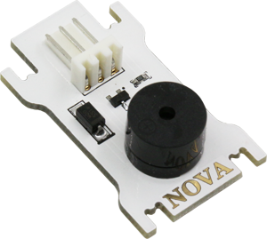
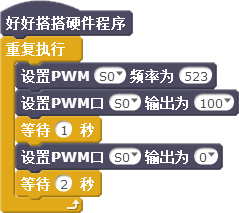

# 第4课  在Nova中使用蜂鸣器——音乐播放器

在创客作品中，经常会使用蜂鸣器，用于提醒或者警告使用者；除此之外，有时也会使用它演奏一些简单的乐曲。本课我们将使用蜂鸣器和按键模块制作一个音乐播放器，播放我们喜欢的乐曲。


## 模块与指令

**要制作本课的范例作品，需要认识以下这些新的硬件：**

### 蜂鸣器模块

蜂鸣器是一种能够发出指定频率声音的装置（如下图所示），由于结构简单、使用方便，因此在电子产品中应用非常广泛。



声音是由物体振动产生的声波。它有三个主观属性：音量、音调和音色。音量指人耳感受到的声音强弱，也叫做“响度”；音调指人耳能分辨一个声音调子的高低程度；音色指声音振动频率的特性，不同的物体由于材料、结构不同，发声时的振动频率也不相同，就会产生不同音色的声音。

对于蜂鸣器来说：它的驱动电流决定了所发声音的音量；它的工作频率决定了所发声音的音调；它的内部结构与发声原理决定了所发声音的音色。


**要制作本课的范例作品，还需要使用以下新的指令：**

###“设置PWM口输出”指令：

使用这个指令可以设置指定数字端口的PWM输出值。指令默认是“S0”、输出值为“0”。通过单击下拉列表，可以选择S0—S3这4个数字端口；具体输出值既可以单击下拉列表选择预置的数值，也可以直接输入。
对于蜂鸣器来说，使用这个指令可以控制所发出声音的音量。


### “设置PWM口频率”指令：

使用这个指令可以设置指定数字端口的PWM频率。指令默认是“S0”、频率为“523”。通过单击下拉列表，可以选择S0—S3这4个数字端口；具体频率值可以在第二个参数的文本框中输入。

对于蜂鸣器来说，使用这个指令可以控制所发出声音的音调。


## 作品制作

要制作本课的范例作品，可以按以下步骤先连接硬件、运行插件程序，然后进入“好好搭搭”网站编写、调试、编译、下载程序。


### 第一步：搭建硬件、运行插件

首先将模块与主控板连接起来：蜂鸣器模块连接“S0”端口、按键模块连接“S1”端口（如下图所示）；接着把主控板和计算机连接起来，最后打开“好好搭搭硬件下载”插件，确认插件程序显示“打开端口成功”。


### 第二步：让蜂鸣器演奏一个音符

首先打开浏览器进入“好好搭搭”网站；登录后进入网站的“创作”栏目，选择“haohaodada_NOVA模版”，进入“模版项目页”；在“模版项目页”中单击网页右上角的“转到设计页”按钮，进入“NOVA编程设计页”。

要让蜂鸣器演奏一个音符，可以在“重复执行”指令中，先使用“设置PWM频率”指令，不修改频率参数，让蜂鸣器发出频率为“523”的声音，也就是C调中的“do”；再使用“设置PWM输出”指令，设置输出参数为“100”，也就是蜂鸣器发出声音的音量是“100”；然后使用“等待”指令，让蜂鸣器持续发声“1秒”，也就是这个音符演奏的节拍；接着再使用“设置PWM输出”指令，设置输出参数为“0”，关闭蜂鸣器；最后再使用“等待”指令，等待“2秒”后重新演奏“do”这个音符。具体程序代码如下图所示：



 ####试一试：

 声音的频率与C调的音符有如下表所示的对应关系，请参考这张对照表，编写一段能够演奏一个你最喜欢音符的程序脚本。


### 第三步：让蜂鸣器演奏多个音符

要让蜂鸣器演奏多个音符，每个音符都应该使用“设置PWM频率”、“设置PWM输出”以及“等待”指令设置音调、音量、节拍，然后再使用“设置PWM输出”指令停止声音。如下图所示就是演奏“do”、“re”这两个音符的程序。


### 第四步：调用功能块演奏音符

像上图这样演奏音符太过于麻烦。可以定义一个“演奏音符”功能块，将重复使用的指令都放在这个功能块里，使程序代码更为简洁。

下面以新建一个名为“Note”的音符演奏功能块为例，介绍具体操作步骤：

1. 单击“更多模块”指令类别中的“新建功能块”按钮，在打开的“New Block”对话框中，输入新建的功能块名称“Note”。如下图所示：


```
注意：与变量一样，在Nova中功能块名称也不能是中文，只能使用英文字母和数字作为变量名、并且首位必须是英文字母。
```

2. 由于演奏音符需要指定音符的“音调”、“节拍”，因此需要为新建的功能块添加两个数字参数，并且应该为每个参数添加标签，说明参数的用途。

   要添加参数标签，可以先单击“新建功能块”对话框中的“选项”，展开进行具体的设置；再单击“添加文本标签”选项右边的图标，会在功能块名称右边自动出现一个文本标签，用键盘修改标签名称为“音调”。

   添加完标签后，继续单击“添加一个数字参数”选项右边的图标，在刚才添加的标签右边添加一个数字参数文本框，修改这个数字参数文本框的名称为“tone”，作为功能块的第一个数字参数。

   第二个参数的添加方法与前一个类似，也是先添加文本标签“节拍”，再添加数字参数“beat”。这两个参数添加完成后，如下图所示：


3. 功能块设置完成后，单击“确定”按钮关闭对话框 。会在“更多模块”指令类别的“新建功能块”按钮下方增加这个新添加的功能块；在脚本区也会增加一个名为“定义Note”的功能块脚本指令。
4. 在“定义Note”指令下方添加“设置PWM频率”、“设置PWM输出”、“等待”以及第二个“设置PWM输出”指令；将“定义Note”指令中的“number1”参数拖动到“设置PWM频率”指令参数位置，“number2”参数拖动到“等待”指令参数位置，设置第一个“设置PWM输出”指令参数为“100”，确认第二个“设置PWM输出”指令参数为“0”，如下图所示：


 #### 试一试：

 根据下面这首“两只老虎”的乐谱，编写这首儿歌的演奏程序。


###第五步： 用按键控制乐曲演奏                       	 

按照以上步骤编写的程序，程序编译后下载到主控板上会马上自动播放。为了更便于控制，可以添加用按键控制的功能：只有按下按键，乐曲才会播放。

在“重复执行”指令里面添加一个“如果……那么”指令，设置条件为：“读数字口”指令的值等于“0”，也就是按键处于“按下”状态时条件成立。条件一旦成立，就演奏刚才编写的这些音符。演奏完成后继续处于条件判断状态，等待再次按下按键重新演奏。具体的程序代码如下图4-9所示：


 ####练一练：

 除了“两只老虎”这首乐曲，你还能编写其它喜欢的乐曲演奏吗？


## 拓展与思考

你能够使用7个按键和1个蜂鸣器模块，制作一个简单的电子琴吗？