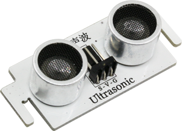
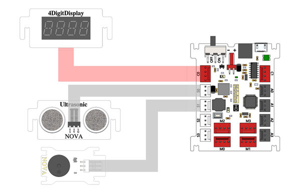
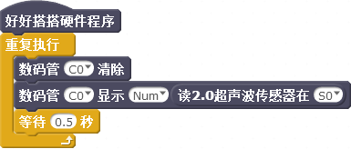
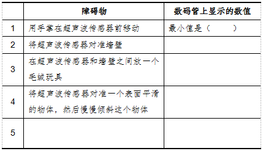
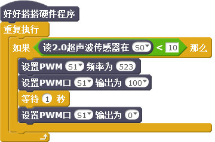
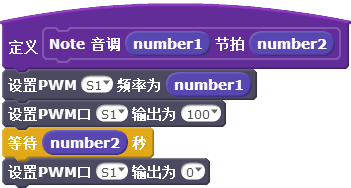
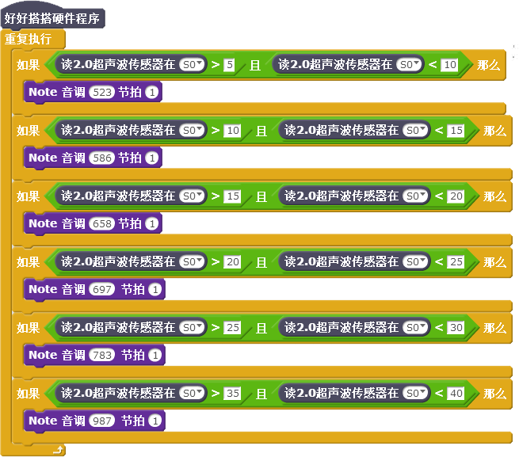

# 第5课  在Nova中使用超声波传感器——魔法音乐盒


音乐盒又称八音盒，是一种通过机械力自动演奏音乐的玩具。它悠扬的乐声，经常勾起人们对美好往事的回忆。本课范例作品所制作的“魔法音乐盒”，能够让人隔空挥动手掌演奏音符，充满了魔幻色彩。


## 模块与指令

**要制作本课的范例作品，需要认识以下这些新的硬件：**

### 超声波传感器模块

超声波传感器模块是一种能够把超声波信号转换为电信号的传感器。Nova套件中的超声波传感器是一种专门利用超声波测量距离的传感器（如下图所示）。它可以发射和接收超声波，发射的超声波碰到障碍物后会反射，这些反射波被超声波传感器接收到以后，通过计算发射和接受的时间间隔来确定与障碍物之间的距离。



```
注：声音是由于物体振动产生的。人耳能听到的声音频率一般在20HZ—20KHZ范围内，超过20KHZ称为超声波，低于20HZ的称为次声波。
```


**要制作本课的范例作品，还需要使用以下新的指令：**

###“读2.0超声波传感器”指令：

使用这个指令可以读取指定端口的超声波传感器测量出来的距离值，单位是“厘米”。指令默认是“S0”端口；通过单击下拉列表，可以选择S0—S3这4个数字端口以及A0—A3这4个模拟端口。


### “读超声波传感器”指令：

这个指令也是读取指定端口的超声波传感器测量出来的距离值，但它读取的是好好搭搭2017年以前生产的超声波传感器数值。


## 作品制作

要制作本课的范例作品，可以按以下步骤先连接硬件、运行插件程序，然后进入“好好搭搭”网站编写、调试、编译、下载程序。


### 第一步：搭建硬件、运行插件

首先将模块与主控板连接起来：超声波传感器模块连接“S0”端口、蜂鸣器连接“S1”端口、数码管模块连接“C0”端口（如下图所示）；接着把主控板和计算机连接起来，最后打开“好好搭搭硬件下载”插件，确认插件程序显示“打开端口成功”。




### 第二步：在数码管上显示超声波传感器的值

登录“好好搭搭”网站，选择“创作”栏目中的“haohaodada_NOVA模版”，进入“NOVA编程设计页”进行编程。
要在数码管上显示超声波传感器的值，可以使用“重复执行”指令，重复执行“数码管消除”、“数码管显示”及“等待”指令，再将“读2.0超声波传感器”指令作为“数码管显示”指令的显示数值参数。由于超声波传感器连接的是“S0”端口，因此会在数码管上每隔“0.5”秒刷新显示超声波传感器与被测量的障碍物之间的距离。具体程序代码如下图所示：



 ####试一试：

 将上图所示代码编译后下载到主控板上，然后按下表要求进行测试，将数码管上显示的数值记录下来，你发现了什么？




### 第三步：用超声波传感器控制蜂鸣器发声

要让超声波传感器控制蜂鸣器发声，需要对超声波传感器的值进行判断：如果超声波传感器所连接的“S0”端口读取的值小于“10”、也就是在10厘米以内有障碍物，那么蜂鸣器发出一秒“do”的声音。具体的程序代码如下图所示：




 #### 想一想：

 用这种方法控制蜂鸣器发声，与第4课用按键控制有什么不同？你喜欢哪种方式？


### 第四步：用超声波传感器控制的魔法音乐盒

本课所制作的“魔法音乐盒”可以用手掌隔空挥动来控制音符演奏。其实就是检测超声波传感器检测与手掌之间的距离，不同的距离值演奏不同的音符。
由于魔法音乐盒会用蜂鸣器演奏不同的音符，因此可以参照第4课所学知识，首先新建一个名为“Note”的功能块，用于演奏指定频率、时长的音符。具体这个功能块程序代码如下图所示：



在如下图所示的“魔法音乐盒”范例主程序代码中，使用了七个“如果…那么”指令，根据超声波传感器所测量距离数值的不同，调用“Note”功能块，演奏不同的音符。




 ####练一练：

 进一步完善程序，使得“魔法音乐盒”音符演奏控制更精准、更好玩。


## 拓展与思考

超声波传感器除了控制蜂鸣器发声、制作魔法音乐盒，你还能用它制作哪些更好玩的智能装置作品？

