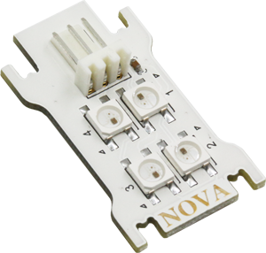
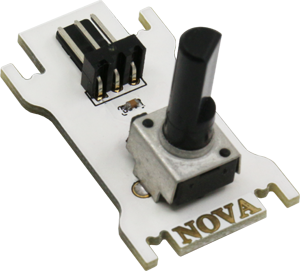
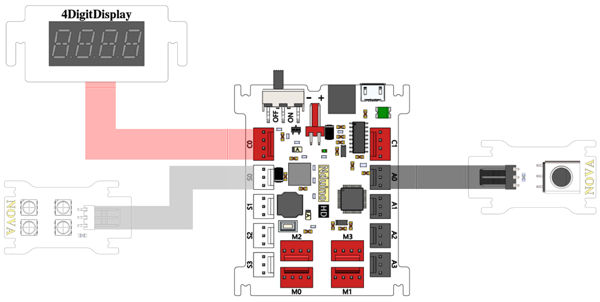
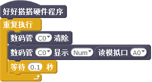
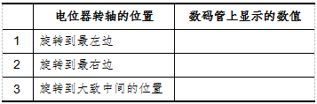
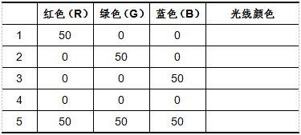
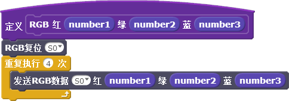
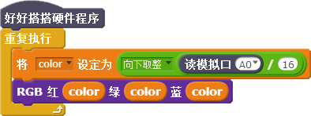

# 第6课  在Nova中使用RGB LED与电位器——多彩台灯

一般台灯发出的光线大多数是白色的，比较单调。本课我们将使用RGB LED和电位器模块，制作一台可以随心所欲改变颜色的多彩台灯。

## 模块与指令

**要制作本课的范例作品，需要认识以下这些新的硬件：**

### RGB LED模块

RGB LED是由红绿蓝三种颜色的发光二极管组成的、可以发出彩色光线的元件（如下图所示）。RGB LED模块由4个RGB LED灯珠组成，每个灯珠边上都有编号，可以使用指令，根据编号控制这些灯珠。



```text
RGB是一种颜色模式，通过设置不同的R（红）G（绿）B（蓝）颜色值，可以显示出人类视力所能感知的几乎所有颜色。
```

### 电位器模块

Nova入门套件中的电位器是一种旋转变阻器（如下图所示），通过调节转轴调整电阻的大小，从而改变输出数值的大小。电位器模块输出数值的取值范围是（0，4095）。



**要制作本课的范例作品，还需要使用以下新的指令：**

### “读模拟口”指令：


使用这个指令可以读取指定模拟口的输出值。指令默认是数字口“A0”。通过单击下拉列表，可以选择A0—A3这4个模拟端口、S0—S3这4个数字端口。

### “RGB复位”指令：


使用这个指令可以设置RGB LED模块复位，要点亮或者修改RGB LED颜色必须先使用这条指令。指令默认是“S0”端口；通过单击下拉列表，可以选择S0—S3这4个数字口、A0—A3这4个模拟端口。

### “发送RGB数据”指令：


使用这个指令可以设置RGB LED发出光线的颜色。指令默认是“S0”端口的RGB LED红色值为“10”，绿色、蓝色值均为“0”，也就是发红色光。通过单击下拉列表，可以选择S0—S3这4个数字端口、A0—A3这4个模拟端口；“红”、“绿”、“蓝”这三个参数既可以单击下拉列表选择预置的数值，也可以直接输入。

## 作品制作

要制作本课的范例作品，可以按以下步骤先连接硬件、运行插件程序，然后进入“好好搭搭”网站编写、调试、编译、下载程序。

### 第一步：搭建硬件、运行插件

首先将模块与主控板连接起来：电位器模块连接“A0”端口、RGB LED模块连接“S0”端口、数码管模块连接“C0”端口（如下图所示）；接着把主控板和计算机连接起来，最后打开“好好搭搭硬件下载”插件，确认插件程序显示“打开端口成功”。



### 第二步：在数码管上显示电位器数值

登录“好好搭搭”网站，选择“创作”栏目中的“haohaodada\_NOVA模版”，进入“NOVA编程设计页”进行编程。

要在数码管上显示电位器的值，可以使用“重复执行”指令，重复执行“数码管消除”、“数码管显示”及“等待”指令，再将“读模拟口”指令作为“数码管显示”指令的显示数值参数。由于电位器连接的是“A0”端口，因此会在数码管上每隔“0.1”秒刷新显示电位器当前的数值。具体程序代码如下图所示：



#### 试一试：

将上图所示代码编译后下载到主控板上，然后按下表要求手动调节电位器上转轴的位置，将数码管上显示的数值记录下来。



### 第三步：点亮RGB LED

要点亮RGB LED，应该先使用“RGB复位”指令，然后再使用“发送RGB数据”指令，最后根据实际连接情况设置端口参数、设置“红”、“绿”、“蓝”参数值。具体程序代码如下图所示：


```text
注意：由于Nova的RGB LED模块外部没有灯罩，因此“发送RGB数据”指令的三个颜色参数值可以设置的小一些，在使用时也尽量不要直视灯珠。
```

#### 试一试：

按下表数值分别设置上图程序中“发送RGB数据”指令的“红”、“绿”、“蓝”参数值，编译后下载到主控板，看看RGB LED发出的是什么颜色的光线。



### 第四步：使用“功能块”点亮RGB LED

由于RGB LED模块有4个灯珠，要同时点亮这4个灯珠，需要使用4个“发送RGB数据”指令。发送的第1条指令用于设置第1个灯珠颜色、第2条设置第2个、……。

为了使程序更简洁，可以使用“更多模块”指令类别中的“新建功能块”，新建一个名为“RGB”的功能块。具体功能块代码如下图所示：



新建了“RGB”功能块后，就可以在主程序中调用。使用“重复执行”指令，重复执行“RGB功能块”和“等待”指令，设置“RGB”功能块指令的三个颜色参数值为随机数。每隔1秒种，RGB LED模块随机发出一种颜色的光线。具体程序代码如下图所示：


#### 想一想：

怎样让RGB LED模块的4个灯珠发出不同颜色的光线？

### 第五步： 用电位器控制RGB LED模块

要用电位器控制RGB LED模块，可以在上一步骤编写程序的基础上，加上电位器控制的脚本。

电位器数值的取值范围是（0，4095），“发送RGB数据”指令的三个颜色参数值是（0，255），前一个大约是后一个的16倍，因此应该先将读取的电位器数值除以16，然后使用“向下取整”指令得到一个255以内的整数。

为了使程序更简洁，还可以新建一个名为“color”的变量，设置这个变量的值是缩小、取整以后的电位器数值。最后使用如图6-6所示新建的“RGB”功能块指令，设置这个指令三个颜色参数值都是变量“color”。具体程序代码如下图所示：



#### 练一练：

除了电位器模块，能不能使用按键模块控制RGB LED模块？

## 拓展与思考

使用3个电位器模块制作多彩台灯，使得台灯光线的颜色控制更加方便、精确。

