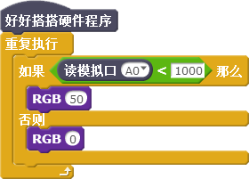

# 第7课  在Nova中使用声音与亮度传感器——智能声控灯

普通灯一般使用机械开关控制亮灭，而智能灯使用各种传感器控制亮灭。本课将学习制作一种智能声控灯，它能够在检测到周围光线比较暗、同时声音强度达到指定值时自动点亮。不仅能够给使用者带来方便，还可以节约用电。

## 模块与指令

**要制作本课的范例作品，需要认识以下这些新的硬件：**

### 亮度传感器模块

亮度传感器其实是一个光敏管，能够感知周围光线的强度，通过转化和采集后输出具体数值（如下图所示）。Nova套件中亮度传感器输出的光线强度取值范围是（0，4095）。

### 声音传感器模块

声音传感器里面有一个对声音敏感的电容式驻极体话筒，声波会使话筒内的驻极体薄膜振动，产生电压变化，通过转化和采集后输出具体数值（如下图所示）。Nova套件中的声音传感器输出的声音强度取值范围是（0，4095）。

**要制作本课的范例作品，还需要使用以下新的指令：**

###“读模拟口”指令：

使用这个指令可以读取指定模拟口的输出值。指令默认是模拟口“A0”；通过单击下拉列表，可以选择A0—A3这4个模拟端口。

## 作品制作

要制作本课的范例作品，可以按以下步骤先连接硬件、运行插件程序，然后进入“好好搭搭”网站编写、调试、编译、下载程序。

### 第一步：搭建硬件、运行插件

首先将模块与主控板连接起来：亮度传感器模块连接“A0”端口、声音传感器模块连接“A1”端口、RGB LED模块连接“S0”端口、数码管模块连接“C0”端口（如下图所示）；接着把主控板和计算机连接起来，最后打开“好好搭搭硬件下载”插件，确认插件程序显示“打开端口成功”。

### 第二步：在数码管上显示亮度传感器的值

登录“好好搭搭”网站，选择“创作”栏目中的“haohaodada_NOVA模版”，进入“NOVA编程设计页”进行编程。

要在数码管上显示亮度传感器的值，可以使用“重复执行”指令，重复执行“数码管消除”、“数码管显示”及“等待”指令，再将“读模拟口”指令作为“数码管显示”指令的显示数值参数。由于亮度传感器连接的是“A0”端口，因此就会在数码管上每隔“0.5”秒刷新显示当前环境的亮度值。具体程序代码如下图所示：

 ####试一试：

 将上图所示代码编译后下载到主控板上，然后按下表要求测试不同环境下的亮度值，将数码管上显示的数值记录下来。

### 第三步：在数码管上显示声音传感器的值

与数码管上显示亮度传感器值的程序类似，由于声音传感器连接的是“A1”端口，因此在数码管上显示声音传感器值的程序只需要修改“读模拟口”指令的参数为“A1”，这样在数码管上每隔“0.5”秒刷新显示的就是当前环境的声音响度值。具体程序代码如下图所示：

 #### 试一试：

 将上图所示代码编译后下载到主控板上，然后按下表要求手动调节电位器上转轴的位置，将数码管上显示的数值记录下来。

### 第四步：用亮度传感器控制灯光的亮灭

要让亮度传感器控制LED亮灭，需要对亮度传感器的值进行判断：如果亮度传感器所连接的“A0”模拟口读取的值小于“1000”、也就是周围光线比较暗，那么点亮连接在“S0”端口的RGB LED；否则熄灭RGB LED。具体的程序代码如下图所示：

为了使程序更简洁，上图7-6中的程序使用了名为“RGB”的功能块，具体功能块代码如下图所示。

 #### 试一试：

 如何在用亮度传感器控制灯光亮灭的同时，用数码管显示实时的周围环境亮度值？

###第五步： 用亮度和声音传感器同时控制灯光亮灭                       	 

要用声音和亮度传感器同时控制灯光亮灭，也就是周围光线比较暗的同时，声音的响度还要达到一定的值，灯才会亮。这个程序代码的核心是对判断的条件进行设置，可以使用“数字和逻辑运算”类别中的“且”指令。也就是连接亮度传感器“A0”端口的值小于“1000”的同时，连接声音传感器“A1”端口的值还必须大于“2000”，只有这两个条件都满足的情况下，灯才会亮；否则，设置灯是灭的。具体程序代码如下图所示：

 #### 想一想

 如下图所示程序脚本，与上图有什么不同？它能否让智能声控灯正常工作？分析这两种程序编写方法有什么区别？你喜欢哪种方法？

 ####练一练：

 根据实际环境光线及声音响度情况，调整具体数值，使得智能声控灯更有实用性。

## 拓展与思考

除了使用亮度和声音传感器控制灯光，你还能让灯光控制更智能、使用更方便吗？