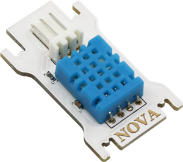
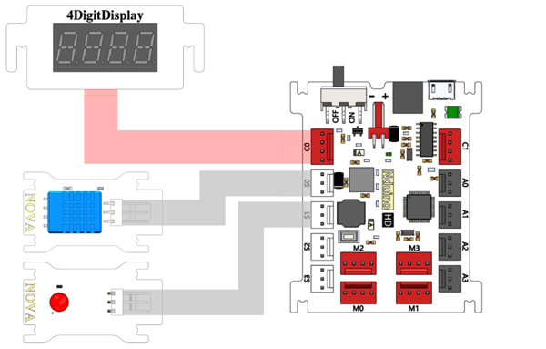
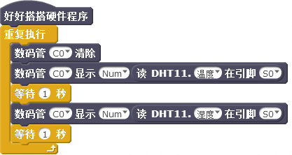
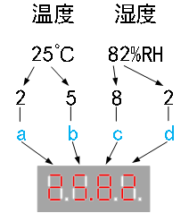
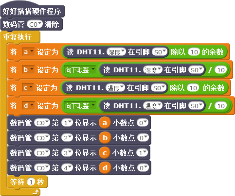
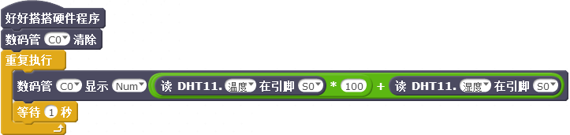
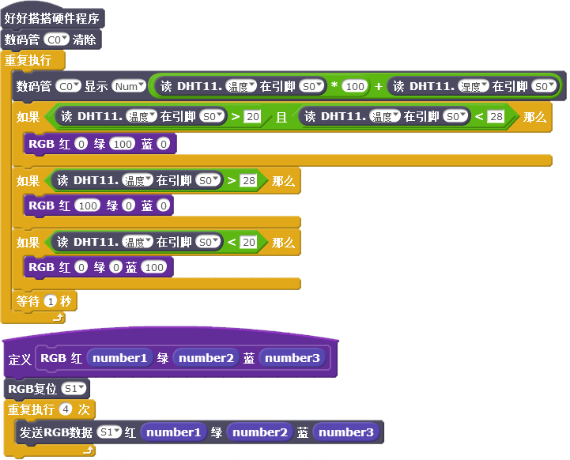

# 第8课  在Nova中使用温湿度传感器——环境自动监测仪

人类舒适的生活环境，与温度、湿度的高低密切相关。本课我们将制作一个环境自动监测仪，它不仅能够在数码管上实时显示温度、湿度值，还可以通过RBG LED的颜色了解环境温度是否适宜。


## 模块与指令

**要制作本课的范例作品，需要认识以下这些新的硬件：**

### 温度、湿度传感器模块

温度、湿度传感器是指能够感受温度、湿度并转换成电信号的传感器。
Nova套件中的温度、湿度传感器采用的是“DHT11”温湿度传感器（如下图所示）。这是一款温湿度复合传感器，既能够检测温度、又能够检测湿度。它的温度检测范围是（0℃-50℃）、误差值±2℃；湿度检测范围是（20%-90%RH）、误差值±5%RH。



```
日常生活中所指的湿度是“相对湿度”，采用“%RH”表示。“90%RH”就是指空气中实际水蒸气的含量与相同温度下饱和水蒸气含量的百分比是90%。
```


**要制作本课的范例作品，还需要使用以下新的指令：**

###“读DHT11温湿度”指令：

使用这个指令可以读取指定端口温湿度传感器上输出的温度、湿度值。指令默认读取的是“S0”端口的温度值；通过单击下拉列表，可以选择读“温度”还是“湿度”，还可以选择S0—S3这4个数字端口、A0—A3这4个模拟端口。


## 作品制作

要制作本课的范例作品，可以按以下步骤先连接硬件、运行插件程序，然后进入“好好搭搭”网站编写、调试、编译、下载程序。


### 第一步：搭建硬件、运行插件

首先将模块与主控板连接起来：温湿度传感器模块连接“S0”端口、RGB LED模块连接“S1”端口、数码管模块连接“C0”端口（如下图所示）；接着把主控板和计算机连接起来，最后打开“好好搭搭硬件下载”插件，确认插件程序显示“打开端口成功”。




### 第二步：在数码管上交替显示温湿度传感器的值

登录“好好搭搭”网站，选择“创作”栏目中的“haohaodada_NOVA模版”，进入“NOVA编程设计页”进行编程。

要在数码管上交替显示温度和湿度，可以使用“重复执行”指令，重复执行“数码管消除”以及两个“数码管显示”、两个“等待”指令，第一个“数码管显示”指令显示温度，等待1秒后再使用第二个“数码管显示”指令显示湿度，最后再等待1秒后重复显示。具体程序代码如下图所示：




 ####试一试：

 如果有两个数码管，请你编写程序，能够一个数码管显示温度、另一个数码管显示湿度。


### 第三步：在数码管上同时显示温湿度传感器的值

要在数码管上同时显示温度和湿度，需要先定义“a”、“b”、“c”、“d”四个变量；然后使用“数码管清除”以及“重复执行”指令。

在“重复执行”指令中，将变量“a”设定为湿度值除以10的余数、就是湿度值的个位数字；将变量“b”设定为湿度值除以10的商“向下取整”、就是湿度值的十位数字；复制这两个变量设定指令，再修改复制后的指令参数，将变量“c”设定为温度值的个位数字、变量“d”设定为温度值的十位数字。

然后使用四个“数码管指定位置显示”指令：第一个指令在第一位显示变量“a”、也就是湿度的个位数字，第二个指令在第二位显示变量“b”、也就是湿度的十位数字，第三个指令在第三位显示变量“c”、也就是温度的个位数字，第四个在第四位显示变量“d”、也就是温度的十位数字；其中第三个指令、也就是显示温度个位数字的指令，增加设置“小数点”参数值为“1”，使用“小数点”将温度值和湿度值在显示的时候隔开。



具体程序代码如下图所示：




 #### 试一试：

 除了使用“数码管指定位置显示”指令，分数位同时显示温湿度值，也可以如下图程序代码所示，通过计算公式同时显示温湿度值。请将下图程序代码编译后下载到主控板上运行，观察数值显示是否正确。再试一试，如果要先显示湿度、再显示温度，程序应该如何修改。




### 第四步：用RGB LED直观显示温度状态

除了使用数码管显示温湿度值，也可以利用RGB LED直观显示温度状态：比如温度如果比较适宜，那么RGB LED显示绿色；如果温度太高了，那么RGB LED显示红色；如果温度太低了，那么RGB LED显示蓝色。具体的程序代码如下图所示：



#### 

 ####练一练：

 除了用RGB LED直观显示温湿度，对于异常的数值，还可以采用蜂鸣器报警。请进一步完善程序代码，使得环境自动监测仪能够使用蜂鸣器报警。


## 拓展与思考

除了温度和湿度，我们还可以监测周围环境的光线强度、声音强度……请进一步完善作品，使得环境自动监测仪功能更加强大。

