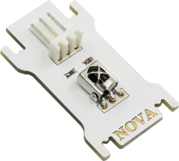
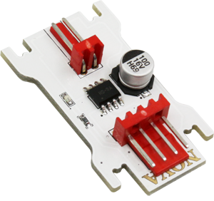
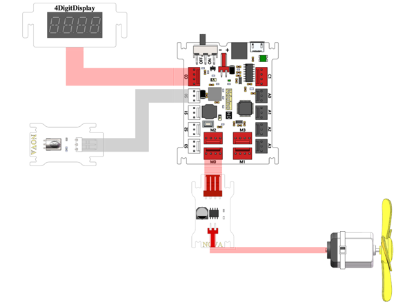
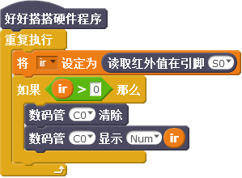
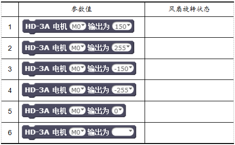
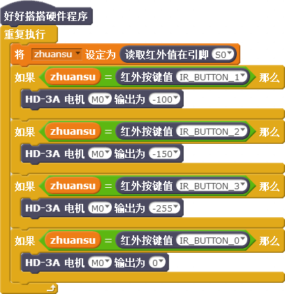

# 第9课  在Nova中使用电机与红外遥控――智能小风扇

电风扇曾经是很多家庭上个世纪八、九十年代最重要的消暑电器，拥有一台自己独自享用的电风扇是那个年代很多孩子梦想的礼物。本课我们将制作一个能够用红外遥控器控制的小风扇，甚至还可以为它加上其它的传感器，使得小风扇更智能。

## 模块与指令

**要制作本课的范例作品，需要认识以下这些新的硬件：**

### 红外发射模块——红外遥控器

红外遥控器是一种红外线发射装置。Nova套件中的红外遥控器有17个按键，除了0-9这十个数字以外，还包括四个方向键、“OK”键以及“\*”、“\#”键（如下图所示）。红外遥控器每个按键都有对应的按键值，可以根据需要在程序中定义不同的功能。


### 红外接收模块

红外接收模块一般与红外发射器一起使用，它能够接收发射器发射的红外线，然后将接收到的红外线信号转换为电信号，经过处理后还原为红外发射器发射的按键值（如下图所示）。



```text
在Nova套件中，红外遥控器和红外接收模块组成了一个完整的红外遥控系统。这类红外遥控方式在现实生活中几乎随处可见，比如绝大多数家庭都有的电视机、空调机，都采用了类似的红外遥控方式。
```

### 电机

电机，也叫“马达”，是依据电磁感应原理将电能转换为机械能的一种装置，很多常用电器和机械的动力源都是各种各样的电机。

电机根据输入电源的不同，可以分为使用直流电的直流电机、使用交流电的交流电机。Nova套件中的130电机就是一种直流电机，能够将输入的直流电能转换为机械能，可以带动套件中的风扇叶旋转（如下图所示）。


### 单路电机驱动模块

Nova主控板是不能直接控制电机的，必须通过电机驱动模块才可以控制电机运行、停止、调节转速。Nova入门套件中的电机驱动模块只能连接一个电机，因此叫做“单路电机驱动模块”（如下图所示）。



**要制作本课的范例作品，还需要使用以下新的指令：**

### “读取红外值”指令：

使用这个指令可以读取指定端口红外接收模块的值。指令默认是“S0”；通过单击下拉列表，可以选择S0—S3这4个数字端口、A0—A3这4个模拟端口。。

### “红外按键值”指令：

使用这个指令可以读取红外遥控器按键的值。指令默认是“OK”键；通过单击下拉列表，还可以选择0-9这十个数字键、四个方向键、以及“\*”、“\#”键。

### “电机输出”指令：

使用这个指令可以设置指定端口电机的输出值。指令默认端口是“M0”、输出值是“150”；通过单击第一个参数的下拉列表，可以选择电机的连接端口M0—M3；通过单击第二个参数下拉列表或者直接输入，可以设置电机的输出值，它的取值范围是（-255，255）。

## 作品制作

要制作本课的范例作品，可以按以下步骤先连接硬件、运行插件程序，然后进入“好好搭搭”网站编写、调试、编译、下载程序。

### 第一步：搭建硬件、运行插件

首先将模块与主控板连接起来：红外接收模块连接“S0”端口、数码管模块连接“C0”端口、单路电机驱动模块连接“M0”端口，将风扇叶安装到130电机的转头上、电机的连线插入单路电机驱动模块（如下图9-5所示）；接着把主控板和计算机连接起来，最后打开“好好搭搭硬件下载”插件，确认插件程序显示“打开端口成功”。



### 第二步：在数码管上显示红外接收模块接收到的值

登录“好好搭搭”网站，选择“创作”栏目中的“haohaodada\_NOVA模版”，进入“NOVA编程设计页”进行编程。

要在数码管上显示红外接收模块接收到的值，可以按以下步骤操作：

1. “新建变量ir”；
2. 使用“重复执行”指令，重复执行“将变量设定为”、“如果…那么”指令；
3. 将“读红外值”指令作为“将变量设定为”指令的参数；
4. 设置“如果…那么”指令的条件是“ir0”，条件满足后执行“数码管消除”和“数码管显示”指令，设置“数码管显示”指令最后一个参数是变量“ir”。

由于红外接收模块连接的是“S0”端口，因此当按下红外按键、也就是读取的“S0”端口值大于“0”，就会在数码管上显示红外接收模块接收到的红外值。具体程序代码如下图所示：



#### 试一试：

将上图所示代码编译后下载到主控板上，然后按红外遥控器上的按键，观察数码管上显示的数值，思考以下问题：

1. 红外遥控器必须对准红外接收模块吗？如果不对准会怎么样？
2. 为什么要使用变量？只有这个变量的值大于“0”才显示红外值。而不是和前几课一样，直接显示红外值？

### 第三步：让风扇旋转起来

要让风扇旋转起来，可以使用“电机输出”指令，具体程序代码如下图9-7所示：


#### 试一试：

根据上图所示代码，按下表要求分别修改电机输出值，编译后下载到主控板上，观察不同参数下风扇旋转的状态，将结果记录下来。



### 第四步：用红外遥控器控制风扇旋转

要用红外遥控器控制风扇旋转：按数字“1”键控制风扇比较慢的旋转、“2”键比较快旋转、“3”非常快旋转，可以按以下步骤编写程序：

1. 单击“数据”类别中的“新建变量”按钮，在打开的“新建变量”对话框中输入新变量的名称“zhuansu”，单击“确定”按钮完成新建变量。
2. 添加“重复执行”指令，重复执行“将变量设定为”和“如果…那么”指令；将“zhuansu”变量设定为“读红外值”指令的值；
3. 设置“如果…那么”指令的条件为“zhuansu”变量“等于”“红外按键值”；单击“红外按键值”指令的下拉列表，选择“IR\_BUTTON\_1”选项，也就是红外遥控器上的“1”按键。
4. 设置“如果…那么”指令条件成立时执行“电机输出”指令，设置电机输出值为“-100”。
5. 将“如果…那么”指令再复制三个，分别修改“红外按键值”指令的参数为“IR\_BUTTON\_2”、“IR\_BUTTON\_3”、“IR\_BUTTON\_0”，再分别修改“电机输出”指令的输出值为“-150”、“-255”、“0”。

具体的程序代码如下图所示：



#### 想一想：

可以不新建“zhuansu”变量，直接设置“读红外值”指令“等于”“红外按键值”指令吗？

#### 练一练：

进一步修改程序，使得小风扇旋转的同时，数码管上能够显示相应的转速。比如显示比较慢的“1”档、比较快的“2”档以及非常快的“3”档。

## 拓展与思考

除了使用红外遥控器控制风扇，你还能让风扇的控制更智能、使用更方便吗？

