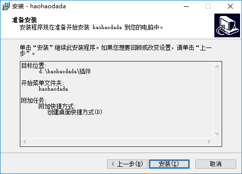

# 阅读材料一：“好好搭搭”插件的下载与安装

使用Scratch编写的Nova程序，必须通过“好好搭搭”插件程序才能下载到主控板上，可以按照以下的步骤下载、安装插件程序。

## 一、下载“好好搭搭”插件

1. 打开网页浏览器，进入“好好搭搭”网站（haohaodada.com）；
2. 单击网站上方导航栏中的“资源”按钮，进入“资源下载”网页。

1. 在“好好搭搭插件下载”网页中，单击插件介绍文字上方的“点击下载”文字，将安装文件下载、保存到本地计算机。

## 二、安装“好好搭搭”插件

1. 运行所下载的“好好搭搭”插件安装程序，打开如下图所示的安装向导，单击“下一步”按钮开始安装。

   

2. 在如下图所示的“选择目标位置”对话框中，一般不需要改变安装位置，将插件程序安装到“D:\haohaodada\插件”文件夹中。单击“下一步”按钮继续安装。

   

3. 在如下图所示的“选择开始菜单文件夹”对话框中，默认会在“开始”菜单文件夹生成一个名为“haohaodada”的程序组，一般不要改变。单击“下一步”按钮继续安装。

   

4. 在如下图所示的“选择附加任务”对话框中，默认会在桌面上生成快捷方式，一般也不要改变。单击“下一步”按钮继续安装。

   

5. 在如下图所示的“准备安装”对话框中，进一步确认“安装位置”、“开始菜单程序组”、“桌面快捷方式”等安装内容。单击“安装”按钮，开始插件程序的安装。

   

6. 插件程序安装完成以后，还会打开如下图所示的“驱动安装”对话框，安装“好好搭搭”设备的驱动程序。单击“安装”按钮开始安装。

   

7. “好好搭搭”设备驱动程序安装完成后，会显示如下图所示的对话框，单击“确定”按钮退出驱动安装程序。

   

8. 在如上右图所示的“haohaodada安装向导完成”对话框中，单击“完成”按钮，就可以退出插件安装程序，完成“好好搭搭”插件的安装。

   

## 三、将Nova主控板和计算机连接起来

1. 使用USB线，将Nova主控板与计算机连接起来。USB小口端的插头应该插入Nova主控板的USB接口，大口插头插入计算机的USB接口。如果主控板是第一次连接计算机，会自动识别并安装设备驱动程序。
2. “好好搭搭”插件程序安装完成后，默认会在计算机桌面上生成两个快捷图标，单击其中的“硬件下载插件”快捷图标，会打开如下图所示的“haohaodada-硬件下载”程序窗口。

   

   如果计算机桌面上没有“硬件下载插件”快捷图标，可以单击桌面左下角的“开始”按钮，在打开的“程序”中查找名为“haohaodada”的程序组，该程序组中包含有“硬件下载插件”快捷图标。

3. 一般情况下，“haohaodada硬件下载”程序会根据当前计算机的串口情况，自动选择连接主控板的串口，不需要人工设置；另外也不需要修改“型号”，只要使用默认的“haohaodada”就可以了。需要注意的是，在使用过程中，“haohaodada硬件下载”程序窗口不能关闭。

**按照以上步骤将主控板硬件和软件都连接到计算机后，只要进入“好好搭搭”网站，就可以在线编写Nova硬件作品程序，然后编译、下载到主控板上运行。**

