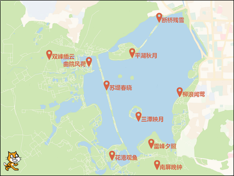
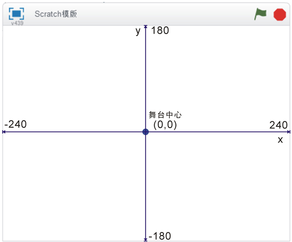
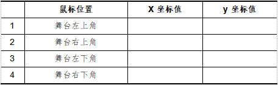
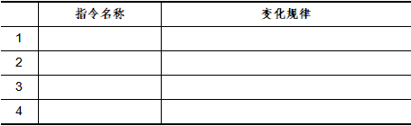
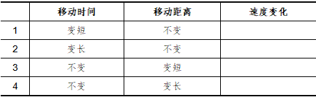
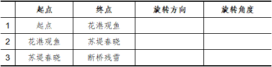

# 第3课 喵喵游西湖

西湖，位于浙江省杭州市，是中国十大风景名胜之一，2011年正式列入“世界文化遗产目录”。湖上有苏堤、白堤，还有三个小岛鼎立于波光粼粼的湖面上，湖边有雷峰塔与保俶塔隔湖相映，自然风光非常优美。

“喵喵”打算趁着假期游览西湖，特别是花港观鱼、苏堤春晓、断桥残雪这些著名的“西湖十景”，它都想好好的去游览一番

在本课的任务中，“喵喵”将从起点出发，分别移动到地图上这些景点游览。

## 创意构思

首先导入“西湖浏览图”作为“喵喵游西湖”作品的舞台背景图、设置“喵喵”的大小和旅游的起点位置，然后编写脚本使“喵喵”在地图上移动，分别浏览那些知名的西湖景点。

要完成本课的创意构思，需要了解以下的新指令：

1.

属于“动作”类别指令，能使角色移动到舞台的指定位置，指令中的两个参数用来指定角色移动目的地的位置坐标。

Scratch的舞台是一个长480、宽360的长方形，角色在舞台上都会有一个坐标值。比如角色如果在舞台中心，那么它的坐标值是（0，0），即x坐标值是0，y坐标值是0。

#### 试一试

将鼠标移到下面表格中指定的位置，观查舞台右下角的x和y坐标值的变化，把你的发现记录下来。

[单击此处](http://haohaodada.com/video/a20301.php)或者扫描下方二维码可以观看相关的视频。

2.

属于“动作”类别指令，使角色在指定的时间内移动到舞台的指定位置，指令中的第一个参数用来指定移动所需时间，后两个参数指定角色移动的目的地坐标值。

#### 想一想

这两个指令有什么不同，分别适用于哪些场合使用？

[单击此处](http://haohaodada.com/video/a20302.php)或者扫描下方二维码可以观看相关的视频。

3.

属于“动作”类别指令，使角色向右（顺时针方向）或者向左（逆时针方向）旋转指定角度，指令中的参数用来指定角色旋转的角度。

## 脚本设计

### 第一步：导入外部舞台背景图片

本课使用的背景图片不在Scratch的背景库中，因此我们需要将它“从本地文件中上传背景”：

1.打开网络浏览器，在地址栏中输入“haohaodada.com/a2”，打开本课的范例程序网页，单击网页右边的“资源下载”选项卡，下载“西湖游览图”这个图片文件。

2.单击舞台列表区工具栏中的

按钮；在“打开”对话框中找到并上传刚才下载的“西湖游览图”图片。

[单击此处](http://haohaodada.com/video/a20303.php)或者扫描下方二维码观看以上内容相关的视频。

### 第二步：设置小猫角色属性

由于导入的“西湖浏览图”图片与默认的小猫角色大小比例不合适，可以按以下步骤操作：

1.单击工具栏中的

按钮；

2.在小猫上连续单击将它缩小到合适的大小；

3.根据上一课所学知识，将小猫重命名为“喵喵”。

[单击此处](http://haohaodada.com/video/a20304.php)或者扫描上方的二维码可以观看以上内容相关的视频。

### 第三步：设置“喵喵”的起始位置

确认已经选中小猫“喵喵”角色，然后按以下步骤编写它的程序脚本：

1.将

指令拖动到脚本区作为“喵喵”程序脚本的第一条指令。

2.将“喵喵”拖动到舞台左下角的起始位置，此时指令区

指令上的坐标参数会自动更新为目前角色位置的坐标值。

3.最后将该指令拖动到脚本区与第一条指令组合。

[单击此处](http://haohaodada.com/video/a20305.php)或者扫描下方二维码可以观看以上内容相关的视频。

#### 试一试

单击“脚本”选项卡的“动作”类别，然后把“喵喵”拖动到舞台的不同位置，观察“指令区”中哪些指令的参数发生了变化？把你的发现记录下来：

[单击此处](http://haohaodada.com/video/a20306.php)或者扫描下方二维码可以观看相关视频。

### 第四步：让“喵喵”在地图上移动

下面，我们为小猫“喵喵”编写脚本，使它能够在地图上移动：

1.将小猫“喵喵”拖动到地图上的第一个景点“花港观鱼”的位置。此时，指令区内

指令上的坐标参数值也会同步更新，再将它拖动到脚本区，组合到原有指令的下方。

2.将

指令拖动组合到 

指令下方，使“喵喵”能够在景点稍作停留。

3.按照以上方法，先用鼠标拖动“喵喵”到新的景点，再添加

指令，让小猫分别浏览“苏堤春晓”、“断桥残雪”这些著名的西湖景点。

[单击此处](http://haohaodada.com/video/a20307.php)或者扫描下方二维码可以观看以上内容相关的视频。

#### 试一试

分别改变角色的移动时间与距离，看看角色移动的速度变化，把你的发现记录下来。

[单击此处](http://haohaodada.com/video/a20308.php)或者扫描下方二维码可以观看相关视频。

### 第五步：使“喵喵”移动时面向目的地

通过以上操作，“喵喵”已经能够从起点位置沿直线移动浏览西湖景点，但它从“花港观鱼”移动到“苏堤春晓”的过程中，始终面向舞台右侧，感觉比较僵硬。要在移动的过程中，使“喵喵”能够面向目的地方向，可以按以下步骤操作：

1.首先，将

指令拖动到“脚本区”，组合到第二条

指令（也就是移动到第二个旅游景点“苏堤春晓”）上方；然后，修改指令参数为“120”。这样，“喵喵”在从“花港观鱼”移动到“苏堤春晓”的过程中，所面对的方向是“苏堤春晓”。

2.将

指令组合到第三条

指令（也就是移动到第三个旅游景点“断桥残雪”）上方；再修改参数为“45”，让小猫能够面向“断桥残雪”这个景点移动。

[单击此处](http://haohaodada.com/video/a20309.php)或者扫描下方二维码可以观看以上内容相关的视频。

#### 想一想

想要精确地指定小猫面向目的地景点旋转的角度值，你有什么办法？

[单击此处](http://haohaodada.com/video/a20310.php)或者扫描下方二维码可以观看相关视频。

#### 练一练

完成整个程序的脚本程序设计，然后多运行几次程序，你发现了什么问题？该如何解决？

[单击此处](http://haohaodada.com/video/a20311.php)或者扫描下方二维码可以观看相关视频。

## 拓展思考

小猫“喵喵”成了名副其实的“小小旅行家”。不过，它似乎觉得自己的旅程还不够精彩，怎么办？展开想象，用学过的知识让“喵喵”的旅程变得更加丰富。

