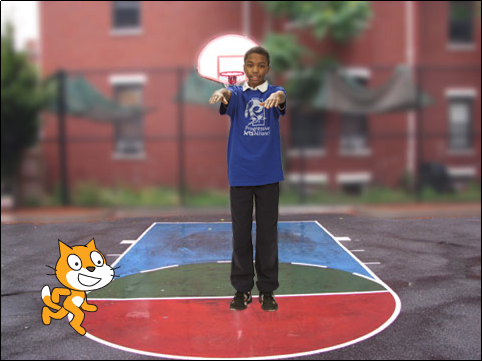
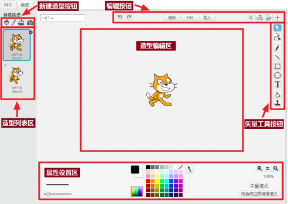
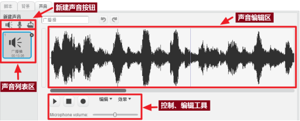

# 第4课  喵喵学做操

操场上有很多同学在做广播操，伸伸臂、弯弯腰、踢踢腿。小猫“喵喵”也想跟着同学们一起学做广播操。
在本课的范例作品中，操场上的学生会配合广播操音乐不停地做出各种广播操动作，教“喵喵”学做操。

## 创意构思

Scratch的角色可以有多个造型，通过不断地切换造型，会产生动画效果。学生在操场上做广播操，就是按照这个办法做出广播操的各种动作。为了达到比较好的效果，还需要使角色造型的切换与广播操音乐的播放同步。

要完成本课的创意构思，需要了解以下的新指令：

1.  

属于“外观”类别指令，如果某个角色拥有多个造型的话，使用这个指令可以切换到这个角色造型列表中的下一个造型。

#### 2. “造型”选项卡

在Scratch中，如果当前选中的是角色，那么单击“造型”选项卡，可以对这个角色的造型进行编辑、设置。

[单击此处](http://haohaodada.com/video/a20401.php)或者扫描下方二维码可以观看以上内容相关的视频。

*  

3.  

属于“控制”类别指令，Scratch循环结构指令中的一种，可以重复执行该指令中间所包含的脚本，通过指令的参数可以指定重复执行的次数。

#### 4. “顺序结构”与“循环结构”

前几节课所编写的程序脚本，都是“顺序结构”，也就是按指令的顺序依次执行。这是一种最基本的计算机程序结构。

“循环结构”也是一种基本的计算机程序结构，它可以重复执行一段程序脚本，是最能发挥计算机特长的一种程序结构。

当“顺序结构”的程序脚本中存在周期性重复出现的指令时，可以使用“循环结构”对脚本进行简化，这样可以极大减轻程序脚本编写的复杂程度。

[单击此处](http://haohaodada.com/video/a20402.php)或者扫描下方二维码可以观看以上内容相关的视频。

*  

4.  

属于“声音”类别指令，用于播放指定的声音文件；通过单击指令中的下拉列表参数，可以选择需要播放的声音文件。除了角色默认的声音文件，如果需要播放其它声音，都需要先在“声音”选项卡中导入，才可以在指令的下拉列表参数中选择。

#### 5. “声音”选项卡

在Scratch中，单击“声音”选项卡，可以显示当前对象的“声音编辑区域”。

[单击此处](http://haohaodada.com/video/a20403.php)或者扫描下方二维码可以观看以上内容相关的视频。

*  

## 脚本设计

### 第一步：导入舞台背景与角色

1. 单击“背景列表区”的  按钮，从打开的“背景库”中上传“basketball-court1-a”背景图片。
2. 单击选中默认的小猫角色，将它重命名为“喵喵”；然后调整它的大小；最后将它拖放到舞台左下角的合适位置。
3. 单击“角色列表区”右上角的  按钮；在打开的“角色库”中导入“D-Money Hip-Hop”角色；然后将导入的这个角色重命名为“学生”；最后将它拖放到舞台中央的合适位置。

[单击此处](http://haohaodada.com/video/a20404.php)或者扫描下方二维码可以观看以上内容相关的视频。

*  

#### 试一试

单击选中“学生”角色；然后单击“造型”选项卡，看看这个角色有几个造型；最后快速地在这些造型上单击，观看舞台上这个角色的变化，你发现了什么？

[单击此处](http://haohaodada.com/video/a20405.php)或者扫描下方二维码可以观看相关的视频。

*  

### 第二步：导入广播操声音文件

“喵喵”在学做广播操时所播放的声音文件不在Scratch自带的“声音库”文件中，需要按以下步骤从“好好搭搭”网站下载并导入到程序作品中：

1. 打开网络浏览器，在地址栏中输入“haohaodada.com/a2”，打开本课的范例程序网页，单击网页右边的“资源下载”选项卡，下载“广播操”这个声音文件。
2. 由于广播操是“学生”这个角色在做操的时候播放的，因此应该先确认已经选中这个角色；然后再单击“声音”选项卡中的  按钮，在“打开”对话框中找到并且双击刚才下载的“广播操”声音文件，将这个声音文件导入到程序作品中。

[单击此处](http://haohaodada.com/video/a20406.php)或者扫描下方二维码观看以上内容相关的视频。

*  

### 第三步：编写程序让“学生”角色做广播操

要让“学生”这个角色能够根据广播操节奏切换造型做动作，可以按照以下步骤操作：

1. 单击选中“学生”角色，将  指令拖动到脚本区。
2. 将  指令拖动并且组合到  指令下方，这样每单击一次 ，就能切换一次角色造型。
3. 要让“学生”角色中的造型不停地切换，应该添加多个  指令，为了能够看清每个动作，还应该在这个指令下方再添加一个  指令。

[单击此处](http://haohaodada.com/video/a20407.php)或者扫描上方的二维码可以观看以上内容相关的视频。

*  

#### 试一试

完成“学生”角色的脚本编写，使它能够做完一套广播操。完成以后仔细观察“学生”角色脚本，你发现了什么？

 [单击此处](http://haohaodada.com/video/a20408.php)或者扫描下方二维码可以观看相关视频。

*  

### 第四步：编写“循环结构”程序让“学生”角色做广播操

按照以上步骤所编写的“顺序结构”程序中，存在着周期性的重复指令，可以使用“循环结构”来简化原有的脚本：

具体脚本如下图所示：

[单击此处](http://haohaodada.com/video/a20409.php)或者扫描下方二维码可以观看以上内容相关的视频。

*  

#### 想一想

* 如果想让“学生”做“伸展运动”这节广播操，指令中的参数应该设置成多少，它们之间存在怎样的数量关系？

 [单击此处](http://haohaodada.com/video/a20410.php)或者扫描下方二维码可以观看相关视频。

*  

### 第五步：为广播操配上音乐

为了达到更好地效果，还需要为广播操配上音乐。具体可以按照以下步骤操作：

1. 确认已经选中“学生”角色，然后再将  指令拖动到脚本区.
2. 将  指令拖动并且组合到  指令下方，单击指令中的下拉列表参数，选择导入的“广播操”音乐。

[单击此处](http://haohaodada.com/video/a20411.php)或者扫描下方二维码可以观看以上内容相关的视频。

*  

#### 练一练

完成“喵喵学做操”这个程序作品，然后尝试调整 与  这两个指令的参数，使“学生”这个角色做操的动作与广播操音乐协调一致，最后能在音乐停止的时候结束做操动作。

 [单击此处](http://haohaodada.com/video/a20412.php)或者扫描下方二维码可以观看相关视频。

*  

## 拓展思考

请你用学过的知识让小猫“喵喵”学做操的过程更有趣。