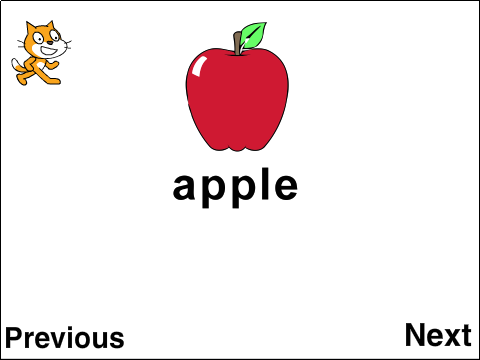
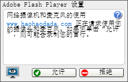

# 第5课 喵喵学英语

英语是世界上使用最广泛的语言之一，小猫“喵喵”也想学好英语，可以方便地与外国的小朋友交流Scratch学习经验。

在本课的范例作品中，小猫“喵喵”将学习三个英文单词：apple、banana、orange。单击“Next”和“Previous”可以在单词间切换，每切换到一个单词会播放该单词的朗读。



## 创意构思

范例作品中的舞台背景可以从“好好搭搭”网站下载，作为外部图片导入；另外还需要创建翻页用的“Next”和“Previous”角色、录制单词朗读的声音。在程序脚本中，需要充分利用“事件”类别中的指令控制背景图片的切换、控制单词朗读声音的播放。

要完成本课的创意构思，需要了解以下的新指令：

1.


属于“事件”类别指令，当鼠标单击这个指令所属的角色时触发，然后执行这个指令下方的程序脚本。

在Scratch中，“事件”是一个非常重要的概念，是指可以被计算机识别的操作。最常见的“事件”是“鼠标事件”，比如“单击”、“双击”、“指向”等，当这些事件发生后，就会执行该事件相对应的程序脚本。

[单击此处](http://haohaodada.com/video/a20501.php)或者扫描下方二维码可以观看以上内容相关的视频。


2.


属于“事件”类别指令，当切换到指定背景时触发，然后执行这个指令下方的程序脚本。单击指令中的下拉列表参数，可以选择触发这个事件的背景图片名称。

3.


属于“外观”类别指令，用于切换背景图片。单击指令中的下拉列表参数，可以选择需要切换的背景图片名称。

该指令有两个特殊的选项“下一个背景”、“上一个背景”。如果选择“下一个背景”，Scratch会将舞台背景切换到背景列表中的下一张图片；如果当前已经是最后一张图片，那么会切换到背景列表的第一张图片。

4.


属于“声音”类别指令，可以停止所有正在播放的声音。

### 角色脚本与背景脚本

在“角色列表区”单击某个角色缩略图，然后在“脚本区”所编写的脚本都是这个角色的“角色脚本”；而在“背景列表区”单击背景缩略图，然后在“脚本区”所编写的脚本都是“背景脚本”。

“背景脚本”通常是所有角色共用的脚本，是整个Scratch作品都要共同执行的；而“角色脚本”与具体的某个角色相关联，是这个角色所独有的，只有这个角色会执行。

[单击此处](http://haohaodada.com/video/a20502.php)或者扫描下方二维码可以观看以上内容相关的视频。


#### 试一试

请分别单击舞台背景缩略图与小猫角色缩略图，然后观察“指令区”中的指令，找一找哪些指令是“角色脚本”所独有的？哪些指令是“背景脚本”所独有的？

[单击此处](http://haohaodada.com/video/a20503.php)或者扫描下方二维码可以观看相关的视频。


## 脚本设计

### 第一步：导入外部图片作为舞台背景

本课范例作品中的舞台背景共有三张图片，是作为外部图片，从“好好搭搭”网站上下载后导入。具体可以按以下步骤操作：

1.打开网络浏览器，在地址栏中输入“haohaodada.com/a2”，打开本课的范例作品网页，单击网页右边的“资源下载”选项卡，下载“喵喵学英语图片”压缩文件。

2.将下载的文件解压缩，就会生成一个名为“喵喵学英语图片”的文件夹，里面包含“apple”、“banana”、“orange”三个图片文件。

3.单击“背景列表区”的


按钮；在“打开”对话框中找到并上传刚才下载的三个背景图片。

4.全部背景图片导入后，可以在“背景”选项卡左边看到四个背景缩略图。单击选中白色背景的缩略图，然后再单击缩略图右上角的


图标将这个没用的背景删除。

[单击此处](http://haohaodada.com/video/a20504.php)或者扫描下方二维码可以观看以上内容相关的视频。


### 第二步：创建用于翻页的文字角色

本课范例作品共有三个角色，其中小猫“喵喵”是默认的角色；另两个是文字角色，用于程序运行时前、后翻页。具体可以按以下步骤操作：

1.单击选中默认的小猫角色，将它重命名为“喵喵”；然后调整它的大小；最后将它拖放到舞台左上角的合适位置。

2.单击“角色列表区”右上角的


按钮，会打开“造型”选项卡；默认进入的是“位图编辑状态”，这种状态下创建的文字角色放大后会有很多锯齿，不美观，可以单击右下角的“转换成矢量编辑模式”按钮，在“矢量编辑状态”下创建文字角色。

3.单击““造型”选项卡”右边工具栏中的


按钮，在中间的“造型编辑区”单击，用键盘输入“下一页”的英文“Next”。

4.单击““造型”选项卡”右边工具栏中的


按钮，再单击选中刚才输入的文字，用鼠标拖动文字四周的控制点改变文字的大小。

5.根据以上介绍的方法再绘制第二个文字角色。先单击“角色列表区”右上角的


按钮，然后在““造型”选项卡”的“矢量编辑状态”下单击


按钮输入“上一页”的英文“Previous”，最后使用


按钮工具调整文字大小。

6.文字角色全部绘制完成后，用鼠标拖动舞台上的这两个文字角色，将它们摆放到合适的位置。

```text
注：由于Scratch功能的限制，在线版Scratch不能直接输入中文。如果需要在Scratch中使用中文，可以按照课后阅读材料的方法操作。
```

[单击此处](http://haohaodada.com/video/a20505.php)或者扫描下方二维码观看以上内容相关的视频。


#### 试一试

* 尝试在“造型”选项卡的“位图模式”下输入文字，然后单击舞台左上角的

  !\[\]\(../../.gitbook/assets/scratch5-9.png

  图标，在全屏状态下比较这两种模式所绘制文字的区别。

[单击此处](http://haohaodada.com/video/a20506.php)或者扫描下方二维码可以观看相关视频。


### 第三步：录制单词朗读文件

本课范例作品中，每个英语单词出现的同时，会自动播放这个单词的朗读。如果你有能在计算机上录音用的话筒（一般笔记本电脑内置有话筒），就可以按照以下步骤操作录制声音（如果不能录制朗读，也可以从“好好搭搭”网站的本课范例作品网页中下载相应的声音文件）：

1.由于这些单词的朗读是在切换到相应的背景图片时播放的，因此应该先单击“背景列表区”的缩略图，然后再单击进入“声音”选项卡。

2.单击“声音”选项卡左上角的


按钮，就会增加一个空白声音缩略图，可以删除编辑区域上方文本框中默认的声音名称，重新输入所要朗读的单词作为声音名称。

3.如果使用的是外置的话筒，将话筒连接到计算机上。

4.单击“声音控制区域”中的


按钮开始录音。如果使用的是网络版的Scratch，开始录音之前会显示如下图所示的对话框，必须单击“允许”按钮才能继续录音。



5.单词朗读完成以后，单击“声音控制区域”中的


按钮停止录音。

[单击此处](http://haohaodada.com/video/a20507.php)或者扫描上方的二维码可以观看以上内容相关的视频。


#### 试一试

尝试使用“声音控制区域”的工具，对录制的声音进行编辑。

[单击此处](http://haohaodada.com/video/a20508.php)或者扫描下方二维码可以观看相关视频。


### 第四步：编写角色代码切换背景

“喵喵学英语”作品中单词的切换，是通过单击“Next”向后翻页、单击“Previous”向前翻页实现的。具体可以按照以下步骤操作：

1.单击选中“Next”角色，将“事件”类别中的


指令拖动到脚本区。

2.再将“外观”类别中的


指令拖动到脚本区组合到上一个指令的下方；然后从下拉列表参数中选择“下一个背景”。

3.“Previous”角色的脚本与“Next”类似，可以将“Next”的脚本拖动到“Previous”角色缩略图上放开鼠标，可以复制这段脚本。

4.单击“Previous”角色，可以在脚本区看到刚才复制的脚本，修改


指令的参数为“上一个背景”。

[单击此处](http://haohaodada.com/video/a20509.php)或者扫描下方二维码可以观看以上内容相关的视频。


#### 想一想


有什么不同？

[单击此处](http://haohaodada.com/video/a20510.php)或者扫描下方二维码可以观看相关视频。


### 第五步：编写背景代码播放声音

“喵喵学英语”这个作品中，切换到哪个单词，就会播放这个单词的朗读。由于这些声音需要跟背景对应起来，因此播放声音的脚本应该编写在背景代码中。具体可以按以下步骤操作：

1.单击“背景列表区”的背景缩略图，将“事件”类别中的


指令拖动到脚本区，然后在指令下拉列表中选择“apple”。

2.将“声音”类别中的


指令拖动组合到上一个指令的下方。

3.将


指令作为第三条指令，与前两条指令组合；然后在指令下拉列表参数中选择播放的声音是“apple”。

4.另两个单词的声音播放脚本与“apple”类似，可以用鼠标右键单击“apple”这段脚本的第一个指令，在打开的菜单中选择“复制”选项，就可以复制出完全相同的一段脚本，将这段脚本摆放到“脚本区”合适的位置。再修改所复制脚本中的指令参数为“banana”。

5.继续复制脚本，并且修改所复制脚本的指令参数为“orange”。

[单击此处](http://haohaodada.com/video/a20511.php)或者扫描下方二维码可以观看以上内容相关的视频。


#### 想一想

* 在编写背景代码播放声音时，能否不使用


  指令？为什么？

[单击此处](http://haohaodada.com/video/a20512.php)或者扫描下方二维码可以观看相关视频。


## 拓展思考

“喵喵”英语学得可开心了，请你使用学过的知识，让它的学习过程变得更有趣。

