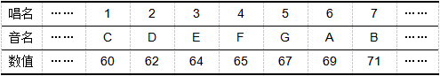

# 第6课  喵喵演奏会

小猫“喵喵”去听了一场音乐会后，它可高兴了。于是决定立即去找它的小伙伴“咪咪”，一起自己来举办一场演奏会。

在本课的范例作品中，“喵喵”将和“咪咪”一起在Scratch中演奏儿童乐曲“小蜜蜂”。首先是“咪咪”的钢琴独奏表演，随后是“喵喵”的打鼓表演，最后是它俩的合奏表演。

## 创意构思

可以使用Scratch弹奏指令来完成喵喵演奏会曲谱的演奏。此外，可以通过先前学过的单击角色的切换方法来进行节目的变更。也就是单击“咪咪弹琴”角色时，弹奏音符；当单击“喵喵打鼓”角色时，弹奏鼓声；当单击舞台背景时，“喵喵”和“咪咪”一起表演合奏。

要完成本课的创意构思，需要了解以下的新指令：

1.  

属于“声音”类别指令，按指定的音符、节拍弹奏音乐。指令的第一个参数确定弹奏的音符，可以单击下拉列表参数，在打开的虚拟键盘上单击琴键选择。指令的第二个参数确定弹奏的节拍。

在Scratch中，每个弹奏的音符都可以用一个数表示。在单击虚拟键盘的琴键时，可以在琴键下方看到具体的音名和数值。

在Scratch中，“节拍”就是发出声音的时间长度。默认状况下，1拍相当于1秒。

2.  

属于“声音”类别指令，按指定的乐器、节拍弹奏鼓声。指令的第一个参数确定具体的乐器，一共有18种打击乐器可供选择；第二个参数确定具体的节拍。

3.  

属于“声音”类别指令，相当于乐谱中的休止音符；指令的参数确定休止音符的节拍数。

4.  

属于“声音”类别指令，用于控制音乐弹奏时的速度；指令的参数是具体的速度值，默认值是“60”bpm，也就是每分钟弹奏60个节拍。

## 脚本设计

### 第一步：设置舞台背景和角色

本课范例作品中的舞台背景是从“背景库”中选取的，角色是作为外部图片，从“好好搭搭”网站上下载后上传的。具体可以按以下步骤操作：

1. 单击“背景列表区”的  按钮，从“背景库”中上传“stage1”背景图片；同时删除默认的空白背景图片。

2. 由于本课范例不需要使用默认的小猫角色，因此可以右键单击小猫角色，在打开的菜单中选择“删除”选项将它删除。

3. 打开网络浏览器，在地址栏中输入“haohaodada.com/a2”，打开本课的范例作品网页，下载“喵喵演奏会”压缩文件。

4. 将下载的压缩文件解压缩，会在“喵喵演奏会”文件夹里看到“咪咪弹琴”、“喵喵打鼓”这两个图片文件。
5. 单击“角色列表区”的  按钮，分别将下载的两个图片作为“本地文件”上传角色；上传完成后，将这两个角色用鼠标拖动到合适的位置。

[单击此处](http://haohaodada.com/video/a20601.php)或者扫描下方二维码可以观看以上内容相关的视频。

*  

#### 

### 第二步：单击咪咪把琴弹

在本课的范例作品中，单击“咪咪弹琴”角色，就会演奏“小蜜蜂”这首乐曲。

1. 单击选中“咪咪弹琴”角色，将“事件”类别中的  指令拖动到“脚本区”。

2. 再将“声音”类别中的  指令拖动并与第一个指令组合；然后，设置第一个参数为“5”所对应的数值“67”，设置第二个参数为“1”；也就是弹奏“5”这个音符1拍。

3. 按同样的方法再添加两个  指令到“脚本区”与原有指令组合；设置音符参数为“4”所对应的“65”、“3”所对应的“64”，节拍数都是“1”。

4. 乐谱中的第4个音符是一个长度为一拍的休止符，可以将“声音”类别中的  指令拖动到“脚本区”与前四个指令组合，并将参数修改为“1”。
5. 按以上方法继续添加指令、修改参数，演奏“小蜜蜂”乐曲剩余的音符。

[单击此处](http://haohaodada.com/video/a20602.php)或者扫描下方二维码观看以上内容相关的视频。

*  

 #### 想一想

 仔细观察“小蜜蜂”乐谱，有没有发现乐谱中有重复的小节？对于这些重复的音符，你有什么办法可以加快程序脚本的编写？

 [单击此处](http://haohaodada.com/video/a20603.php)或者扫描下方二维码可以观看相关视频。

-  

### 第三步：单击喵喵来打鼓

单击小猫“喵喵打鼓”角色，它将根据“小蜜蜂”乐曲的节奏演奏鼓声，具体可以按以下步骤操作：

1. 单击选中“喵喵打鼓”角色，将“事件”类别中的  指令拖动到“脚本区”。

2. 再将“声音”类别中的  指令拖动并与第一个指令组合；设置指令第一个参数为“2”，也就是“低音鼓”；第二个参数为“1”，也就是“1拍”。

3. 按同样的方法再添加两个  指令到“脚本区”与原有指令组合；设置这两个指令的第一个参数都为“低音鼓”，第二个参数都是“0.5拍”。

通过观察乐谱可以发现，“小蜜蜂”这首乐曲共有12个小节，每个小节的节奏都相同，也就是同样的节奏重复了12次。

4. 将“控制”类别中的  指令拖动到  下方，与原有指令组合起来；修改指令参数为“12”。

完整的程序脚本如下图所示：

[单击此处](http://haohaodada.com/video/a20604.php)或者扫描上方的二维码可以观看以上内容相关的视频。

*  

 #### 试一试

 如果想让“小蜜蜂”这首曲子的鼓声节奏变得更快，可以怎样操作?

 [单击此处](http://haohaodada.com/video/a20605.php)或者扫描下方二维码可以观看相关视频。

-  

 #### 练一练

 编写程序脚本，使单击舞台背景的时候，小猫“喵喵”和“咪咪”能够合奏“小蜜蜂”这首乐曲，也就是一个弹琴、一个打鼓。

 [单击此处](http://haohaodada.com/video/a20606.php)或者扫描下方二维码可以观看相关视频。

-  

## 拓展思考

“喵喵”和“咪咪”成功举办了演奏会！伴着优美的乐曲，小伙伴们跳起舞来。请你再添加角色，让角色能够与乐曲配合跳舞。

