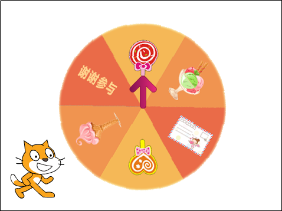
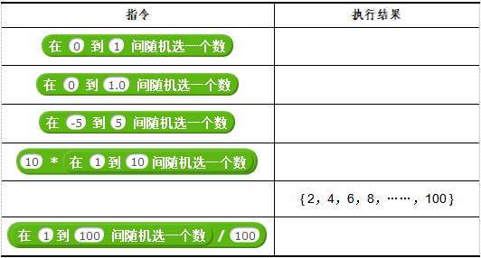

# 第7课 喵喵大抽奖

小猫“喵喵”第一次为班会课做主持，设计了一个抽奖环节，可惜没有抽奖用的大转盘，我们可以用Scratch做一个幸运大抽奖转盘程序帮助它。

本课要完成的抽奖转盘由“箭头”和“转盘”两部分组成。抽奖时，转盘会沿顺时针方向连续转动一个角度后停止。此时，箭头所指向的物品就是所获的奖品。

## 创意构思

幸运大抽奖转盘上的箭头是固定不动的，转动的只是转盘；转盘旋转的角度每次都应该不一样，应该随机产生旋转的角度值。

要完成本课的创意构思，需要了解以下的新指令：

1.

属于“数字和逻辑关系”类别指令，将指令中两个参数的值进行乘法运算。与这个指令相类似的还有

这些运算指令。

2.

属于“数字和逻辑关系”类别指令，可以在指定范围内产生一个随机数；指令中的两个参数确定这个随机数产生的范围。使用这个指令，可以使游戏或者模拟类的程序更有趣、更真实。

#### 试一试

* 在“指令区”设置 

指令的参数，然后单击运行指令，研究所产生随机数的规律？

[单击此处](http://haohaodada.com/video/a20701.php)或者扫描下方二维码可以观看相关的视频。

## 脚本设计

### 第一步：导入并设置角色

本课范例作品中的舞台背景采用默认的空白图片，角色有三个。其中“转盘”是外部图片文件，可以从“好好搭搭”网站下载后导入。具体可以按以下步骤操作：

1.打开网络浏览器，在地址栏中输入“haohaodada.com/a2”，打开本课的范例作品网页，单击网页右边的“资源下载”选项卡，下载“转盘”图片。

2.单击“角色列表区”工具栏中的

按钮；在“打开”对话框中找到并上传刚才下载的“转盘”图片。

3.另一个角色“箭头”是从“角色库”中选取的，可以先单击“角色列表区”右上角的

按钮，在打开的“角色库”对话框中找到并且双击名为“Arrow1”的缩略图；然后在“造型”选项卡中删除多余的造型，仅保留第四个向上的箭头造型；最后将它拖动到舞台中央，使箭头底部对准“转盘”的中心位置。

4.最后一个是默认的小猫角色。将它重命名为“喵喵”，调整它的大小，再将它拖放到舞台左下角的合适位置。

[单击此处](http://haohaodada.com/video/a20702.php)或者扫描下方二维码可以观看以上内容相关的视频。

#### 试一试

在导入角色时，如果先导入箭头，再导入“转盘”，会出现什么问题？应该如何解决？

[单击此处](http://haohaodada.com/video/a20703.php)或者扫描下方二维码可以观看相关的视频。

### 第二步：让转盘动起来

在本课的范例作品中，转盘是沿顺时针方向旋转的。下面以转盘顺时针转60度为例，介绍具体的操作方法：

1.选中“转盘”角色，将“事件”类别中的

指令拖动到脚本区。

2.将“控制”类别中的

指令拖动并且与第一个指令组合，修改这个指令的参数为“60”。

3.将“动作”类别中的

指令拖动组合进第二个指令的中间，修改这个指令的参数为“1”。

具体的程序如下图所示：

[单击此处](http://haohaodada.com/video/a20704.php)或者扫描下方二维码观看以上内容相关的视频。

#### 试一试

* 如果不按以上步骤操作，只使用

指令（如下图所示），运行时会有什么不同？你认为哪段脚本最合适？

[单击此处](http://haohaodada.com/video/a20705.php)或者扫描下方二维码可以观看相关视频。

### 第三步：让转盘转动一个随机角度

本课的范例作品中，转盘转动的角度是随机的，这样才符合实际生活中抽奖的需要。这就需要使用随机数指令，具体可以按以下步骤操作：

1.将

指令拖动到

指令的参数位置附近，当出现白色吸附线时，放开鼠标左键，

指令就会组合到

指令的参数位置上。

2.修改

指令的第二个参数为“360”。

[单击此处](http://haohaodada.com/video/a20706.php)或者扫描上方的二维码可以观看以上内容相关的视频。

#### 想一想

如果想改变转盘的速度，可以怎么操作呢？

[单击此处](http://haohaodada.com/video/a20707.php)或者扫描下方二维码可以观看相关视频。

### 第四步：完善抽奖转盘

根据以上步骤的操作，转盘能够向右随机旋转一个角度，从而使箭头指向奖品区的某个奖品。但多次实际运行程序后可以发现，偶尔箭头会指向两个奖品的交接处，这就难以判断到底是哪个奖品了。要解决这个问题，可以让箭头随机旋转的角色始终是60的倍数，这样箭头只会停留在奖品区域的正中间。要实现这个功能，关键是产生的随机数应该是60的倍数，可以按以下步骤操作：

1.将

指令拖动到“指令区”空余区域，先不要组合进程序脚本中，再输入“60”作为指令的第一个参数。

2.将

指令拖动到

指令第二个参数的位置组合起来，修改

指令的两个参数分别为“1”和“6”。这样产生的随机数始终是60的倍数。

3.将以上两步组合完成的指令再组合到“重复执行”指令的参数位置。

具体的脚本如下图所示：

[单击此处](http://haohaodada.com/video/a20708.php)或者扫描下方二维码可以观看以上内容相关的视频。

## 拓展思考

在“喵喵”的帮助下，班会的抽奖环节圆满举行，“喵喵”也赢得了同学们的掌声。不过“喵喵”觉得这个抽奖转盘还不够完美。请你展开想象，用学过的知识帮助“喵喵”，让抽奖转盘变得更加丰富。

