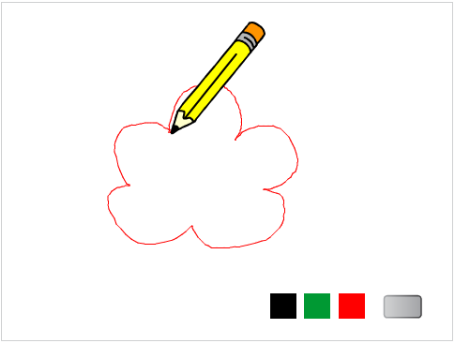

# 第9课 喵喵学画画

看到朋友们在电脑上画出各种各样好看的图画，“喵喵”可羡慕了，它也想学习画画。让我们一起来帮“喵喵”学画画吧。

在本课的范例中，我们需要制作的是一块能够自由画画的画板。该画板拥有清屏功能，也可以选择不同颜色的画笔来绘图。

## 创意构思

为了制作一块能够自由画画的画板，可以使用鼠标来控制画笔，如果按住鼠标左键在舞台上移动，可以将鼠标移动的轨迹画出来。除此之外，通过广播的方式，设置画笔的颜色以及清除屏幕功能。

要完成本课的创意构思，需要了解以下的新指令：

1.

属于“画笔”类别指令，执行该指令后，角色在舞台上移动时会留下画笔轨迹。

2.

属于“画笔”类别指令，作用与上一个指令正好相反，角色在舞台上移动时不会留下画笔轨迹，默认状态下，所有角色都处于这种状态。

3.

属于“画笔”类别指令，清除舞台中所有的画笔轨迹e。

4.

于“画笔”类别指令，将画笔颜色设置成指定颜色。单击指令中的颜色参数，然后用鼠标在需要设定的颜色上单击，就会设置这个颜色作为画笔颜色。

5.

属于“画笔”类别指令，将画笔设置成指定粗细；指令的参数就是具体的粗细值。

6.

属于“事件”类别指令，当按下键盘上的指定按键时，执行指令下方的脚本；可以在下拉列表参数中选择具体的按键。

7.

属于“控制”类别指令，可以编写“选择”结构的程序脚本。它包含两段相互独立的脚本，当指定的条件成立时，执行第一段脚本；如果不成立，执行第二段脚本。指令的参数就是判断的条件。

[单击此处](http://haohaodada.com/video/a20901.php)或者扫描下方二维码可以观看以上内容相关的视频。

8.

属于“控制”类别指令，Scratch“循环”程序结构的一种，可以无条件地重复执行指令所包含的脚本。

9.

属于“动作”类别指令，当鼠标位于舞台范围内时，可以将角色定位到鼠标指针位置。

10.

属于“侦测”类别指令，检测是否按下了鼠标左键。

11.

属于“外观”类别指令，在舞台上显示或者隐藏角色。

## 脚本设计

### 第一步：准备背景

一个完整的作品，应该有一个软件封面。一般封面包含作品名称、作者、操作说明等信息。运行程序后，首先就显示软件封面。因此，本课范例包含“封面”和“画板”两个背景：

1. 使用PowerPoint制作一张幻灯片作为封面的背景图片。内容为：“作品名称：神奇的画板”，“作者：喵喵”，“操作说明：按空格键，进入画板！”。制作完成后将幻灯片保存为“封面”。
2. 将制作保存的“封面”图片导入到Scratch，作为舞台背景。
3. 修改默认的舞台背景名称，重命名为“画板”；调整这两个背景缩略图的顺序，第一个背景缩略图为“封面”，第二个为“画板”。

[单击此处](http://haohaodada.com/video/a20902.php)或者扫描下方二维码可以观看以上内容相关的视频。

#### 想一想

软件封面还可以怎样设计？

### 第二步：准备角色

本课范例作品有五个角色，可以按以下步骤准备这些角色：

1.由于本课范例不需要使用默认的小猫角色，可以将它删除。

2.从Scratch角色库中导入“Pencil”和“Button3”这两个角色，再分别重命名为“画笔”和“板擦”。

3.单击“角色列表区”的

按钮，进入“造型”选项卡后，单击右下角的

按钮，进入“矢量模式”。

4.单击选中“矢量工具按钮”中的

按钮，再单击选中“颜色”区域的

及“填充模式”中的

最后在“造型编辑区”拖动鼠标，画出一个红色矩形；将这个新角色命名为“红色”。

5.在“角色列表区”右键单击“红色”角色缩略图；然后，在快捷菜单中选择“复制”选项，将复制的角色重命名为“绿色”

6.单击“绿色”角色，进入这个角色的“造型”选项卡，将造型中的矩形填充成绿色。

7.按同样的方法再复制一个角色，重命名为 “黑色”，再将造型中的矩形填充成黑色。

8.调整所有角色的大小，并把它们摆放到舞台的合适位置。

[单击此处](http://haohaodada.com/video/a20903.php)或者扫描下方二维码观看以上内容相关的视频。

### 第三步：隐藏角色

范例程序运行后，首先显示的是“封面”背景，而其它角色此时都是隐藏的。因此，首先需要单击背景缩略图，添加以下图所示的背景脚本：

然后，还需要分别为“画笔”、“红色”、“绿色”、“黑色”和“板擦”这些角色添加如下图所示的角色脚本：

[单击此处](http://haohaodada.com/video/a20904.php)或者扫描上方的二维码可以观看以上内容相关的视频。

### 第四步：显示角色

当按下键盘上的“空格键”后，需要先将舞台背景切换成“画板”；然后再向所有角色广播“开始”消息。相关的背景脚本如下图所示：

当“画笔”、“红色”、“绿色”、“黑色”和“板擦”角色收到“开始”消息后，应该在舞台上显示。因此这些角色都应该有如下图所示的角色脚本：

[单击此处](http://haohaodada.com/video/a20905.php)或者扫描下方二维码可以观看以上内容相关的视频。

#### 试一试

程序开始运行的时候不隐藏这些角色，会出现什么问题？

[单击此处](http://haohaodada.com/video/a20906.php)或者扫描下方二维码可以观看相关视频。

### 第五步：让画笔动起来

为“画笔”角色添加如下图所示脚本，可以使它能够跟随鼠标移动：

[单击此处](http://haohaodada.com/video/a20907.php)或者扫描下方二维码可以观看以上内容相关的视频。

#### 想一想

* 上述脚本中的

  

  指令能否删除？为什么？

[单击此处](http://haohaodada.com/video/a20908.php)或者扫描下方二维码可以观看相关视频。

### 第六步：在舞台上绘图

要让“画笔”在舞台上绘图，需要首先检测是否按下鼠标左键，如果按下了，那么就“落笔”，使画笔在移动的同时留下笔迹；如果没有按下鼠标左键，那么就“抬笔”，使画笔移动的同时不留下笔迹。

[单击此处](http://haohaodada.com/video/a20909.php)或者扫描下方二维码可以观看以上内容相关的视频。

### 第七步：设置“画笔”角色的造型中心

通过以上操作，可以通过鼠标控制“画笔”角色在舞台上作画。但按下鼠标左键时，并没有从“画笔”的笔尖位置产生线条，这是为什么呢？ 原来，在Scratch中，每个角色都有一个“造型中心”。在默认的情况下，造型中心位于造型的中心位置，所以按下鼠标左键画出的线条是从“画笔”的造型中心画出来。正确状态下应该是从“画笔”的笔尖画出线条，这就需要将“画笔”的造型中心变更到笔尖位置： 要设置“画笔”角色的造型中心，可以按以下步骤操作：

1. 选中“画笔”角色，再单击“造型”选项卡。
2. 单击造型编辑窗口右上角的按钮，可以看到在造型编辑区有两条直线相交，交点位置就是角色的造型中心。
3. 在“画笔”角色的笔尖位置单击，将造型中心变更到笔尖位置。

[单击此处](http://haohaodada.com/video/a20910.php)或者扫描下方二维码可以观看以上内容相关的视频。

### 第八步：设置画板按钮功能

通过单击舞台下方的“红色”、“绿色”和“黑色”这三个角色，可以设置画笔的颜色，使画笔的颜色更为丰富。

依次为单击这三个角色，分别添加以下图所示脚本：

然后，在“画笔”角色的脚本中添加以下的消息处理脚本：

[单击此处](http://haohaodada.com/video/a20911.php)或者扫描下方二维码可以观看以上内容相关的视频。

#### 练一练

为画板中的“板擦”角色编写脚本，使得单击后能够清除“画板”上的图画。

[单击此处](http://haohaodada.com/video/a20912.php)或者扫描下方二维码可以观看相关视频。

## 拓展思考

“喵喵”学画画用的画板终于制作完成了，你还能够为这块画板添加更多的功能吗？

