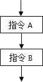
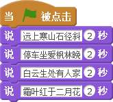
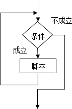
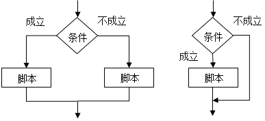

# 阅读材料五：Scratch中的三种程序结构

在Scratch虽然只是面向少年儿童的“积木式”的程序设计语言，但却能像其它计算机语言一样编写出顺序、循环、选择这三种基本结构组成的脚本。三种基本结构的脚本之间相互配合，共同实现具有复杂功能的程序功能。

### 一、顺序结构

顺序结构的Scratch脚本由多条指令顺次拼接而成，并按从上往下的顺序依次执行。即，先执行指令A，再执行指令B。

例如，在“喵喵背古诗”作品中，喵喵背诵《山行》的脚本就是按照先后顺序一个个指令依次执行。

[单击此处](http://haohaodada.com/video/a21101.php)或者扫描下方二维码可以观看以上内容相关的视频。

 

### 二、循环结构

循环结构的Scratch脚本，在执行过程中能够重复执行同一段脚本，这段脚本被称为“循环体”。可以为循环结构的脚本设置一个循环条件，也就是当条件成立时才执行循环体内的指令，当条件不成立时则向下执行后续指令。

如果“顺序结构”的脚本中存在呈周期性重复出现的指令，就可以使用循环结构来进行简化，可以大大减少脚本编写的工作量。

Scratch提供、、三个循环指令，其中，指令没有循环结束条件；会一直执行循环体；而  和 指令则由参数来确定循环条件，指定重复的次数或者重复的条件。

[单击此处](http://haohaodada.com/video/a21102.php)或者扫描下方二维码观看以上内容相关的视频。

 

### 三、选择结构

选择结构的Scratch脚本，将根据给定的条件是否来成立，来决定是否执行相应的脚本。选择结构分为单选择结构和双选择结构。

在Scratch中，  和  指令分别用于实现单选择结构和双选择结构。在“喵喵学画画”作品中，就使用了双选择结构程序脚本，实现鼠标左键控制抬笔和落笔功能。

[单击此处](http://haohaodada.com/video/a21103.php)或者扫描下方二维码观看以上内容相关的视频。

 

 