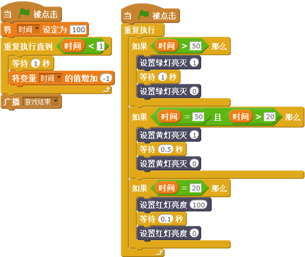

# 第10课 综合作品制作——森林小卫士

宁静的森林里来了一群无恶不作的恶魔，它们在森林里横冲直撞、肆意毁坏森林。勇敢的森林小卫士为了保护森林挺身而出，它能不停地发射子弹，还能上下左右灵活躲闪。在100秒之内，小卫士能打败恶魔，取得胜利吗？让我们一起帮助森林小卫士保卫森林吧！

## 模块与指令

要制作本课的范例作品，需要用到以下这些指令：

#### 想一想

除了以上这些传感器指令，在这个游戏中，你还打算还使用哪些？让它们分别实现什么功能？

[单击此处](http://www.haohaodada.com/video/b11001)或者扫描下方二维码可以观看相关的视频。

## 作品制作

要完成这个任务，我们首先需要编写恶魔在森林里飞行、横冲直撞的脚本；然后再编写读取传感器板上的摇杆、按键等传感器数值、控制森林小卫士飞行、发射子弹，补充子弹的脚本；当然，游戏还应该有得分统计、生命值计算等脚本，让游戏变得更加有意思。

### 第一步：设置舞台背景与角色

[单击此处](http://www.haohaodada.com/video/b11002)或者扫描下方二维码可以观看相关的视频。

1.找到“背景库”中的“blue sky”作为舞台背景、“角色库”中的“Gobo”作为森林小卫士、“Bananas”作为子弹、“Ghost2”作为恶魔，调整这些角色的大小和位置。

2.单击“角色列表区”的

按钮新建角色。进入造型编辑的“矢量模式”，使用“文字”工具添加“The game victory”和“Game over”这两个文字角色，用于表示游戏胜利和游戏结束。

3.对舞台背景和角色按要求统一重命名，同时隐藏舞台上无关的传感器数值。

4.为舞台添加“声音库”中的“jungle”、子弹添加“laser1”、恶魔添加“chomp”声音。

### 第二步：编写森林小卫士角色脚本

[单击此处](http://www.haohaodada.com/video/b11003)或者扫描下方二维码可以观看相关的视频。

### 第三步：编写恶魔角色脚本

[单击此处](http://www.haohaodada.com/video/b11004)或者扫描下方二维码可以观看相关的视频。

范例游戏中的恶魔通过克隆，从舞台的右侧不断向左侧飞行，向小卫士进攻。它的第一段脚本是先设置隐藏，然后不断的克隆自己。

第二段脚本是当恶魔作为克隆体启动后，先在舞台右侧的随机起始位置显示，然后向舞台左侧的随机终点位置飞行。

第三段脚本是当恶魔作为克隆体启动后，如果在飞行过程中碰到子弹，就删除这个克隆体、播放被击中的声音；如果没有碰到子弹，飞行到舞台边缘时，也删除克隆体。

### 第四步：编写子弹的脚本

[单击此处](http://www.haohaodada.com/video/b11005)或者扫描下方二维码可以观看相关的视频。

本课范例程序的“子弹”就是“香蕉”，它是森林小卫士进攻的武器。

第一段脚本首先新建“子弹”变量，并设置它的初始值为“5”；然后重复执行：当子弹数量大于0时，如果按下传感器板上的“Up”键，会克隆子弹、播放发射子弹的声音、减少子弹变量值。具体脚本代码如下左图所示。

第二段脚本是当“子弹”作为克隆体启动后，先移动到“森林小卫士”角色边上显示，然后使用重复执行指令：让“子弹”向右移动、同时旋转产生动态效果，增加游戏趣味性；同时判断子弹克隆体在飞行过程中，如果碰到恶魔或者舞台边缘，都删除克隆体。具体脚本代码如上右图所示。

第三段脚本是检测有没有按下传感器板上的“Down”键，如果按下了，那么重新设置子弹数量为5。具体脚本代码如下图所示。

### 第五步：设置生命系统

[单击此处](http://www.haohaodada.com/video/b11006)或者扫描下方二维码可以观看相关的视频。

为了增加游戏的可玩性，还可以设置游戏的生命系统。本课范例游戏中，当森林小卫士被恶魔碰到，它的生命值就会减少，当生命值为零的时候，游戏失败。随着生命值的减少，传感器板上的蜂鸣器可以发出不同的警报声音。

首先选中“森林小卫士”角色，新建“生命”变量、设置生命变量的初始值为5。每次碰到“恶魔”角色，“生命”变量值就减少1，当这个值小于1、也就是等于0时，广播“游戏结束”。完整的脚本代码如下左图所示：

第二段代码同样也在“森林小卫士”脚本中添加，在“重复判断”指令中判断：当生命值小于4并且大于1时，传感器板上蜂鸣器发出相对急促的警报声；当生命值等于1时，蜂鸣器会发出非常急促的警报声。具体脚本代码如上右图所示。

### 第六步：设置计分系统

[单击此处](http://www.haohaodada.com/video/b11007)或者扫描下方二维码可以观看相关的视频。

一个完整的游戏，还应该有计分系统。本课范例游戏中，每次“森林小卫士”的子弹击中恶魔，就会累计得分，当得分达到一定的数值时，广播“游戏胜利”消息。

首先选中舞台背景缩略图，新建“得分”变量、设置“得分”变量的初始值为0；然后在重复指令中判断：如果得分变量大于490（也就是达到500分），就广播“游戏胜利”。具体脚本代码如下图所示。

还应该选中“子弹”角色，在它作为“克隆体启动”的脚本中添加：如果碰到“恶魔”，那么“得分”变量值增加10。

### 第七步：设置游戏计时系统

[单击此处](http://www.haohaodada.com/video/b11008)或者扫描下方二维码可以观看相关的视频。

为了增加游戏的难度和紧张感，一般在游戏中还需要加入计时系统。在范例游戏中，游戏时间为100秒，随着时间的减少，传感器板上的绿色、黄色、红色LED灯会依次亮起，提示玩家注意时间。

同样也是先选中舞台背景缩略图，新建“时间”变量、设置“时间”变量的初始值为“100”；然后添加倒计时脚本：以秒为单位依次减少时间，当变量为0的时，广播“游戏结束”。具体脚本代码如下左图所示。

还可以在舞台脚本中添加传感器板上的LED灯提示脚本：当时间大于50秒时，绿灯闪烁；当时间等于50并且大于20时，黄灯闪烁；当时间等于20时，红灯闪烁。具体脚本代码如上右图所示。

### 第八步：设置游戏结束

[单击此处](http://www.haohaodada.com/video/b11009)或者扫描下方二维码可以观看相关的视频。

本课范例游戏一开始，“游戏胜利”和“游戏结束”文字角色隐藏；当接收到“游戏胜利”或者“游戏结束”消息时，显示相应角色。具体这两个角色的脚本代码如下图所示：

#### 拓展思考

拓展思考

开动脑筋，你能让“森林小卫士”这个游戏更好玩吗？比如：可以添加合适的背景音乐；除了常规子弹外，还可以添加超级炸弹；在战斗过程中，森林小卫士得到不同的奖励等等。

