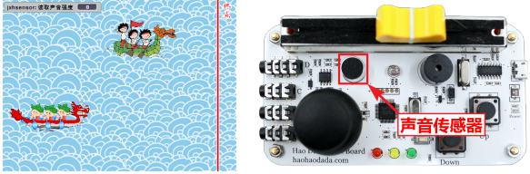
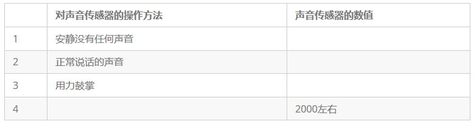
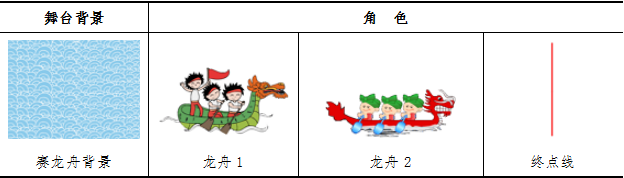
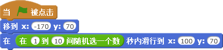
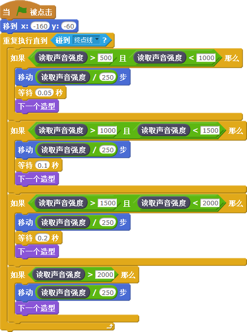
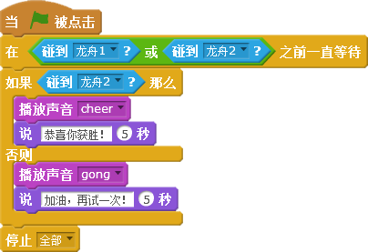
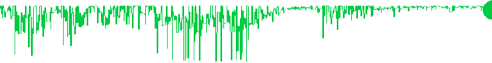

# 第六课  

同学们，你们知道中国传统节日端午节有什么习俗吗？o 吃粽子、挂艾草、放风筝、戴香包……当然还少不了赛龙舟。赛龙舟时通常会有人给他们击鼓加油。我们可以用Scratch设计一个赛龙舟的游戏，通过传感器板上的声音传感器，将我们的加油声传递给划龙舟的小伙伴们，帮助他们赢得比赛。

## 模块与指令

要完成本课的创意构思，需要了解以下的新知识、使用以下的新指令：

### 声音传感器

[单击此处](http://www.haohaodada.com/video/b10601)或者扫描下方二维码可以观看相关的视频。

声音传感器里面有一个对声音敏感的电容式驻极体话筒。声波会使话筒内的驻极体薄膜振动，从而使电容产生相对应的微小电压变化，通过转化和采集后输出相应的电压变化。

### “读取声音强度”指令：

读取传感器板上的声音传感器当前接收到的声音强度数值，取值范围（0，4095）。

声音的强度又称音量，也叫响度。人耳感受到的声音强弱，是人对声音大小的一个主观感受。对于同一个声音来说，距离越远，声音强度越小。

#### 试一试

登录“好好搭搭”网站，连接传感器板，根据下表的要求操作，观察舞台上显示的声音强度数值，将不同状态下的声音强度数值记录下来。

[单击此处](http://www.haohaodada.com/video/b10602)或者扫描下方二维码可以观看相关的视频。

## 作品制作

要完成本课范例，可以先添加舞台、龙舟角色；然后设置两条龙舟的运动速度，其中一条龙舟是由程序自动控制的，另一条龙舟是根据我们加油声的声音强度来控制的；最后哪条龙舟先触碰终点线，就是哪个获胜。

### 第一步：设置舞台背景与角色

[单击此处](http://www.haohaodada.com/video/b10603)或者扫描下方二维码可以观看相关的视频。

本课范例所使用的背景和角色需要从网站上下载，作为外部图片文件导入：

1.打开网络浏览器，在地址栏中输入“haohaodada.com/b1”，进入“好好搭搭”网站，打开本课的范例程序网页，单击网页右边的“资源下载”选项卡，下载“赛龙舟”压缩文件，然后将下载的文件解压缩到本地计算机上。

2.单击“舞台列表区”工具栏中的

按钮，通过“打开”对话框上传刚才下载并解压缩到文件夹中的“赛龙舟背景”图片。

3.单击“角色列表区”工具栏中的

按钮，通过“打开”对话框分别上传刚才下载并解压缩到文件夹中的“龙舟1”、“龙舟2”图片；再单击“角色列表区”工具栏中的“绘制新角色”按钮，在“造型”选项卡中绘制一条红线作为比赛的“终点线”；调整这三个角色的位置，使两条龙舟在舞台左侧、红色“终点线”在舞台右侧。

4.单击选中“终点线”角色，在“声音”选项卡中通过单击

按钮，在声音库中找到“人声”类别中的“cheer”作为比赛胜利的效果声；“效果”类别中的“gong”作为比赛失败的效果声。

5.单击隐藏舞台上除“声音强度”以外，其它无关的传感器数值。

### 第二步：编写“龙舟1”角色脚本

[单击此处](http://www.haohaodada.com/video/b10604)或者扫描下方二维码可以观看相关的视频。

“龙舟1”是由软件自动控制的，先将它移动到合适的起点位置，观察它的坐标值，其中X值大致为“-170”，y值大致为“70”；再将龙舟向终点方向移动，触碰到终点线，这时X值大致为“100”，y值可以保持不变。为了让比赛更精彩，可以设置“龙舟1”的移动速度是1-10秒之间的随机数。具体的脚本代码如下图所示。

#### 想一想

除了使用滑行指令控制“龙舟1”移动，还能用其他方式控制它的移动吗？

[单击此处](http://www.haohaodada.com/video/b10605)或者扫描下方二维码可以观看相关的视频。

### 第三步：编写“龙舟2”角色脚本

[单击此处](http://www.haohaodada.com/video/b10606)或者扫描下方二维码可以观看相关的视频。

“龙舟2”是由传感器板上的声音传感器所获取的声音强度控制的。为了获得比较好的控制效果，应该先测量“安静”和“加油”这两种环境下声音传感值的变化范围。

在本课范例中，经过尝试得出声音强度变化的大致范围为（500，2000）。

可以把声音强度的变化区间以500为单位分成四段：非常响：（大于2000），响：（1500，2000），一般响：（1000，1500），轻：（500，1000）。

根据不同的声音响度，决定造型切换的速度、角色移动的速度。

具体代码如下图所示：

#### 试一试

尝试修改代码中的参数，使得“龙舟2”的移动速度和造型变化更符合你的想法。

[单击此处](http://www.haohaodada.com/video/b10607)或者扫描下方二维码可以观看相关的视频。

### 第四步：判断比赛结果

[单击此处](http://www.haohaodada.com/video/b10608)或者扫描下方二维码可以观看相关的视频。

比赛结果是由“终点线”角色完成的，哪艘龙舟先碰到“终点线”，哪艘龙舟就获胜，在没有龙舟碰到之前一直等待。当有龙舟碰到“终点线”就判断：如果是龙舟2先碰到，就说“恭喜你获胜”，同时播放胜利的音乐；否则说“加油，再试一次”，并播放失败的音乐；音乐播放完毕后停止所有程序。

#### 练一练

在以上介绍的基础上再进一步完善程序，比如增加舞台场景、添加其它角色、控制游戏的难度，还可以再加上计分、计时，使游戏变得更好玩

#### 拓展思考

我们听到的声音实际上是由声波组成的，声音的强度越大振幅就大，反之振幅就小。你想看看声音的波形吗？动动脑筋，利用声音传感器来绘制一段声音的波形。

我们可以新建角色

让它作为画笔进行波形的绘制。首先对画笔进行初始化，设置画笔的初始位置和颜色，清空画面、落笔；然后让

的y坐标值根据声音强度大小调整，同时按一定的步长移动；最后当

移动舞台右边时停止绘制。

