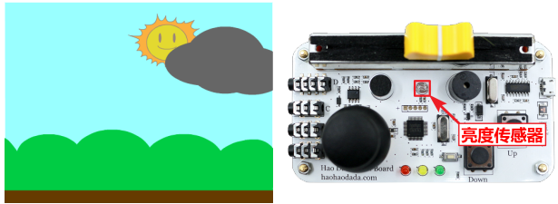
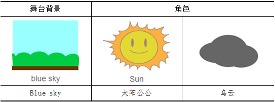
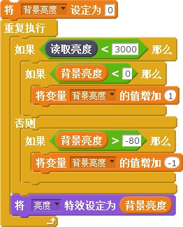
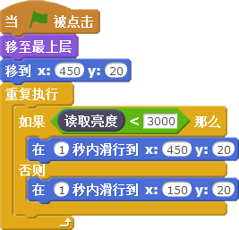
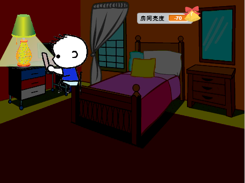

# 第七课  在Scratch中使用亮度传感器——太阳公公笑了

太阳公公最近有点心烦，因为乌云不断来骚扰它，总是偷偷过来遮住它的脸，让它看不清蓝天、白云与绿色的大地。本课我们将通过传感器板上的亮度传感器帮助太阳公公控制乌云，让乌云变得听话。

## 模块与指令

要完成本课的创意构思，需要了解以下的新知识、使用以下的新指令：

### 亮度传感器

[单击此处](http://www.haohaodada.com/video/b10701)或者扫描下方二维码可以观看相关的视频。

亮度传感器其实是一个光敏管，能够感知周围光线的强弱，然后转换成电信号输出。

### ”读取亮度“指令：

读取传感器板上亮度传感器的数值，取值范围是（0，4095）。

#### 试一试

登录“好好搭搭”网站，连接传感器板，根据下表的要求操作，观察舞台上显示的亮度传感器数值，将不同状态下的亮度传感器数值记录下来。

[单击此处](http://www.haohaodada.com/video/b10702)或者扫描下方二维码可以观看相关的视频。

## 作品制作

要完成本课范例，可以先添加舞台、角色，设置舞台和角色的初始状态；然后读取传感器板上亮度传感器的值，如果光线比较暗，乌云会遮住太阳公公；如果光线比较亮，乌云会消散，露出太阳公公的笑脸。

### 第一步：设置舞台背景与角色

[单击此处](http://www.haohaodada.com/video/b10703)或者扫描下方二维码可以观看相关的视频。

1.通过“背景库”对话框添加“blue sky”图片作为舞台背景；再通过“角色库”对话框添加太阳公公（Sun）角色。
    
2.通过“绘制新角色”的方法，在“矢量编辑模式”利用“椭圆”工具绘制“乌云”角色。（如果觉得自己绘制“乌云”角色有困难，也可以登录“好好搭搭”网站，从本课的范例程序网页的“资源下载”选项卡中下载）

3.调整舞台上这两个角色的大小、将它们拖动到舞台的合适位置。

4.隐藏舞台上除“亮度”以外，其它无关的传感器数值。

### 第二步：编写舞台背景脚本

[单击此处](http://www.haohaodada.com/video/b10703)或者扫描下方二维码可以观看相关的视频。

舞台背景应该能够根据传感器板上亮度传感器的数值而改变亮度。

为了获得比较好的控制效果，应该先测量环境的正常亮度。

在本课的范例作品中，环境的正常亮度是“3000”左右，当传感器板上的亮度值小于3000时，说明环境比较亮；大于3000时，环境比较暗。

在编写脚本的时候，不能直接使用“亮度”特效设置背景图片的亮度（如下图所示），不然当环境持续亮时（一直都小于3000），背景会不断增加亮度特效，直到整个图片全部变白（特效值为100）；反之又会持续变暗，暗得只剩下黑色（特效值为-100）。

正确的办法是控制背景“亮度”特效值的变化范围，一般可以在（0，-80）之间变化。因此先创建一个“背景亮度”变量，设置这个变量初始值为“0”，也就是正常的亮度特效值；然后进行判断：在亮度传感器数值小于3000时，表明周围光线充足，这时如果“背景亮度”变量值小于0，那么应该将“背景亮度”变量值“+1”；如果亮度传感器的值大于3000，表明周围光线较暗，这时如果“背景亮度”变量值大于-80，那么应该将“背景亮度”变量的值“-1”。最后根据“背景亮度”变量的数值设置亮度特效。具体脚本代码如下图所示。

#### 试一试

为太阳角色编写脚本，让它也能够根据亮度传感器的数值调整亮度特效。

[单击此处](http://www.haohaodada.com/video/b10704)或者扫描下方二维码可以观看相关的视频。

### 第三步：编写乌云角色脚本

[单击此处](http://www.haohaodada.com/video/b10705)或者扫描下方二维码可以观看相关的视频。

“乌云”角色能够根据亮度传感器的值进入与退出舞台，当环境光线正常时，乌云不会出现；当环境光线变暗时，乌云就会进入舞台，挡住太阳公公。

要让“乌云”角色能够准确的进入、退出舞台，还应该知道“乌云”角色相应的坐标值，可以通过鼠标拖动“乌云”摆放到目标位置的方法获取。本课范例中，“乌云”角色在舞台外的坐标是（450，20），遮挡住太阳公公的坐标是（150，20）。

#### 练一练

结合前面所学知识，进一步完善程序。比如在乌云遮住太阳公公的时候，环境亮度变暗了，传感器板上的红色LED就会慢慢亮起来；当乌云没有遮住太阳公公，环境变亮了，红色LED慢慢变暗。

#### 拓展思考

利用传感器板上的亮度传感器，还可以设计如下图所示的智能台灯，利用传感器板上的亮度传感器，控制台灯的亮、灭以及亮度变化。

