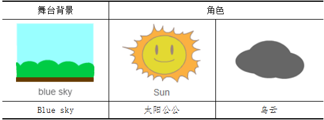

# 第8课 在Scratch中使用摇杆――猴子接香蕉

小猴子最喜欢吃香蕉。可是这次，它遇到了麻烦，调皮的香蕉被施了魔法，会随机地出现在不同的地方；让我们使用传感器板上的摇杆，帮助小猴子接香蕉，让它在规定时间内得到更多的香蕉。

## 模块与指令

要完成本课的创意构思，需要了解以下的新知识、使用以下的新指令：

### 摇杆

[单击此处](http://www.haohaodada.com/video/b10801)或者扫描下方二维码可以观看相关的视频。

摇杆可以前、后、左、右四个方向拨动，接收用户位移的数据，可以非常方便地控制角色在Scratch舞台上移动。

### “读取摇杆X”指令：

读取传感器板上摇杆的X轴数值，取值范围（0，1023）。

### “读取摇杆Y”指令：

读取传感器板上摇杆的Y轴数值，取值范围（0，1023）。

#### 试一试

登录“好好搭搭”网站，连接传感器板，根据下表的要求操作，观察舞台上显示的摇杆数值，将不同状态下的摇杆数值记录下来。

[单击此处](http://www.haohaodada.com/video/b10802)或者扫描下方二维码可以观看相关的视频。

## 作品制作

作品制作

要完成本课范例，可以先添加舞台、角色，设置舞台和角色的初始状态，然后让香蕉随机地出现在舞台上，同时通过用户拨动摇杆，控制猴子在舞台上移动。如果猴子接到香蕉，会累积成绩，还可以设置游戏的持续时间，在规定的时间内接到的香蕉越多成绩越好。

### 第一步：设置舞台背景与角色

[单击此处](http://www.haohaodada.com/video/b10803)或者扫描下方二维码可以观看相关的视频。

1.通过“背景库”对话框添加“lake”图片作为舞台背景；再通过“角色库”对话框添加猴子（Monkey2）、香蕉（Bananas）角色；调整这两个角色的大小、将它们拖动到舞台的合适位置。

2.隐藏舞台上除“摇杆X”和“摇杆Y”以外，其它无关的传感器数值。

### 第二步：编写香蕉角色脚本

[单击此处](http://www.haohaodada.com/video/b10804)或者扫描下方二维码可以观看相关的视频。

香蕉是由程序自动控制、随机出现在舞台上，考虑到猴子都是在树林中活动，因此香蕉角色出现的位置应该只是舞台上的树木区域。当“香蕉”角色碰到“猴子”角色、或者停留一定的时间后自动消失，然后重新在新的位置出现。

#### 想一想

范例程序中香蕉只有一支，如何使用“克隆”指令，让舞台上能够出现多支香蕉？

[单击此处](http://www.haohaodada.com/video/b10805)或者扫描下方二维码可以观看相关的视频。

### 第三步：编写猴子角色脚本

[单击此处](http://www.haohaodada.com/video/b10806)或者扫描下方二维码可以观看相关的视频。

猴子角色的脚本共有三段。其中第一段脚本通过检测摇杆的值，控制猴子在舞台上移动。

编写这段脚本时要注意：摇杆在不操作时，数值也会在一定的范围内变化，这属于正常的数据漂移现象。为了调试方便，实际编程时，具体的摇杆数值可以取整十、整百的近似数。

第一段脚本如下图所示：

这段脚本先设置猴子的初始位置和大小，然后使用重复执行和4个判断指令，通过读取当前摇杆的数值，并且与不操作摇杆时的数值进行比较，从而决定猴子的移动方向：如果摇杆X大于X轴数据漂移的最大值，猴子向右移动；如果摇杆X小于X轴数据漂移的最小值，猴子向左移动；如果摇杆Y大于Y轴数据漂移的最大值，猴子向上移动；如果摇杆Y小于Y轴数据漂移的最小值，猴子向下移动。

#### 试一试

请根据你所使用的传感器板上摇杆的数据漂移区间，选择合适的值，完成用摇杆控制猴子在舞台上移动的程序脚本。

第二段脚本是进行成绩统计。先添加一个变量“成绩”，并设置这个变量的初始值是“0”，用来保存接到香蕉的个数；然后判断猴子是否碰到香蕉，如果碰到，那么“成绩”变量值加1、播放“猴子”角色自带的声音、同时说出当前所接到的香蕉数量。

第三段是通过“猴子”角色的造型切换，让游戏更好玩。

#### 试一试

以上代码实现了用摇杆控制猴子自由移动，但是在移动过程中猴子的速度是固定不变的，你能否在此基础上，让猴子能够有加速移动的功能？也就是摇杆数值变化越大，猴子的移动速度越快。

[单击此处](http://www.haohaodada.com/video/b10807)或者扫描下方二维码可以观看相关的视频。

### 第四步：编写舞台背景脚本

[单击此处](http://www.haohaodada.com/video/b10808)或者扫描下方二维码可以观看相关的视频。

舞台背景脚本是对游戏时间进行控制。先添加一个“时间”变量，并设置这个变量的初始值是“30”，也就是倒计时30秒；然后每过一秒，“时间”变量值减少“1”，一直重复执行到“时间”变量值为“0”；最后停止全部角色脚本。

#### 练一练

在以上介绍的基础上再进一步完善程序，比如增加舞台背景、添加其它角色、编写奖励和惩罚的脚本，从而使游戏更好玩。

#### 拓展思考

摇杆在各类游戏中的应用非常广泛，可以灵活地控制角色在舞台上移动。请你思考一下，利用摇杆还可以设计一个怎样的游戏？

