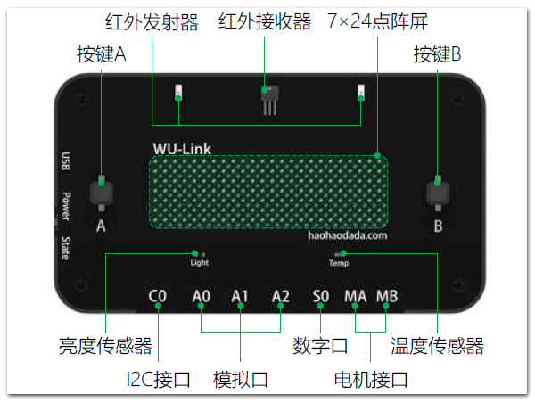
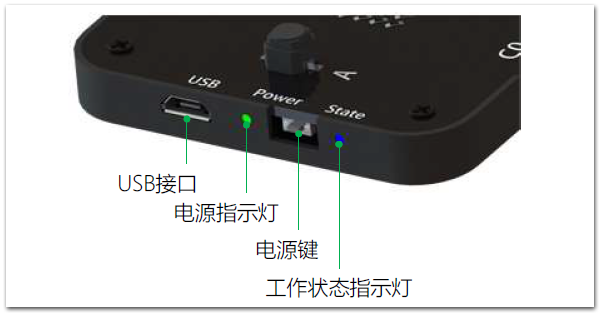
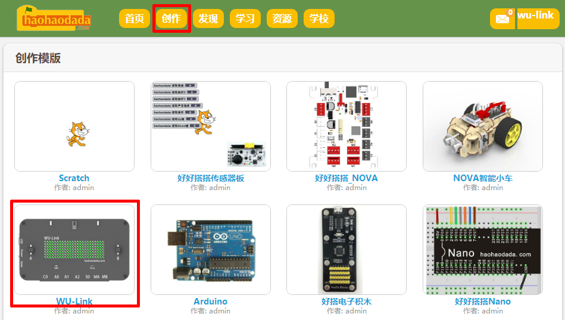
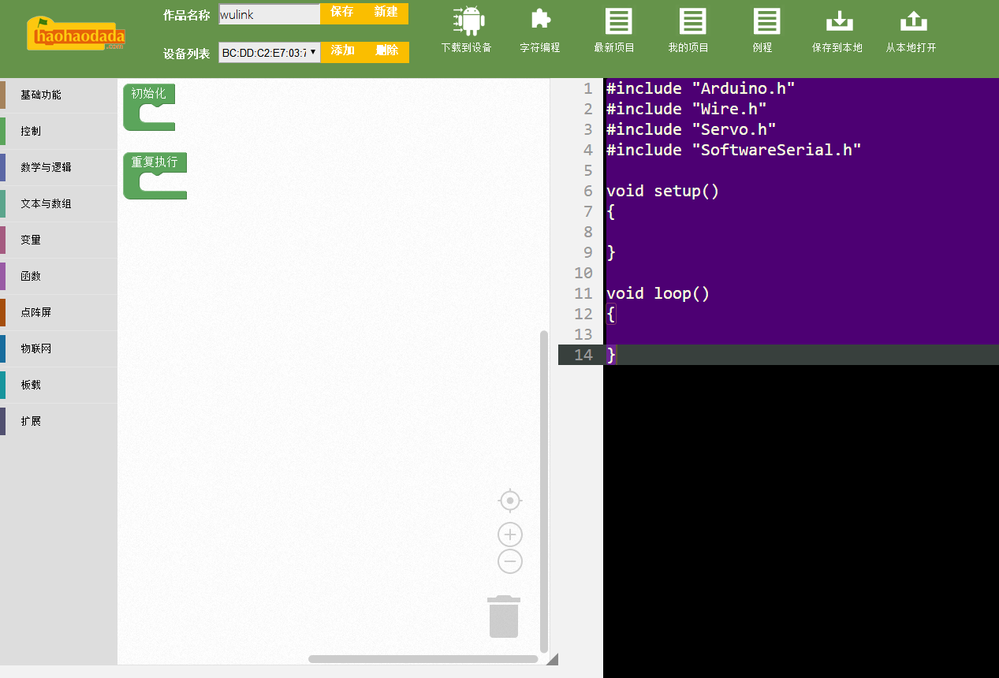
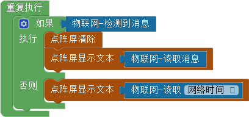
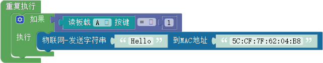

#第一课 初识物联网造物神器——WU-Link

[TOC]

物联网就是物物相连的互联网。英文名称是：Internet of things，英文缩写是“IoT”。

物联网的核心和基础仍然是互联网，但在互联网的基础上扩展和延伸到了任何物品，在物品与物品之间通讯和信息交换。物联网是继计算机、互联网之后信息技术领域的第三次重大变革。


造物，是指自己动手制作物品。作为一名“创客”，就是努力要将自己的创意通过“造物”变成现实，变成看得见、摸得着的物品。

物联网造物，是指基于物联网技术的造物，所创造的物品能够通过互联网实现物物相连。对于中小学生来说，由于年龄较小、专业知识也比较缺乏，物联网造物如果使用过于复杂的硬件和软件会大大增加造物的难度。

WU-Link是基于物联网技术的一块开发板，集在线编程、无线下载、物物互联功能于一体，既能兼容于Arduino、开发一般的应用，也能非常方便地进行物联网造物。




 ####试一试:

 在WU-Link上找到点阵屏、按键、亮度传感器、温度传感器、红外发射器、红外接收器等板载元器件以及A0、A1、A2这三个模拟口，S0这个数字口，MA、MB这两个电机接口，C0这个I2C接口。


##作品制作

使用WU-Link造物非常方便，在正式开始学习之前，先按以下步骤操作，整体了解WU-Link的基本使用方法、实际体验如何编写、修改WU-Link程序。


###第一步：打开和关闭WU-Link电源

WU-Link的电源键在面板的左侧，单击就可以打开。打开电源后，电源键上方的电源指示灯点亮、蜂鸣器连续短促鸣叫两声，表明电源打开正常。



WU-Link电源打开后，自动进入无线网络搜索状态。此时电源键下方的工作状态指示灯呈红色闪烁状态，蜂鸣器连续鸣叫；如果搜索不到事先配置好的无线网络，30秒后蜂鸣器会停止鸣叫；但工作状态指示灯会持续呈红色闪烁状态，请按[阅读材料一](http://haohaodada.com/edu/WULink/a.html)的步骤配置WU-Link的无线网络连接。如果没有无线网络连接，WU-Link是不能正常使用的。

当WU-Link搜索并成功连接到事先配置好的无线网络后，蜂鸣器停止鸣叫，工作状态指示灯呈蓝色长亮状态。

WU-Link正常连接无线网络后，如果内存中有事先保留的程序，会马上执行这个程序。

WU-Link内置有锂电池，所有数据也都通过无线网络传输，因此在使用过程中不需要连接计算机、一般也不需要连接电源。

要关闭WU-Link，可以快速单击两次电源键，如果电源指示灯熄灭，就表明WU-Link已经关闭电源、停止工作。


###第二步：进入在线编程网站

WU-Link可以通过“好好搭搭”网站在线编写、保存程序。具体可以按以下步骤操作：

1.打开浏览器，进入“好好搭搭”网站（haohaodada.com），然后单击网站右上角的“登录”按钮，用事先注册好的账号登录。如果没有账号，可以先单击“加入”按钮免费注册。

2.单击网站左上角的“创作”按钮，打开如下图所示的“创作模版”网页。



3.在“创作模版”网页中找到并单击“WU-Link”模版缩略图，进入WU-Link编程网页（如下图所示）。



WU-Link默认进入的是图形化编程网页，它由以下几部分组成：

* 网页上方是“工具栏”，可以新建、保存、编译下载程序到设备，还可以查看“最新”、“我的”、“例程”项目，将程序“保存到本地”、“从本地打开”；
* 网页左边“指令区”，共有九大类、一百多个指令；
* 网页中间是“编程区”，将左边“指令区”的指令拖动到“编程区”、按一定的逻辑关系组合起来，可以编写出各种各样的程序；
* 网页右边是“代码区”，能够根据组合的指令自动生成C语言代码（如果在手机、平板上打开编程网页，默认不会显示“代码区”）。


 ####试一试：

 进入WU-Link编程网页，单击“指令区”中不同的指令类别，看看都有哪些指令？找出你最感兴趣的三个指令？猜一猜它们可能有什么用？


###第三步：编译、下载程序

WU-Link程序必须通过服务器编译成机器能够识别的机器码，然后下载到主板上才可以运行。下面以“例程”中的“计步器”程序为例，介绍具体的操作步骤：

1.单击WU-Link在线编程网页上方“工具栏”中的“例程”按钮，在打开的网页中找到并单击“计步器”程序缩略图，打开这个范例程序。

2.单击“工具栏”中的“下载到设备”按钮，打开如下图所示的提示对话框，单击“确定”按钮开始将程序上传到服务器编译（如果所使用的“好好搭搭”网站账号没有绑定WU-Link，会出现错误提示框。请按[阅读材料二](http://haohaodada.com/edu/WULink/b.html)所介绍的方法，添加并绑定设备）。


3.服务器编译完成后，会通过无线网络将程序直接下载到账号绑定的WU-Link设备。如果编译、下载成功，会打开如下图所示的提示对话框。同时蜂鸣器鸣叫，稍等片刻下载完成后，蜂鸣器停止鸣叫。


4.程序下载到WU-Link后会替换原有的旧程序，然后自动运行新下载的程序。对于“计步器”这个程序来说，下载运行以后，可以拿着WU-Link走动，它会根据手臂摆动的频率自动计数。


 ####试一试：

 在WU-Link编程网页的“例程”中，除了“计步器”程序，你还对什么程序感兴趣？尝试打开、编译、下载到WU-Link中运行，看看这个程序是怎样的？


###第四步：在线修改程序

WU-Link默认采用的是与Scratch类似的积木式图形化编程方式，非常适合少年儿童使用。下面以“例程”中的“接收消息”、“发送消息”这两个范例程序为例，进一步熟悉这种图形化编程方式，体验使用WU-Link进行物联网编程的便捷性：

1.与同伴合作，两人一组，每组两块WU-Link。

2.使用第一块WU-Link绑定的账号登录好好搭搭网站，打开“例程”中的“接收消息”程序（程序代码如下图所示），将这个程序编译下载到第一块WU-Link中。



3.使用第二块WU-Link绑定的账号登录好好搭搭网站，打开“例程”中的“发送消息”程序，这个程序的代码如下图所示。



上图所示的程序能够重复执行条件判断：如果按下板载的按键“A”，那么会执行“通过物联网发送字符串”指令，发送字符串“Hello”到指定的MAC地址。

```
注：MAC地址是一组由六个十六进制数组成的网络地址，每个十六进制数之间用英文冒号分隔。全世界所有通过互联网连接的网络设备都会有这样一组网络地址，WU-Link的mac地址印刷在面板的背面。
```


4.删除上图程序代码中“通过物联网发送字符串”指令的“MAC地址”参数，用第一块WU-Link真实的“MAC地址”替代默认的地址。

5.完成程序代码的修改后，单击“工具栏”中的“下载到设备”按钮，将修改后的“发送消息”程序编译、下载到第二块WU-Link运行。

通过以上操作，这两块WU-Link通过互联网实现了“物物相连”：第一块WU-Link在没有接收到第二块WU-Link发送的消息时，默认显示的是网络时间；当按下第二块WU-Link面板上的按键“A”时，第一块WU-Link上显示的是第二块WU-Link发送的“Hello”。


 #### 试一试：

 第二块WU-Link除了可以向第一块WU-Link发送“Hello”以外，你还能够再修改程序，发送其它信息吗？


##拓展与思考

第二块WU-Link除了可以向第一块发送信息以外，你还能够再修改程序，向第三块、甚至更多块WU-Link发送信息吗？
