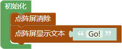
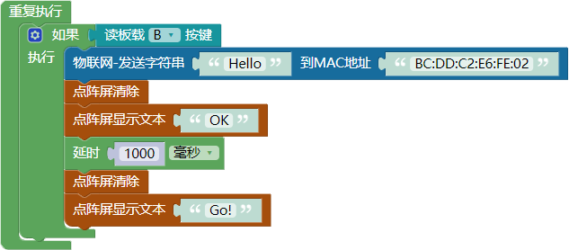
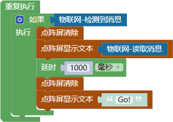
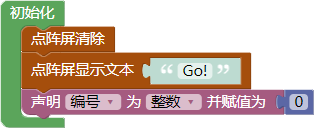
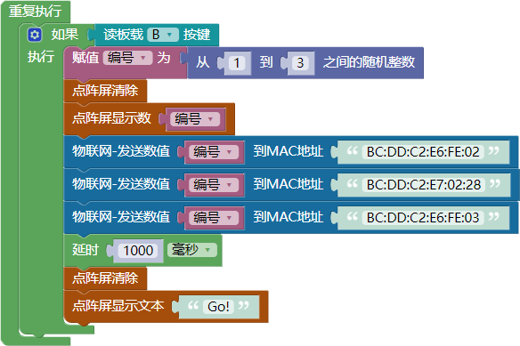
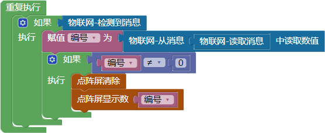
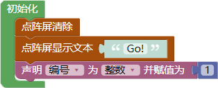
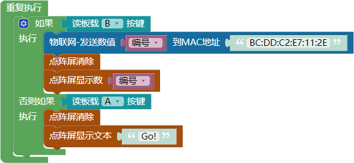
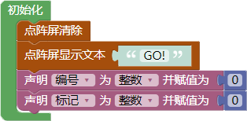
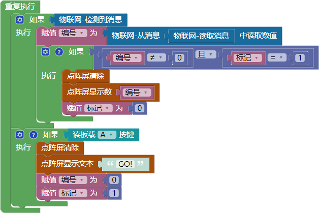

# 第十课 WU-Link之间的互联互控——抽签与抢答程序

[TOC]

WU-Link不仅可以与Scratch互联互控，也可以在WU-Link之间互联互控。今天我们将使用两块甚至多块WU-Link，学习制作“抽签”和“抢答”程序。


## 模块与指令

**要制作本课的范例作品，需要使用以下新的指令：**

###“物联网-发送字符串”指令：


属于“物联网”类别指令；使用这个指令可以将指定的字符串发送给指定MAC地址的WU-Link。

指令的第一个参数是需要发送的字符串；第二个参数是接收字符串的另一块WU-Link的MAC地址。


### “物联网-发送数值”指令：


属于“物联网”类别指令；使用这个指令可以将指定的数值发送给指定MAC地址的WU-Link。

指令的第一个参数是需要发送的数值；第二个参数是接收数值的另一块WU-Link的MAC地址。


### “物联网-从消息中读取数”指令：


属于“物联网”类别指令；使用这个指令可以从获取的物联网消息中读取数。

指令的参数就是从物联网获取的消息，一般使用“物联网”类别中的“物联网读取消息”指令。


## 作品制作

我们将通过制作三个范例来了解如何在WU-Link之间进行互联互控。范例一是一块WU-Link作为“发送端”，向另一块“接收端”的WU-Link发送消息；范例二也是一块WU-Link作为“发送端”，但可以向多块“接收端”的WU-Link发送消息；范例三则是多块WU-Link作为“发送端”，向一块“接收端”的WU-Link发送消息。


### 第一步：一块WU-Link向另一块WU-Link发送消息

要编写一块WU-Link向另一块WU-Link发送消息的程序，需要两块WU-Link：一块运行“发送端”程序，将消息发送出去；另一块运行“接收端”程序，接收并将消息显示出来。

具体可以按以下步骤编写程序：

1.编写“发送端”的“初始化”脚本。

   使用“点阵屏清除”指令清除WU-Link点阵屏、使用“点阵屏显示文本”指令显示“Go!”，表明程序已经开始运行。

   具体初始化程序代码如下图所示：




2.编写“发送端”的“主程序”脚本。

   在“重复执行”指令中进行条件判断：如果按下了板载的按键“B”，就通过网络向指定MAC地址的另一块WU-Link发送字符串“Hello”；然后清除点阵屏、显示“OK”，表明消息已经发送完成；最后延时1秒、重新清除点阵屏、显示“Go!”，重新处于判断有没有按下按键的状态。

   具体主程序代码如下图所示：



   ```
   注意：实际编写程序时，必须将“物联网-发送字符串”指令中的第二个参数，更改为实际用于接收信息那块WU-Link的MAC地址。
   ```

   ​


3.编写“接收端”的“初始化”脚本。

   同样也是清除WU-Link点阵屏、显示“Go!”，表明程序已经开始运行。

   具体初始化程序代码如下图所示：


   ​


4.编写“接收端”的“主程序”脚本。

   在“重复执行”指令中进行条件判断：如果检测到网络上有发给自己的消息，就清除点阵屏、显示从服务器上读取的消息；然后延时1秒、重新清除点阵屏、显示“Go!”，重新处于判断有没有检测到消息的状态。

   具体主程序代码如下图所示：



   ​


 ####试一试：

 1. 将以上程序分别下载到用于发送和用于接收的两块WU-Link中，然后按下“发送端”WU-Link的按键“B”，看看“接收端”WU-Link上是否显示了1秒的“Hello”?
 2. 除了发送文本信息，能不能发送数字信息？程序应该如何修改？


### 第二步：一块WU-Link向多块WU-Link发送消息

一块WU-Link向多块WU-Link发送消息，最典型的应用就是“抽签”程序。

下文步骤中制作的这个“抽签”程序共使用了四块WU-Link：其中一块WU-LinkWU-Link由教师使用，运行“发送端”程序，将随机产生的数——也就是抽中学生的编号消息发送出去；另外三块WU-Link由三位学生使用，运行“接收端”程序，接收并显示教师WU-Link发送过来的编号消息。

1.编写教师使用的“发送端”“初始化”脚本。

   首先单击“变量”类别中的“创建变量”按钮，创建一个名为“编号”的变量，用于存贮学生的编号；然后在“初始化”脚本中清除WU-Link点阵屏、显示“Go!”，使用“声明并赋值”指令声明“编号”变量的数据类型为“整数”、赋值为“0”。

   具体初始化程序代码如下图所示：



   ​

2.编写教师使用的“发送端”“主程序”脚本。

   在“重复执行”指令中进行条件判断：如果按下了板载的按键“B”，就在“1，2，3”这三个数中产生一个随机数（也就是在三个学生中抽中一个学生）并将这个数赋值给“编号”变量；然后在点阵屏上显示这个数并将这个数发送到三块指定MAC地址的WU-Link上；最后延时1秒以后清除点阵屏、重新显示“Go!”，等待重新按“A”按键再次抽签。

   具体主程序代码如下图所示：



   ```
   注意：实际编写程序时，应该根据具体参与抽签的WU-Link数量修改“随机数”指令参数、增删“物联网-发送数”指令的数量、将这些指令中的第二个参数更改为实际用于接收消息WU-Link的MAC地址。
   ```


3.编写学生使用的“接收端”的“初始化”脚本。

   同样也是先创建“编号”变量，用于存贮从网络上接收到编号消息；然后在“初始化”脚本中清除WU-Link点阵屏、显示“Go!”、声明“编号”变量的数据类型为“整数”并赋值为“0”。

   具体初始化程序代码如下图所示：


4.编写学生使用的“接收端”“主程序”脚本。

   在“重复执行”指令中进行条件判断：如果检测到网络上有发给自己的消息，就使用“物联网-从消息中读取数值”和“物联网-读取消息”指令，从网络上读取的消息中读取数值，并把这个数赋值给“编号”变量；然后再对“编号”变量进行判断，当它“不等于”“0”时（说明从网络上接收到的是抽中的学生编号），清除点阵屏、显示“编号”变量。

   具体主程序代码如下图所示：




 ####试一试：

 与两个以上的同学合作（合作的人数越多越有趣），确定一块WU-Link用于抽签、发送抽中的数，另外几块WU-Link用于接收、显示抽中的数，然后根据实际情况修改范例中的指令参数、将修改后的程序分别下载到这些WU-Link中，看看“发送端”和“接收端”的WU-Link是否运行正常。


### 第三步：多块WU-Link向一块WU-Link发送消息

多块WU-Link向一块WU-Link发送消息，最典型的应用就是“抢答”程序。

下文步骤中制作的这个“抢答”程序也使用了四块WU-Link：其中三块WU-Link由三位学生使用，运行“发送端”程序，当学生按下发送按键时向教师所用的WU-Link发送信息、参与抢答；最后一块WU-Link由教师使用，运行“接收端”程序，用于接收判断学生发送过来的消息、显示抢答成功的学生编号。

1.编写学生使用的“发送端”“初始化”脚本。

   也是先创建一个名为“编号”的变量，用于存贮学生编号；然后在“初始化”脚本中清除WU-Link点阵屏、显示“Go!”、声明变量“编号”的数据类型为“整数”并赋值为“1”。

   具体初始化程序代码如下图所示：



   ```
   注意：实际在将以上程序下载到WU-Link之前，还必须修改“编号”变量的赋值。第一块学生使用的WU-Link“编号”变量赋值为“1”、第二块学生使用的WU-Link“编号”变量赋值为“2”……（依次类推）
   ```

   ​

2.编写学生使用的“发送端”“主程序”脚本。

   在“重复执行”指令中进行条件判断：如果按下了板载的按键“B”，就将“编号”变量值发送到指定MAC地址的WU-Link上（也就是教师所用的WU-Link），然后清除点阵屏、显示所发送的“编号”信息；如果按下了板载的按键“A”，就清除点阵屏、显示“Go!”，重新开始参与抢答。

   具体主程序代码如下图所示：



   ```
   注意：实际编写程序时，必须将“物联网-发送字符串”指令中的第二个参数，更改为实际用于接收信息那块WU-Link（也就是教师所用的WU-Link）的MAC地址。
   ```

   ​


3.编写教师使用的“接收端”“初始化”脚本。

   先创建两个变量——“编号”变量和“标记”变量，“编号”变量用于存贮从学生WU-Link上接收到的编号消息、“标记”变量用于标记当前是否处于学生抢答环节；然后在“初始化”脚本中清除点阵屏、显示“Go!”文本信息、声明所创建的两个变量的数据类型都是“整数”、同时都赋值为“0”。

   具体初始化程序代码如下图所示：




4.编写教师使用的“接收端”“主程序”脚本。

   在“重复执行”指令中进行条件判断：如果检测到网络上有发给自己的消息，就使用“物联网-从消息中读取数值”和“物联网-读取消息”指令，从读取的消息中读取出数值，并把这个数赋值给“编号”变量；然后再进行条件判断：如果“编号”变量的值“不等于”“0”（说明接收到的消息中有学生编号）、同时“标记”变量的值“等于”“1”（说明当前处于抢答状态），那么清除点阵屏、显示“编号”变量（也就是成功抢答学生的编号）、赋值“标记”变量为“0”（也就是结束抢答、不接收学生发过来的消息）。最后再增加一个“条件判断”指令：如果按下了板载的按键“A”，就清除点阵屏、显示“Go!”，重新赋值“编号”变量为“0”（清除原有消息数据）、“标记”变量为“1”（设置处于抢答状态），重新开始抢答。

   具体主程序代码如下图所示：




 #### 试一试：

 与两个以上的同学合作（合作的人数越多越有趣），确定一块WU-Link接收消息、判断抢答结果，另外几块WU-Link用于发送消息、参与抢答；然后根据实际情况修改范例中的指令参数、将修改后的程序分别下载到这些WU-Link中，看看抢答程序是否运行正常。


## 拓展与思考

能不能对“抢答”程序进一步完善，由教师统一控制整个抢答过程：

1. 教师端和学生端初始化完成后都在点阵屏上显示“REDY”，同时蜂鸣器鸣叫一声表明程序初始化完成；
2. 教师端按板载按键“A”以后，教师端和学生端WU-Link点阵屏都显示“Go!”、蜂鸣器鸣叫两声表明可以开始抢答；
3. 开始抢答以后，学生端可以按板载按键“B”参与抢答，按下后点阵屏显示“OK”、蜂鸣器鸣叫一声表明抢答完成，已经向教师端发送消息；
4. 开始抢答以后，教师端接收学生发送的消息并进行判断，当接收到第一个有效抢答学生的编号时结束抢答，在教师端和学生端WU-Link点阵屏都显示抢答成功学生的编号，同时蜂鸣器鸣叫三声表明抢答结束。

