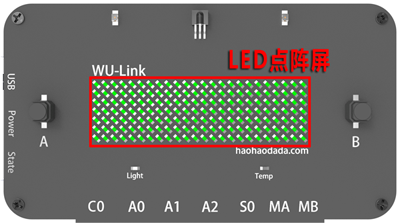
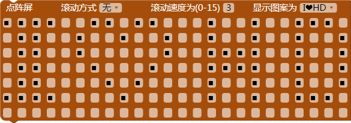
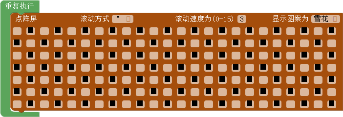
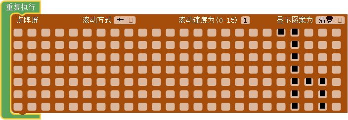
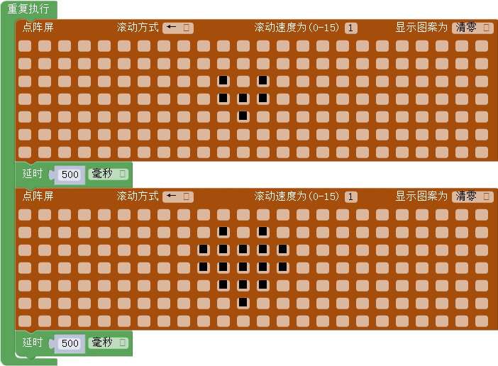
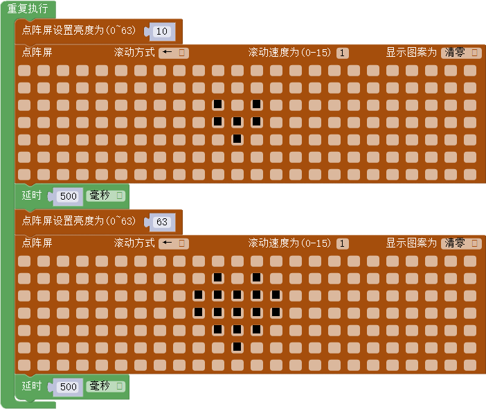

# 第二课 在WU-Link中使用LED点阵屏——玩转图案设计

[TOC]

WU-Link面板上有一块LED点阵屏，可以非常方便地设计并显示各种图案，同时还能够为这些图案设置各种酷炫的动画。

## 模块与指令

**要制作本课的范例作品，需要认识以下这些新的模块：**

### "LED点阵屏"模块

LED点阵屏是将若干个LED以矩形阵列的方式组装为一个模块，通过控制这些LED的亮灭来显示文本或者图案的显示装置。
WU-Link面板中央就有一块LED点阵屏（如下图所示），它是由7x24、共168颗LED组成的，可以同屏显示四个字母或者数字。

**要制作本课的范例作品，还需要使用以下新的指令：**

###“点阵屏设置”指令：

属于“点阵屏”类别指令；使用这个指令可以设置WU-Link板载点阵屏显示的图案。

指令中间有7x24、共168个点，与WU-Link板载点阵屏相对应；黑色的点表示点亮相应的LED，粉色的点表示熄灭相应的LED；用鼠标单击可以改变这些点的状态。

指令上方是图案显示属性设置区域；主要有以下几项设置内容：

- “滚动方式”设置：默认为“无”，单击下拉列表还可以选择“↑”、“↓”、“←”、“→”这四种滚动方向；
- “滚动速度”设置：默认是“3”，可以在方框内输入其它数值，数值的取值范围是（0，15），数值越小，滚动速度越快。
- “显示图案”设置：默认是“I❤HD”，单击下拉列表还可以选择“雪花”图案、“全选”（全部点亮）、“清零”（全部熄灭）。

### “点阵屏亮度设置”指令：

属于“点阵屏”类别指令；使用这个指令可以设置WU-Link点阵屏的亮度。

指令的参数默认是“30”，它的取值范围是（0，63）；数值越小亮度越低。

###“延时”指令：

属于“控制”类别指令；使用这个指令可以设置延时（也就是程序暂停）的时间。

指令的第一个参数是延时的时间，默认是“1000”；第二个参数是时间单位，默认是“毫秒”，可以单击打开下拉列表，从中选择“毫秒”或者“微秒”选项。这两个时间单位与“秒”之间的换算关系是：1秒=1000毫秒，1毫秒=1000微秒。

## 作品制作

要设计各种点阵图案，先要掌握如何在WU-Link点阵屏上显示图案，知道让图案动起来的基本方法；然后编写代码，在WU-Link上显示各种酷炫的图案和图案动画。

### 第一步：在点阵屏上显示图案

要在点阵屏上显示图案，可以将“显示”类别中的“点阵屏设置”指令拖动到编程区，与默认的“重复执行”指令组合。具体的程序脚本如下图所示：

#### 试一试：

将上图所示程序下载到WU-Link，查看WU-Link点阵屏上显示的图案是否和“点阵屏设置”指令设置的相同？

除了“点阵屏设置”指令默认的图案，也可以自己设计图案：

1. 单击“点阵屏设置”指令右边的“显示图案”下拉列表中的“清零”选项，将原先设置的图案清除。
2. 用鼠标单击指令中间的显示区设置图案：黑色表示选中、也就是相应LED点亮；再次单击黑色点可以取消选中、也就是相应LED熄灭。

 #### 试一试：

 下图所示的是一些点阵图案，你还可以设计出其它更加好玩的图案吗？

### 第二步：通过设置属性让点阵屏上的图案动起来

要让点阵屏上的图案动起来，可以更改“设置点阵屏”指令默认的“滚动方式”：单击“滚动方式”右边的下拉列表图标，在打开的下拉列表中选择需要的滚动方式，不同的滚动方式可以达到不同的动画效果。

除了可以设置“滚动方式”让图案动起来，还可以设置合适的“滚动速度”，使得滚动的效果更逼真。“滚动速度”默认是“3”，可以设置的数值范围是（0，15），数值越小，滚动速度越快。

下图所示的程序代码就是长颈鹿从WU-Link点阵屏右边以很快的速度向左移动，移动到最左边以后，再从右边开始重新向左移动。

 ####试一试：

 结合自己设计的图案，再添加合适的滚动方式和滚动速度，让图案动画更好玩。

### 第三步：通过切换图案让点阵屏上的图案动起来

要让点阵屏上的图案动起来，还可以通过两个图案的切换显示，让点阵屏上的图案动起来。

下图所示的程序代码，会在WU-Link点阵屏上依次显示一颗小的爱心和一颗大的爱心，从而产生爱心在跳动的效果。中间添加的两个“延时”指令，可以让图案跳动的动画更逼真。

 #### 试一试：

 除了跳动的爱心，你还能够设计哪些更好玩的图案切换动画？

### 第四步：改变点阵屏亮度让点阵屏图案更酷炫

在通过切换图案让点阵屏上的图案动起来的同时，如果再如下图所示添加“点阵面板设计亮度”指令，就可以让点阵屏图案的显示更酷炫。

## 拓展与思考

除了本课介绍的图案和图案的动画方式，你还能够设计出更多、更好玩的图案及动画效果吗？
