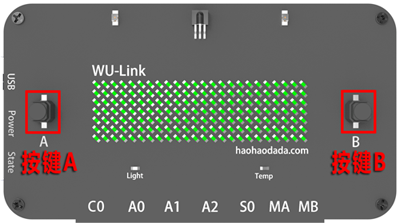
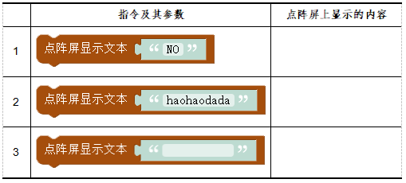
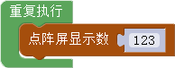
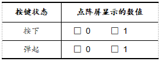
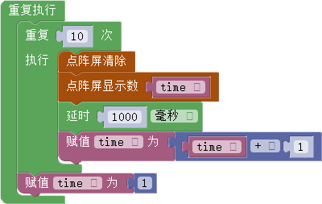
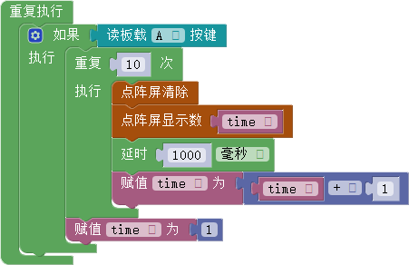

# 第三课 在WU-Link中使用LED点阵屏——送给妈妈的计时器

[TOC]

WU-Link面板上的LED点阵屏，不仅可以显示图案，还可以显示字母、数字等信息。本课我们将使用点阵屏和按键，为爱做烘焙的妈妈制作一个定时器，帮助她更加精确的掌握时间。


## 模块与指令

**要制作本课的范例作品，需要认识以下这些新的硬件：**

### “按键”模块

按键其实就是一种开关，它有“按下”和“弹起”两种状态：一般默认是“弹起”；当用手指按住按键帽往下按、并且保持不动的时候，就处于“按下”状态；松开手指，按键又会重新处于“弹起”状态。

WU_Link面板中央左右两边各有一个按键，其中左边这个按键编号是“A”，右边编号为“B”（如下图所示）。




**要制作本课的范例作品，还需要使用以下新的指令：**

###“点阵屏显示文本”指令:


属于“点阵屏”类别指令；使用这个指令可以设置WU-Link点阵屏显示参数指定的文本内容。

指令的参数默认是“YES”，可以根据需要修改。由于WU-Link点阵屏只能显示四个字母，当输入字母数超过四个，就会以滚动方式显示。


### “点阵屏显示数”指令:


属于“点阵屏”类别指令；使用这个指令可以设置WU-Link点阵屏显示参数指定的数。

指令的参数默认是“123”，可以根据需要修改。由于WU-Link点阵屏只能显示四个数字，当输入数字超过四个，会以滚动方式显示。


### “点阵屏清除”指令:


属于“点阵屏”类别指令；使用这个指令可以清除WU-Link点阵屏原来的显示内容，为显示新的内容做准备。


###“读板载按键值”指令:


属于“板载”类别指令；使用这个指令可以读取WU-Link板载按键的值。当按键处于正常状态、也就是“弹起”时，该指令返回的值是“0”；当按键被“按下”时，指令返回值是“1”。

指令默认是读取按键“A”的值；可以单击打开下拉列表参数，从中选择“A”或者“B”选项，选择读按键“A”还是“B”的值。


### “声明变量类型并赋值”指令：


属于“变量”类别指令；用于声明指定变量的类型并对这个变量赋值。

指令有三个参数：

- 第一个参数是选择需要声明的变量名称（需要先创建变量，所创建变量名称才会在下拉列表中显示）。
- 第二个参数是所要声明的变量类型，共有七种类型，其中最常用的是“整数”、“小数”、“字符串”这些变量类型。
- 第三个参数是具体的赋值，需要组合其它指令，一般最常用的是“数学与逻辑”类别中的“数值”指令和“文本与数组”类别中的“字符串”、“字符”指令。


## 作品制作

要制作本课的范例作品，先要了解WU-Link点阵屏和按键的基本使用方法，能够在点阵屏上显示指定的字母、数以及按键当前状态的值。然后编写代码，将WU-Link点阵屏当作定时器显示屏，显示依次累加（累减）的数。


###第一步：在点阵屏上显示指定的文本                        	

要在点阵屏上显示指定的文本，可以将“显示”类别中的“点阵屏显示文本”指令拖动到编程区，与默认的“重复执行”指令组合。

具体程序代码如下图所示：


 ####试一试：

 将上图所示程序下载到WU-Link，看看WU-Link点阵屏上显示的是什么？然后按下表要求依次修改“点阵面板显示文本”指令的参数，重新下载到WU-Link运行，将点阵屏上显示的内容分别记录下来。




###第二步：在点阵屏上显示指定的数         	

要在点阵屏上显示指定数值，可以将“显示”类别中的“点阵屏显示数”指令拖动到编程区，与默认的“重复执行”指令中组合。

具体程序代码如下图所示：




 ####想一想：

 如何才能够在点阵屏上同时显示字母和数字？


###第三步：在点阵屏上显示按键的值         	

WU-Link点阵屏除了可以显示指定的数，还可以显示传感器的值。

要在点阵屏上显示按键的值，同样也是先将“显示”类别中的“点阵屏显示数”指令拖动到脚本区，与“重复执行”指令中组合；然后将“更多”类别中的“读板载按键值”指令拖动添加到“点阵屏显示数字”指令的参数位置。

具体程序代码如下图所示：


 ####试一试：

 将上图所示程序下载到WU-Link，然后按下表要求“按下”或者“弹起”按键，观察点阵屏上显示的数，把结果记录到表格中。




###第四步：制作计时器               	

计时器的数值会自动变化，从一个初始值开始依次递增或者依次递减。要在点阵屏上显示这个不断变化的数，需要新建变量：

可以先单击“变量”指令类别中的“创建变量”按钮，在打开的“新变量的名称”对话框中（如下图所示）输入“变量名”为“time”，输入完成后单击“确定”按钮，就会在“变量”指令类别中新建这个变量。


```
注意：WU-Link程序中的变量名与Scratch一样，除了可以使用字母和数字作为变量名以外，还可以使用中文作为变量名；变量名最好有一定的意义。
```


变量创建完成后，在编写程序时，还需要先“声明变量类别”。也就是将“变量”指令类别中的“声明并赋值”指令拖动到编程区，与默认的“初始化”指令组合，再将“数字与逻辑”指令类别中“数值输入”指令作为“声明并赋值”指令的参数，设置“数值输入”指令参数为“1”。

具体初始化程序代码如下图所示：


在“初始化”脚本中声明变量后，可以在“重复执行”脚本中先累加变量的值，然后在点阵屏上显示累加后的变量值，等待1秒以后再重复执行。具体可以按以下步骤操作：

1.在“重复执行”指令中依次添加“重复执行指定次数”以及“赋值”指令；

2.在“重复执行指定次数”指令中依次添加“点阵屏清除显示”、“点阵屏显示数字”、“延时”以及“赋值”指令；

3.将“变量”指令类别中的变量“time”指令作为“点阵屏显示数字”指令的参数；修改后的这条指令可以在点阵屏上显示变量“time”的值；

4.将“数字与逻辑”指令类别中的“数值运算”指令添加作为“赋值”指令的参数，再将“变量”指令类别中的变量“time”指令作为“数值运算”指令的第一个加数；修改后的这条指令可以将变量“time”赋值为“time”+“1”，也就是变量依次累加；

5.将“数字与逻辑”指令类别中“数值输入”指令作为“声明并赋值”指令的参数，设置“数值输入”指令参数为“1”；这条指令使得变量“time”重复执行10次显示以后，重新赋值为“1”，再次从1开始依次累加。
具体主程序代码如下图所示：




 ####试一试：

 如果计时器是从“10”开始倒计时，计时到“0”结束。程序代码应该如何修改？


###第五步：用按键控制计时器                       	

要用按键控制计时器，也就是如果“读板载按键A”指令的值等于“1”，计时器开始计时，点阵屏重复执行从“1”显示到“10”。计时结束后继续处于判断状态，等待再次按下按键重新计时。

这段脚本可以在前面“计时器”程序的基础上修改：“初始化”脚本不变；在“重复执行”脚本中添加“条件判断”指令，将原有的“重复执行指定次数”以及“赋值”指令作为“条件判断”指令条件成立后执行的脚本，设置“条件判断”指令的条件为：“读板载按键A的值”“等于”“1”。

具体主程序代码如下图所示：




 ####想一想：

 能不能让这个计时器更好玩？比如计时开始前先闪烁数字“0”，计时结束后闪烁数字“10”？


##拓展与思考

能不能把WU-Link面板上的按键“B”也用上，用按键“B”调整计时器需要计时的值。比如按一下这个按键在数码管上显示“10”，再按一下分别显示“20”、“30”……；需要计时的数值确定后，按按键“A”开始倒计时，倒计时结束后闪烁最后显示的数字“0”。
