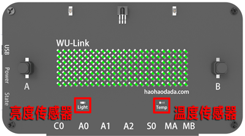
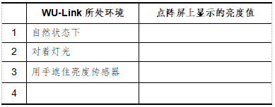
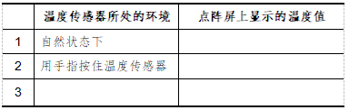
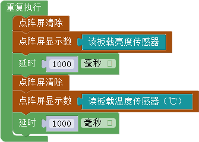
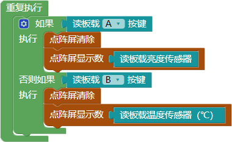

# 第四课 在WU-Link中使用板载传感器——环境自动检测仪

\[TOC\]

人类舒适的生活环境，与环境温度、光线强度密切相关。本课我们将使用WU-Link制作一个环境自动监测仪，实时显示周围环境的光线强度、温度值。

## 模块与指令

**要制作本课的范例作品，需要认识以下这些新的硬件：**

### “亮度传感器”模块

亮度传感器其实是一个光敏管，它能够感知周围光线的强度，通过采集转化后输出具体数值。WU-Link主板上集成有一个亮度传感器，位于面板左下方，标记有英文单词“Light”（如下图所示）。

### “温度传感器”模块

温度传感器能够感受周围环境的温度，通过采集转化后输出温度值。WU-Link主板上也集成有一个温度传感器，位于面板右下方，标记有英文单词“Temp”（如上图所示）。

**要制作本课的范例作品，还需要使用以下新的指令：**

### “读板载亮度传感器”指令

属于“板载”类别指令；使用这个指令可以读取WU-Link板载亮度传感器输出值，输出数值范围是（0，4095）。

### “读板载温度传感器”指令

属于“板载”类别指令；使用这个指令可以读取WU-Link板载温度传感器输出值，输出数值范围是（0℃，50℃）。

## 作品制作

要制作本课的范例作品，先要掌握在WU-Link点阵屏上分别显示环境亮度、温度值的方法，了解亮度传感器、温度传感器的特点；然后编写代码，在WU-Link上同时显示亮度、温度传感器的值。

### 第一步：在点阵屏上显示亮度传感器值

要在点阵屏上显示亮度传感器的值，需要先对点阵屏初始化。

具体初始化代码如下图所示：

初始化点阵屏以后，可以在“重复执行”指令中添加“点阵屏清除”和“点阵屏显示数”指令，再设置“点阵屏显示数”指令的参数为“读板载光线传感器”指令。这段代码先清除旧的点阵屏显示内容，然后显示新读取的板载光线传感器数值。

具体主程序代码如下图所示：

#### 试一试：

将上图所示代码编译后下载到WU-Link，然后按下表要求将WU-Link放到不同的环境下测试亮度值，将点阵屏上显示的亮度值记录下来。

### 第二步：在点阵屏上显示温度传感器值

要在点阵屏上显示温度传感器值，也是先初始化点阵屏（初始化程序代码如第一步所示）；然后同样在“重复执行”指令中添加“点阵屏清除”和“点阵屏显示数”指令，最后设置“点阵屏显示数”指令的参数为“读板载温度传感器”指令。

具体主程序代码如下图所示：

#### 试一试：

将上图所示代码编译后下载到WU-Link，然后按下表要求测试不同环境下的温度值，将点阵屏上显示的温度值记录下来。

### 第三步：在点阵屏上交替显示亮度、温度值

如果要在点阵屏上交替显示亮度、温度值，也是先初始化点阵屏（初始化程序代码如第一步所示）；然后在“重复执行”指令中清除点阵屏显示内容后，再显示新读取的亮度传感器数值；延时“1000”毫秒以后再清除点阵屏显示内容、显示新读取的温度传感器数值、再延时“1000”毫秒。

具体主程序代码如下图所示：

#### 试一试：

尝试删除上图所示程序中的两个“延时”指令，重新编译执行程序，还能够在点阵屏上正常交替显示亮度、温度值吗？为什么？

### 第四步：用A、B按键控制显示亮度、温度值

在点阵屏上交替显示亮度、温度值并不是一个比较好的显示方案，其实可以充分利用WU-Link面板上的两个按键，使用按键来控制传感器数值的显示：按下按键“A”显示亮度传感器值、按下按键“B”显示温度传感器值。具体可以按以下步骤编写程序：

1.初始化点阵屏（初始化程序代码如第一步所示）；

2.在“重复执行”指令中添加“判断”指令，在“判断”指令的条件中添加“读板载按键值”指令，确认该指令参数为“A”，也就是“判断”指令的条件是按键“A”按下。

3.如果“判断”指令的条件成立，那么就执行“点阵屏清除”和“点阵屏显示数”指令，设置“点阵屏显示数”指令的参数为“读板载光线传感器”指令。

4.由于需要判断两个条件，因此可以单击“判断”指令左边的设置图标，在打开的设置窗口中，将“否则如果”添加到“如果”的下方，为“判断”指令再添加一个判断条件。设置完成后再单击“判断”指令的设置图标关闭设置窗口。

5.在“判断”指令的“否则如果”条件中，同样添加“读板载按键值”指令，修改该指令的参数为“B”，也就是“否则如果”的判断条件是按键“B”按下。

6.“否则如果”条件成立，那么就执行“点阵屏清除”和“点阵屏显示数”指令，设置“点阵屏显示数”指令的参数为“读板载温度传感器”指令。 具体主程序代码如下图所示：

#### 想一想：

如果不像上图所示程序这样使用“判断”指令，要用A、B按键控制显示亮度、温度值，还可以怎么编写程序代码？

## 拓展与思考

除了在点阵屏上用数字显示亮度和温度值，你还能够在点阵屏上设计图案，形象的表示环境亮度、温度的适宜程度吗？

