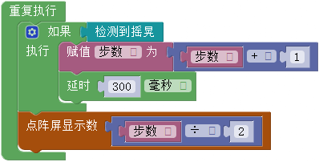

# 第五课 在WU-Link中使用加速度计——自制计步器

\[TOC\]

WU-Link主板上集成了一块加速度计，可以检测WU-Link在各个方向上的移动。本课将利用这块板载的传感器，编写程序，让WU-Link成为可以累计步数的计步器。

## 模块与指令

要制作本课的范例作品，需要认识以下这些新的模块：

### 加速度计

加速度是描述物体速度变化快慢的物理量。加速度计就是能够检测到这种变化并转化、输出相应数值的传感器。在汽车安全系统、地震检测、游戏控制、佩带式智能设备等很多方面都有广泛的应用。

WU-Link在主板上集成的加速度计型号是“MMA7660FC（如下图所示）。它的大小是3 × 3 × 0.9（毫米），可以检测X、Y、Z三个方向的加速度大小，检测精度是±1.5个重力加速度。

要制作本课的范例作品，还需要使用以下新的指令：

### “检测到摇晃”指令：

属于“板载”类别指令；可以检测WU-Link有没有被晃动。如果检测到晃动，输出值为“1”；否则为“0”。

### “读板载加速度计”指令：

属于“板载”类别指令；可以读取WU-Link在左右\(X\)、垂直\(Y\)、前后\(Z\)三个方向上的加速度数值，可以更加精确的获取WU-Link的运动状态。

指令默认是读取按键“X”方向的值；可以单击打开下拉列表参数，从中选择“X”、"Y"、"Z"这三个选项，选择读取WU-Link在左右、垂直、前后这三个方向上的加速度数值。

## 作品制作

要制作“计步器”，先要通过在WU-Link点阵屏上显示“检测到摇晃”指令的值，了解这个指令的使用方法；然后编写代码，让WU-Link变成一个能够累计走路步数的“计步器”。

### 第一步：在点阵屏上显示是否摇晃

要在点阵屏上显示是否摇晃了WU-Link，可以按以下步骤操作:

1.将“点阵屏”类别中的“点阵屏清除”指令拖动到编程区，与默认的“初始化”指令组合。

2.将“点阵屏”类别中的“点阵屏显示数”指令与“重复执行”指令组合。

3.将“板载”类别中的“检测到摇晃”指令拖动到“点阵屏显示数”指令的参数位置，作为它的参数。

完整的程序代码如下图所示：

​

#### 试一试:

将上图所示代码编译后下载到WU-Link，然后按下表要求改变WU-Link的状态，将点阵屏上显示的数值记录下来。想一想，什么状态下显示“1”？什么状态下显示“0”？

### 第二步：创建变量并初始化

要在计步器上显示步数，首先需要创建变量用于累计所走的步数。具体可以按以下步骤操作:

1.单击“变量”类别中的“创建变量”按钮，创建新的变量（本课范例程序创建的变量名称是“步数”）。

2.将“变量”类别中的“声明变量类型并赋值”指令拖动到编程区，组合到原有“初始化”指令的“点阵屏清除”指令下方。确认“声明变量类型并赋值”指令所声明的变量名称是“步数”，类型为“整数”。

3.将“数学与逻辑”类别中的“数值”指令拖动组合到“声明变量类型并赋值”指令右边，将所创建的变量"步数"赋值为“0”。

完整的初始化程序代码如下图所示：

#### 想一想:

“步数”变量为什么要赋值为“0”？可以是其它数吗？为什么？

### 第三步：判断并累计步数

人在走路时，手臂一般都会自然的前后摆动。将WU-Link拿在手上走路，手臂摆动的同时，WU-Link也会跟随摆动。因此可以通过“检测到摇晃”指令来判断是否在走路，再通过数值的累加得到具体的步数。

要实现以上功能，可以按以下步骤编写程序：

1.在“重复执行”指令中添加“控制”类别中的“有条件执行”指令，将“板载”类别中的“检测到摇晃”指令作为“有条件执行”指令的条件。

2.将“变量”类别中的“赋值”指令拖动组合到“有条件执行”指令的执行位置，再将“数字与逻辑”类别中的“数学运算”指令拖动组合到“赋值”指令右边，将该指令参数设置为“步数”变量“+”“1”。

3.删除原有的“点阵屏显示数”指令参数，将该指令参数修改“变量”类别中的“步数”“变量”指令，在点阵屏上显示“步数”变量的值。

具体主程序代码如下图所示：

​

#### 试一试:

将以上代码编译后下载到WU-Link，然后将WU-Link拿在手上自然走路，一边走一边心里默数步数，走十步以后和WU-Link上显示的数字比较是否相同？为什么会不同？

### 第四步：让计步器更精确

* 一般人走路时，走一步手臂会自然摆动2次。而上一步所编写的程序中，点阵屏直接显示累加的变量“步数”，是真实步数的2倍，因此应该将“步数”除以“2”后再显示。具体如下图所示:

* 为了进一步提高计步器的精度，还可以在“有条件执行”指令的执行位置再添加“控制”类别中的“延时”指令，设置“延时”指令的参数为“300”毫秒，也就是“0.3”秒。这样间隔“0.3”秒累加一次，可以防止通过故意快速摆动手臂作弊的漏洞。

  完整的主程序代码如下图所示：

试一试:

“延时”300毫秒是否最合适？你认为应该是多少？

## 拓展与思考

上网搜索专业的计步器软件算法是怎样的？然后进一步修改、调试程序，提高所编写的计步器软件的精确度，使它更具有实用价值。

