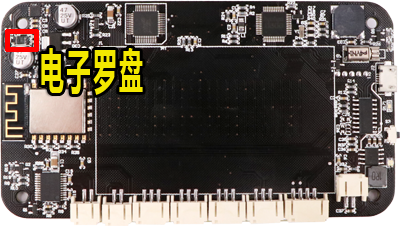
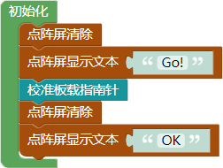
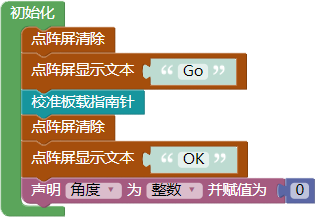
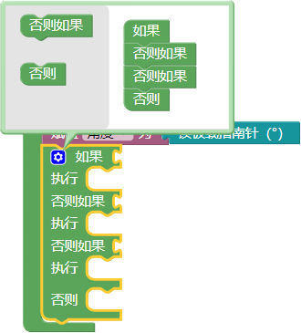
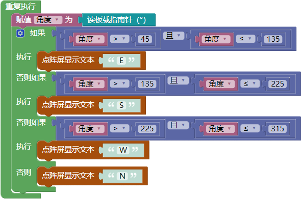

# 第六课 在WU-Link中使用电子罗盘——指南针来了

[TOC]

“要是你在野外迷了路”是我们所熟知的一篇小学课文，课文中介绍了四种天然的“指南针”，除此之外，大自然还有一种更为重要的“指南针”——地球的磁场。本课我们将学习如何使用WU-Link内置的电子罗盘，利用地球磁场制作指南针，让WU-Link也有指示方向的功能。

## 模块与指令

**要制作本课的范例作品，需要认识以下这些新的硬件：**

### 电子罗盘

罗盘也叫做指南针、司南，是中国古代四大发明之一。它能够利用地球磁场来指示方向，在航海中的应用非常广泛，可以说哥伦布到达美洲大陆、麦哲伦环球航行成功都离不开罗盘的帮助。

传统的罗盘相对都比较大。随着电子技术的发展，使用磁阻传感器可以生产出非常小巧的电子罗盘，WU-Link内部的电路板上就集成了一块电子罗盘芯片（如下图所示），使得WU-Link也具有识别方向的功能。

**要制作本课的范例作品，还需要使用以下新的指令：**

###“校准板载指南针”指令：

属于“点阵屏”类别指令；使用这个指令可以校准板载的电子罗盘。

由于地球磁场非常微弱，因此电子罗盘容易受到各种电子产品的干扰。为了提高数据准确性，电子罗盘在使用前一般都需要校准，让电子罗盘的数值更加准确。

### “读板载指南针角度”指令：

属于“点阵屏”类别指令；使用这个指令可以读取板载电子罗盘的角度值。所读取数值的范围是（0-360），将WU-Link正面向上摆放，所读取的角度值和方向之间的关系是：“0”度—正北方、“90”度—正东方、“180”度——正南方、“270”度——正西方。

## 作品制作

要制作指南针，需要先运行校准指令，校准板载的电子罗盘；然后可以在点阵屏上直接显示WU-Link所指示方向的角度值，也可以在点阵屏上显示表示方向的字母。

### 第一步：校准板载电子罗盘

电子罗盘使用之间必须先进行校准。由于校准程序只需要在程序一开始的时候运行一次，因此可以将“校准板载指南针”指令作为“初始化”指令。

电子罗盘的校准过程会自动完成，为了让校准过程操作更加明确，可以在“校准板载指南针”指令前面添加“点阵屏”清除指令和“点阵屏显示文本”指令，修改“点阵屏显示文本”指令的参数为“Go!”；在“校准板载指南针”指令后面再添加“点阵屏”清除指令和“点阵屏显示文本”指令，修改第二个“点阵屏显示文本”指令“的参数为“OK”。这样运行校准指令之前会有提示开始校准程序，完成后也有提示已经完成校准。

具体初始化程序代码如下图所示：

WU-Link电子罗盘校准操作可以按以下步骤操作：

1. 运行上图所示的校准程序。
2. 程序运行以后，点阵屏会显示“Go!”提示文本，这时让WU-Link在水平位置上旋转（比如放在桌面上旋转）。
3. 旋转一定时间以后（根据周围环境的不同，一般半分钟左右），当点阵屏显示“OK”时，表明电子罗盘校准完成。

 ####想一想：

 除了以上介绍的校准提示方法，想一想，你还可以使用什么方法提示操作者开始校准、完成校准？

### 第二步：在点阵屏上显示方向角度值

电子罗盘校准完成后，就可以用它来指示方向。一般可以采用在点阵屏上显示方向角度值的形式指示方向。具体可以按以下步骤操作:

1. 将“点阵屏”类别中的“点阵屏清除”、“点阵屏显示数”指令拖动到编程区，与默认的“重复执行”指令组合，将“板载”类别中的“读板载指南针角度”指令拖动到“点阵屏显示数”指令的参数位置，作为它的参数。

2. 将“控制”类别中的“延时”指令拖动组合到“点阵屏显示数”指令的下方，修改它的参数值为“200”毫秒。

   具体的主程序代码如下图所示：

 ####试一试：

 将WU-Link从北面开始，顺时针或者逆时针旋转，观察点阵屏上显示的角度值，你发现有什么规律？

### 第三步：在点阵屏上显示方向字母

WU-Link电子罗盘显示方向的角度值按顺时针方向从0度到360度依次递增。正北方是0度、正东方是90度、正南方是180度、正西方是270度（如下图所示）。

在WU-Link上显示方向的角度值并不直观，还可以采用显示四个方向英文字母的方式：E（东）、S（南）、W（西）、N（北）。

要在点阵屏上显示这些表示方向的字母，首先需要创建变量保存角度值，然后根据变量值进行判断、显示相应的字母。具体可以按以下步骤操作:

1. 单击“变量”类别中的“创建变量”按钮，在打开的“新建变量”对话框中，输入需要创建的变量名称“角度”，最后单击“确定”按钮完成变量创建。

2. 变量创建完成后，还需要初始化。将“变量”类别中的“声明变量类型并赋值”指令拖动到编程区，组合到原有初始化指令的下方。确认“声明变量类型并赋值”指令所声明的变量名称是“角度”，类型为“整数”。

3. 将“数学与逻辑”类别中的“数值”指令拖动组合到“声明变量类型并赋值”指令右边，将所创建的变量"角度"赋值为“0”。

   完整的初始化程序代码如下图所示：

4. 将“变量”类别中的“赋值”指令拖动组合到默认的“重复执行”指令里，确认指令第一个参数是“角度”变量，再将“板载”类别中的“读板载指南针角度”指令拖动组合到“赋值”指令最后一个参数的位置，作为它的参数。
5. 将“控制”类别中的“有条件执行”指令拖动组合到“赋值”指令的下方；单击指令左上角的“设置”按钮，在打开的设置窗口中，将左边的“否则如果”图标拖动两个组合到右边“如果”图标的下方，再拖动左边的“否则”图标、组合到右边“否则如果”图标的下方（如下图所示）；设置完成后，再次单击指令左上角的“设置”按钮关闭设置窗口。

6. 将“数学与逻辑”类别中的“逻辑关系”指令作为“有条件执行”指令的条件，确认它是默认的“且”逻辑关系；再添加两个“逻辑比较”指令作为“逻辑关系”指令的两个参数，设置第一个“逻辑比较”指令为“角度”变量“”“45”，第二个“逻辑比较”指令为“角度”变量“≤”“135”。

7. 将“点阵屏”类别中的“点阵屏显示文本”指令拖动组合到“有条件执行”指令的执行位置，修改这个指令的文本参数为“E”。

8. 右键单击“有条件执行”指令的条件——“逻辑关系”指令，在打开的右键菜单中选择“复制”选项，将复制的“逻辑关系”指令拖动组合到“有条件执行”指令第一个“否则如果”的条件位置，修改这个指令第一个“逻辑比较”指令为“角度”变量“”“135”，第二个“逻辑比较”指令为“角度”变量“≤”“225”。

9. 再次单击复制“逻辑关系”指令、添加到“有条件执行”指令第二个“否则如果”的条件位置，修改这个指令第一个“逻辑比较”指令为“角度”变量“”“225”，第二个“逻辑比较”指令为“角度”变量“≤”“315”。

10. 复制三个“点阵屏显示文本”指令，添加到两个“否则如果”的执行位置，以及最后的“否则”的执行位置；依次修改这个三个指令的文本参数为“S”、“W”、“N”。

    完整的主程序代码如下图所示：

 #### 试一试：

 以上程序只能判断、显示四个方向；能不能修改程序，再增加“东南”、“西南”、“西北”、“东北”这四个方向的判断、显示？

## 拓展与思考

“用角度值指示方向”这种方法比较精确，可以准确得知方向的数值；“用字母指示方向”这个方法比较直观，能够马上知道当前的方向。能不能编写一个兼顾这两种方法的程序，用按键根据需要切换显示。
