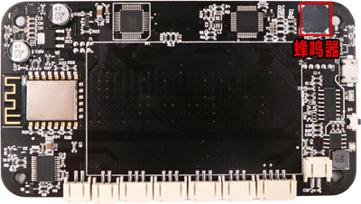
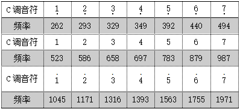

# 第七课 在WU-Link中使用红外传感器——红外电子琴

\[TOC\]

红外遥控是一种无线、非接触的控制技术，具有功耗低、成本低、易实现等优点。它在生活中几乎随处可见，比如绝大多数家庭的电视机、空调机，都可以用红外遥控技术控制。本课我们将深入学习了解红外遥控，制作一个可以用红外遥控器控制的电子琴。

## 模块与指令

**要制作本课的范例作品，需要认识以下这些新的硬件：**

### 板载红外遥控系统

一套完整的红外遥控系统由红外发射和红外接收两部分组成。红外发射装置通过红外发光二极管，发出经过编码、调制的红外光波；红外接收装置则通过红外接收二极管，将接收的红外光波转换为原来的编码信息。

在WU-Link点阵屏的上方，板载了一套红外遥控系统，包括两个红外发射模块和一个红外接收模块（如下图所示）。这套板载的红外遥控系统，使得WU-Link不仅能够发射、还能够接收红外编码信息。


```text
注：红外光波又叫做红外线。我们人眼能够看到的各种光线叫做可见光，除此之外还有不可见光，可见光和不可见光都是电磁波。可见光的光谱包括红、橙、黄、绿、青、蓝、紫七种颜色，波长在0.38um~0.76um之间。而比红色光波更长的不可见光叫做红外光波，它的波长在0.76um~1000um之间。红外光波按波长范围分为近红外、中红外、远红外、极红外四类。一般红外遥控系统使用的是近红外光波传送编码信息，它的波长是0.76um~1.5um。
注：um是一种长度单位，也叫做“微米”。1mm（毫米）=1000um（微米)
```

### 红外遥控器

红外遥控器是一种红外发射装置。遥控器上有很多按键，每个按键都有对应的红外编码，按下按键，遥控器就会通过红外光波将相应的按键编码发射出去。不同厂家的红外遥控器由于编码方式不同，有可能所发射的红外按键编码是不同的，一般相互之间不能通用。

如下左图所示的是创客们常用的一种简易红外遥控器，一共有17个按键，除了0-9这十个数字以外，还包括四个方向键、“OK”键以及“\*”键、“\#”键；如下右图所示的是一种电视机顶盒配套的红外遥控器，相比左图的遥控器，按键更多，能够遥控的功能也更多，但一般也都包含了数字键、方向键等常用的按键。


另外还有一种“学习型”红外遥控器，其实这种遥控器内部同时集成了红外发射和接收模块，可以根据实际需要，“学习”不同遥控器的红外按键数值。

### 板载的蜂鸣器模块

蜂鸣器是一种能够发出指定频率声音的装置，WU-Link点阵屏的内部主板上，集成了一个蜂鸣器模块（如下图所示）。蜂鸣器由于结构简单、使用方便，因此在电子产品中应用非常广泛。



```text
注：声音是由物体振动产生的声波。它有三个主观属性：音量、音调和音色。音量指人耳感受到的声音强弱，也叫做“响度”；音调指人耳能分辨一个声音调子的高低程度；音色指声音振动频率的特性，不同的物体由于材料、结构不同，发声时的振动频率也不相同，就会产生不同音色的声音。
对于蜂鸣器来说：它的驱动电流决定了所发声音的音量；它的工作频率决定了所发声音的音调；它的内部结构与发声原理决定了所发声音的音色。
```

**要制作本课的范例作品，还需要使用以下新的指令：**

### “读板载红外接收值”指令：


属于“板载”类别指令；使用这个指令可以读取WU-Link板载红外接收模块接收到的红外数值。

### “板载红外发射”指令：


属于“板载”类别指令；使用这个指令可以让WU-Link板载红外发射模块发射指定的红外数值。

指令的第一个参数是红外发射的“地址”，一般不需要设置；第二个参数是需要红外发射的“数据”，可以根据需要修改。

### “设置板载蜂鸣器音调”指令：


属于“板载”类别指令；使用这个指令可以设置板载的蜂鸣器发出指定的音调。

指令默认是发出“低音DO”的声音；可以单击打开下拉列表参数，从中选择具体的音调。

### “设置板载蜂鸣器音量”指令：


属于“板载”类别指令；使用这个指令可以设置板载蜂鸣器所发出声音的音量。

指令的参数就是音量值，默认是“10”，取值范围是（0，255），可以根据需要修改；数值越小声音越轻，如果是“0”，就是关闭声音。

### “设置板载蜂鸣器频率”指令：


属于“板载”类别指令；使用这个指令可以设置板载蜂鸣器发出指定频率的声音——也就是音调。

指令的参数就是频率值，默认是“523Hz”，可以根据需要修改。与“设置板载蜂鸣器音调”指令相比，这个指令更加灵活，除了音符，还可以设置各种声音的音调。

### “创建不带输出值的函数”指令：


属于“函数”类别指令；使用这个指令可以创建一个不带输出值的自定义函数。

指令的参数就是这个自定义函数的名称，默认是“PROCEDURE”，可以根据需要重新设置。函数创建以后，会在“函数”类别中新增一个以这个函数名称命名的指令，用于在程序中调用这个自定义函数。

单击指令左上角的“设置”图标，可以在打开的设置窗口中为所创建的自定义函数添加输入参数。

## 作品制作

要制作用红外遥控器控制的电子琴，除了WU-Link以外，还需要一块红外遥控器。首先编写第一段程序，获取所用红外遥控器各个数字按键的红外编码值； 然后编写第二段程序进行判断：按下遥控器的数字键，WU-Link板载的蜂鸣器演奏相应的音符。

### 第一步：在点阵屏上显示红外遥控器按键编码

要在WU-Link的点阵屏上显示遥控器按键的红外编码，需要先定义变量，用于存贮接收到的红外按键编码数值；然后根据这个变量值进行判断是否为“0”，如果不为“0”，那么就在点阵屏上显示这个变量值——也就是按键的编码值。

具体可以按以下步骤操作:

1. 单击“变量”类别中的“创建变量”按钮，创建“红外编码”变量；在默认的初始化指令中，使用“变量”类别中的“声明变量类型并赋值”指令初始化这个变量类型为“整数”、赋值为“0”。
2. 在“初始化”指令中再添加“点阵屏”类别中的“点阵屏清除”指令，对点阵屏初始化。

   完整的初始化程序代码如下图所示：


程序初始化完成后，可以在主程序中编写代码，获取接收到的红外编码并显示在WU-Link的点阵屏上。

具体可以按以下步骤操作：

1. 将“变量”类别中的“赋值为”指令拖动到编程区，与默认的“重复执行”指令组合。将“板载”类别中的“读板载红外接收值”指令拖动到“赋值为”指令的参数位置，作为它的参数。
2. 将“控制”类别中的“判断”指令拖动组合到“赋值为”指令的下方；将“数字与逻辑”类别中的“比较”指令作为“有条件执行”指令的条件；设置“比较”指令为“红外编码”变量“≠”“0”。
3. 将“点阵屏”类别中的“点阵屏清除”、“点阵屏显示数”指令拖动组合到“判断”指令的执行位置；设置“点阵屏显示数”的参数为变量“红外编码”。

   具体主程序代码如下图所示：


#### 试一试：

将以上步骤编写的程序代码编译后下载到WU-Link上，然后用遥控器对准WU-Link接收模块，根据下表的要求，将遥控器上的按键红外值记录下来。


### 第二步：用红外遥控器控制蜂鸣器演奏音符

要让红外遥控器控制蜂鸣器发声——比如按遥控器上的“1”按键，能够发出“do”的声音。需要对所读取的红外编码数值进行判断：如果变量“红外编码”——也就是读取的红外接收值，等于上一步骤获取的遥控器按键“1”所对应的数值“255”，那么就设置蜂鸣器的音调为“中音do”、音量为“20”、延时为“1000毫秒”——也就是持续发1秒的声音，最后再设置音量为“0”、关闭蜂鸣器。

具体主程序代码如下图所示：


```text
注：实际编写代码时，应该将上图所示代码中“判断”指令条件值“255”，修改为第一步程序所获取遥控器按键“1”的红外编码值。
```

#### 试一试

1. 除了“中音DO”，你能不能修改代码，让WU-Link演奏其它音符？
2. 如果不使用自定义变量“红外遥控”，直接在“判断”指令的条件参数中使用“读板载红外接收值”指令（如下图所示），还能够演奏音符吗？编译、下载后使用一下，你发现了什么？为什么？


### 第三步：自定义函数演奏多个音符

如果需要蜂鸣器演奏的音符很多，如下图所示演奏“DO、RE、MI”音符的程序代码：


在这段程序代码中，要演奏每个音符，除了需要设置音调以外，还需要包含以下三个指令：

* 第一个“设置蜂鸣器音量”指令让蜂鸣器演奏；
* “延时”指令用于保持一定时长的声音；
* 第二个“设置蜂鸣器音量”指令关闭蜂鸣器。

这样要演奏的音符越多，这些重复的指令也就越多，造成大量的冗余代码。

要解决这类代码冗余问题，可以使用自定义函数，将重复执行的代码放到自定义函数中，使程序代码更加简洁。

具体可以按以下步骤操作：

1. 拖动“函数”类别中的“创建不带输出值的函数”指令到编程区，单击设置函数的名称为“Note”。
2. 将需要重复执行的指令：第一个“设置蜂鸣器音量”指令、“延时”指令、第二个“设置蜂鸣器音量”指令拖动到新建函数的执行位置。

完整的自定义函数“Note”程序代码如下图所示：


```text
注意：WU-Link程序中的函数名称与变量一样，除了可以使用字母和数字命名以外，也可以使用中文作为变量名，但函数名最好有一定的意义。
```

创建了“Note”函数以后，在“函数”类别中就会增加一个名为“Note”的指令，用它替换原本程序代码中重复的三个指令（如下图所示），可以使程序更为简洁。


#### 试一试：

1. 进一步完善代码，让遥控器可以演奏其它中音的音调。
2. 除了中音的七个音调，能不能还能够演奏低音、高音的其它音调？

## 拓展与思考

除了使用“设置板载蜂鸣器音调”指令以外，也可以使用“板载”类别中的“设置板载蜂鸣器频率”指令设置需要演奏音符的音调。

声音的频率与C调的音符有如下表所示的对应关系：



请参考这张对照表，编写用遥控器演奏音符的程序。

然后想一想：这个程序与以上介绍的、使用“设置板载蜂鸣器音调”指令的程序有什么不同？

