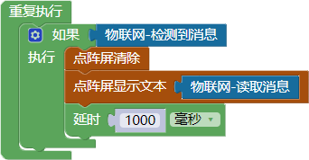
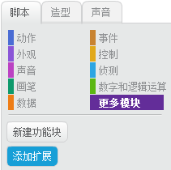
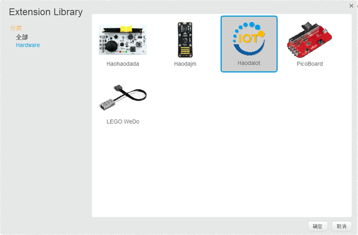
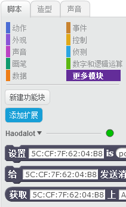

# 第八课 Scratch与WU-Link互联互控——物联网点读机

[TOC]

很多同学都用过英语点读机，今天我们就制作一个“物联网点读机”。这个点读机可以通过Scratch点击，然后通过互联网把相应的信息发送给WU-Link，在WU-Link的点阵屏上显示出来。


## 模块与指令

**要制作本课的范例作品，还需要使用以下新的指令：**

###“物联网-检测到消息”指令：

属于“物联网”类别指令；使用这个指令可以检测“好好搭搭”物联网服务器上有没有发送给当前绑定WU-Link的消息。如果有消息，指令的返回值为“1”，也就是逻辑值为“真”；如果没有消息，指令的返回值为“0”，也就是逻辑值为“假”。


### “物联网-读取消息”指令：

属于“物联网”类别指令；使用这个指令可以读取“好好搭搭”物联网服务器上发送给当前绑定WU-Link的消息。指令的返回值就是消息内容。


### “给物联网发送消息”指令：

属于“好好搭搭”在线版Scratch物联网扩展指令，必须通过“好好搭搭”网站的Scratch在线编程网页添加。

使用这个指令可以向“好好搭搭”网络服务器发送消息，通过服务器再将消息转发给指令参数指定的WU-Link。

指令的第一个参数是发送对象（也就是接收消息的WU-Link）的MAC地址； 第二个参数是要发送的消息内容。


## 作品制作

物联网点读机分为两个程序：一个是用Scratch编写的，用于向“好好搭搭”物联网服务器发送消息的程序；另一个是用WU-Link编程网页编写的，用于读取“好好搭搭”物联网服务器上消息的程序。


### 第一步：编写读取物联网服务器消息的WU-Link程序

要编写用于读取“好好搭搭”物联网服务器消息的WU-Link程序，首先初始化WU-Link点阵屏； 然后重复进行判断：如果检测到“好好搭搭”物联网服务器上有新的消息，就清除点阵屏原来显示的内容，显示从服务器上读取到的新消息。

具体可以按以下步骤操作：

1. 在默认的“初始化”指令中添加“点阵屏”类别中的“点阵屏清除”、“点阵屏显示文本”指令，对点阵屏初始化。

   具体的初始化程序代码如下图所示：

   

2. 将“控制”类别中的“判断”指令拖动组合到“重复执行”指令中；添加这个“判断”指令的条件为“物联网”类别中的“检测到消息”指令。

3. 将“点阵屏”类别中的“点阵屏清除”、“点阵屏显示文本”以及“控制”类别中的“延时”指令作为“判断”指令条件成立后执行的脚本。

4. 设置“物联网”类别中的“读取消息”指令作为“点阵屏显示文本”指令的参数。

   具体的主程序代码如下图所示：




### 第二步：编写向物联网服务器发送消息的Scratch程序

要编写向“好好搭搭”物联网服务器发送消息的程序，方法很多，下面介绍的是采用Scratch编写的发送消息程序。

首先按以下步骤操作，进入“好好搭搭”Scratch在线编程网页、添加舞台背景图片和角色：

1. 进入“好好搭搭”网站“创作”栏目，单击其中的“Scratch”模板缩略图，进入“Scratch模板项目页”。

2. 在“Scratch模板项目页”中，单击右上角的“转到设计页”按钮，进入Scratch在线编程网页。

3. 在Scratch中，添加名为“room3”的舞台背景图片以及名为“cat1”、“apple”的角色图片，用鼠标将他们拖动到合适的位置。

   具体如下图所示：


要在Scratch中编写向“好好搭搭”物联网服务器发送消息的程序，还必须添加“好好搭搭”物联网扩展指令。具体可以按以下步骤操作：

1. 单击Scratch编程网页的“脚本”选项卡，再单击“更多模块”中的“添加扩展”按钮（如下图所示）。



2. 在打开的如下图所示的对话框中双击“Haodaiot”缩略图。



3. 在“脚本”选项卡的“更多模块”中，会自动添加三条如下图所示的“好好搭搭”物联网扩展指令。通过这三条指令，Scratch才可以向“好好搭搭”物联网服务器发送或者接收消息。



```
注：“好好搭搭”物联网扩展指令，只能通过“好好搭搭”网站的Scratch在线编程网页添加，如果采用其它版本的Scratch是不能添加的。
```


做好以上准备工作以后，就可以按以下步骤编写程序，向“好好搭搭”物联网服务器发送消息：

1. 在“角色列表区”单击“cat1”角色缩略图，添加如下图所示的脚本，让小猫被点击的时候会播放声音、给“好好搭搭”服务器发送消息“Cat”。其中“发送消息”指令就是上一步添加的“好好搭搭”物联网指令，中间的MAC地址参数应该修改为实际绑定WU-Link的MAC地址。


2. 同样再单击为“apple”角色缩略图，添加如下图所示的脚本，当它被点击的时候也播放声音、给“好好搭搭”服务器发送消息“Apple”。同样也需要将指令中的MAC地址修改为实际绑定WU-Link的MAC地址。


 ####试一试：

 范例中的两个角色，单击后播放的只是Scratch声音库中的声音，并不是这个单词的读音。能不能在“声音”选项卡中自己录制单词的读音，点击后播放的是这个单词的朗读声。


### 第三步：实际体验“物联网点读机”

通过前面的操作，已经用“好好搭搭”在线版的Scratch，编写了“物联网点读机”的消息发送程序；也在“好好搭搭”网站的WU-Link程序编写网页，编写了显示物联网消息的程序。接下来，可以按以下步骤分别运行这两个程序，体验“物联网点读机”的实际功能：

1. 将WU-Link物联网消息显示程序编译、下载到实际所绑定的WU-Link中。程序运行后，WU-Link会检测“好好搭搭”物联网服务器上有没有新的消息，如果有就会显示。
2. 再运行Scratch编写的消息发送程序，随着单击“cat1”或者“apple”角色，除了会在Scratch程序网页中播放声音，也会在WU-Link点阵屏上同步显示Scratch发送的单词。


 #### 试一试：

 范例中只有两个角色，能不能再添加其它的角色，让这个物联网点读机更有用？


## 拓展与思考

通过Scratch向WU-Link发送消息，除了可以制作点读机，还可以制作哪些更有趣的应用？