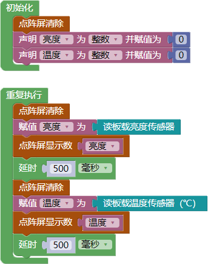
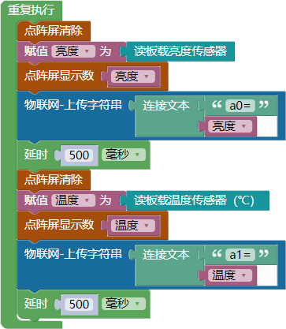
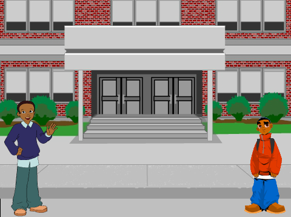
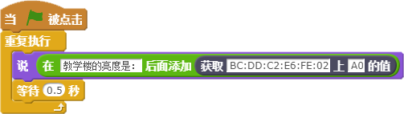
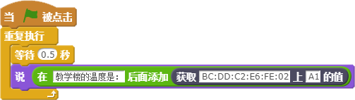
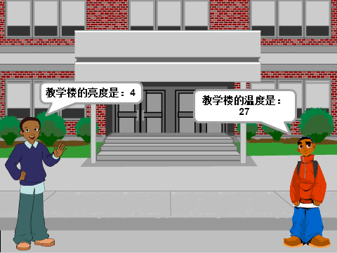

# 第九课 Scratch与WU-Link互联互控——物联网环境监测仪

[TOC]

在第四课中，我们使用WU-Link制作了一个校园环境自动监测仪，能够监测周围环境的光线强度和温度值。本课我们将在此基础上添加物联网功能，使得监测仪能够将环境数据上传到“好好搭搭”物联网服务器上，然后通过Scratch显示出来。将这样的多个监测仪放置到校园的各个角落，就可以实时监测校园内多个场所的环境。


## 模块与指令

**要制作本课的范例作品，还需要使用以下新的指令：**

###“物联网-上传字符串”指令：


属于“物联网”类别指令；使用这个指令可以将指定的字符串上传到“好好搭搭”物联网服务器上。

指令的参数就是需要上传的字符串，默认是“haohaodada”，可以根据需要修改。


### “连接文本”指令：


属于“文本与数组”类别指令；使用这个指令可以将参数中的两个文本连接起来。

指令可以连接两个文本参数，一般最常用的是“文本与数组”类别中的“字符串”、“字符”等指令。


## 作品制作

物联网环境监测仪程序也是由两个程序组成：一个是用WU-Link编程网页编写的，用于检测并且上传亮度、温度值的程序；另一个是用“好好搭搭”网站的在线版Scratch编写的，用于从“好好搭搭”物联网服务器中获取绑定WU-Link上传的字符串、然后显示出来的程序。


### 第一步：编写能够轮替显示环境亮度和温度的WU-Link程序

在第四课中我们已经学过如何在点阵屏上交替显示亮度、温度值。需要先初始化点阵屏、声明两个变量“亮度”、“温度”为“整数”并赋值为“0”；然后在“重复执行”指令中清除旧的点阵屏显示后，将新读取的板载亮度传感器数值赋值给“亮度”变量，再在点阵屏上显示出来，“延时”后再清除点阵屏，将新读取的板载温度传感器数值赋值给“温度”变量，再在点阵屏上显示温度值、最后再“延时”。

完整的程序代码如下图所示：




 ####试一试：

 能够同时在点阵屏上显示亮度和温度值吗？


### 第二步：将WU-Link检测到的亮度、温度值发送到物联网服务器

要将WU-Link检测到的亮度、温度值发送到“好好搭搭”物联网服务器上，可以在上一步所编写的“在点阵屏上交替显示亮度、温度值”的主程序中，添加将信息上传到服务器的指令：

具体可以根据以下步骤操作：

1. 在第一个“点阵屏显示数”指令的下方，添加“物联网”类别中的“上传字符串”指令，再在指令的参数位置添加“文本与数组”类别中的“连接文本”指令，设置连接的文本为文本“a0=”和“亮度”变量。

2. 在第二个“点阵屏显示数”指令的下方，再添加“上传字符串”指令、在这个指令参数位置再添加“连接文本”指令，设置连接的文本为文本“a1=”和“温度”变量。
   
   完整的主程序代码如下图所示：



```
注：向“好好搭搭”服务器上传的字符串必须要有一个名称，也就是程序中的“a0”、“a1”，具体名称可以自定义；在这个名称后面必须要用“=”与后面的字符串加以区分。
```


### 第三步：在Scratch上显示WU-Link检测到的亮度、温度值

WU-Link检测并上传到“好好搭搭”物联网服务器上的字符串，可以通过Scratch中的指令读取后显示出来。

具体可以按以下步骤操作：

1.进入“好好搭搭”网站的“创作”栏目，单击其中的“Scratch”模板缩略图，进入“Scratch模板项目页”，再单击网页右上角的“转到设计页”按钮，进入Scratch在线编程网页。

2.在Scratch中，添加名为“school2”的舞台背景图片以及名为“boy1”、“boy4”的角色图片，用鼠标将他们拖放到合适的位置。
  
  具体可以如下图所示：



3.单击“脚本”选项卡“更多模块”中的“添加扩展”按钮，在打开的对话框中双击“Haodaiot”缩略图，将“好好搭搭”物联网指令添加到Scratch中。

4.为“boy1”角色添加如下图所示的脚本，将“教学楼的亮度是”文本与获取到的字符串合并在一起、然后用“说”指令显示出来。其中“获取指定MAC地址的值”指令就是新添加的“好好搭搭”物联网指令，中间的MAC指令应该修改为实际绑定WU-Link的MAC地址。
  
  具体的程序脚本如下图所示：



5.同样再为“boy4”添加如下图所示的脚本，让他会说“教学楼的温度”值。同样也需要将范例中的MAC地址修改为实际绑定WU-Link的MAC地址。
  
  具体的程序脚本如下图所示：




### 第四步：实际体验校园环境自动监测仪

通过以上步骤，已经分别编写了亮度、温度值的上传程序和显示程序，可以按以下步骤分别运行这两个程序，实际体验校园环境自动监测仪的功能：

1. 将第二步编写的WU-Link显示、上传亮度、温度值的程序编译、下载到实际所绑定的WU-Link中。运行程序后，WU-Link会不断的在点阵屏上显示亮度、温度值，同时将相关数值上传到“好好搭搭”物联网服务器上。

2. 运行第三步所编写的Scratch程序，如果一切正常，会在舞台上显示从“好好搭搭”物联网服务器上获取的亮度、温度值。

   具体如下图所示：




 #### 试一试：

 能不能让一个角色既说亮度值、同时又说温度值？


## 拓展与思考

与同学合作，将多块WU-Link放置到校园的不同地点，然后用Scratch监测这些地点的环境亮度、温度。
