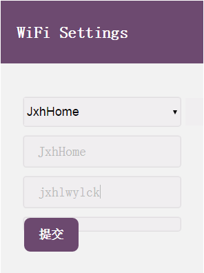
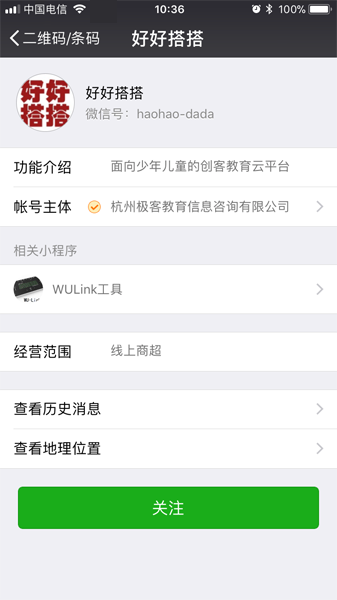

# 阅读材料一：WU-Link的无线网络连接设置

[TOC]

WU-Link是基于物联网技术设计、开发的一套“造物”套件。它不需要数据线，只要处于开机状态并且通过无线网络接入互联网，那么无论身处何地都可以对它进行编程、控制。

由于WU-Link是基于物联网的，因此它应该在拥有良好无线网络接入的环境中使用，使用之前首先需要设置接入无线网络。

设置WU-Link接入无线网络主要有两种方式：Web网页配置方式和微信公众号配置方式。可以根据实际情况选择一种合适的方式设置。

##通过Web方式配置无线网络连接

通过Web方式配置WU-Link连接无线网络，需要一台有无线网卡的智能终端设备：比如笔记本电脑、平板电脑或者手机。下面就以笔记本电脑为例，介绍具体的操作步骤：

1. 确保WU-Link处于关机状态，然后用右手大拇指按住面板上的“B”键的同时、用左手大拇指按一下电源开关，打开电源（如下图所示）；WU-Link的红色电源指示灯会点亮、蜂鸣器响一声，提示WU-Link进入了配置模式；最后松开右手。

2. WU-Link在配置模式状态下，本身会成为一个无线热点，这个无线热点的名称是由“haohaodada”开头、再加上这块WU-Link的mac地址组成的，可以用笔记本电脑搜索这个无线热点（如下图所示）。

3. 搜索到WU-Link的无线热点以后，选择加入这个热点，在询问热点的连接密码时输入“haohaodada”（如下图所示）。

4. WU-Link的无线热点连接成功后，就可以进入Web配置网页：打开网页浏览器，在地址栏中输入网址：192.168.4.1，打开如下图所示的网页：

5. 首先单击上图a-4所示的下拉列表，选择所要连接的无线网络名称；如果在下拉列表中没有找到，可以在下方的第一个文本框内手工输入这个无线网络名称。然后在第二个文本框内输入所要连接无线网络的密码。最后单击“提交”按钮，打开如下图所示网页。

6. 按以上步骤设置并提交WU-Link所要连接的无线网络信息后，WU-Link的网络指示灯会呈红色闪烁状态、同时蜂鸣器持续鸣叫。如果一切顺利，稍等片刻后，WU-Link的网络指示灯变为蓝色常亮、蜂鸣器也会停止鸣叫，就代表WU-Link已成功接入了无线网络。

 ## 通过微信公众号配置

WU-Link也可以通过微信公众号的方式设置接入无线网络。下面就以手机操作为例，介绍具体的操作步骤：

1. 单击WU-Link电源按钮，打开电源。WU-Link会试图去连接本地无线网络，当连接失败后，自动进入等待微信配置模式。此时WU-Link网络指示灯为红色慢闪状态、蜂鸣器持续鸣叫。

2. 确认手机已经正常接入所要连接的无线网络、已经安装“微信”APP。

3. 打开手机微信，使用“扫一扫”功能，扫描WU-Link背板上的二维码（如下左图a-6所示），

   

4. 扫描二维码以后，根据提示关注“好好搭搭”微信公众号（如下图所示）。

5. 进入“好好搭搭”微信公众号，单击底部工具栏中的“WU-Link”→“WIFI配置”选项（如下图所示）；

5. 打开“WIFI配置”网页（如下右图a-9所示）。

5. 单击“WIFI配置”网页下方的“开始配置”按钮，在打开的“配置设备上网”网页中确认所要连接无线网络的名称，在“Wi-Fi密码”文本框中输入无线网络的连接密码，最后单击“连接”按钮（如下图所示）。

6. 等待一段时间后，WU-Link联网指示灯变为蓝色常亮之后，就代表WU-Link已经成功接入了无线网络。
