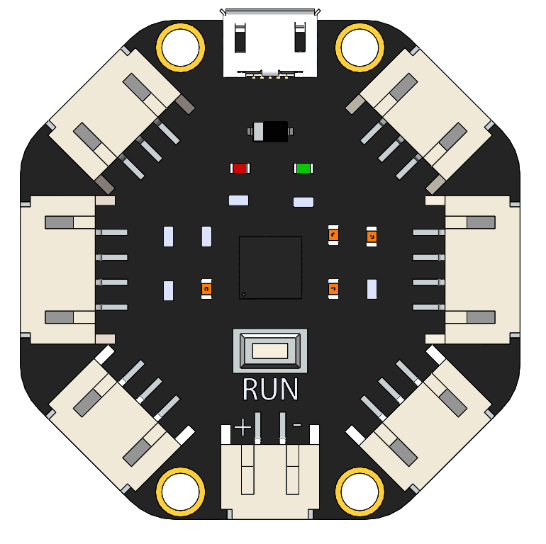
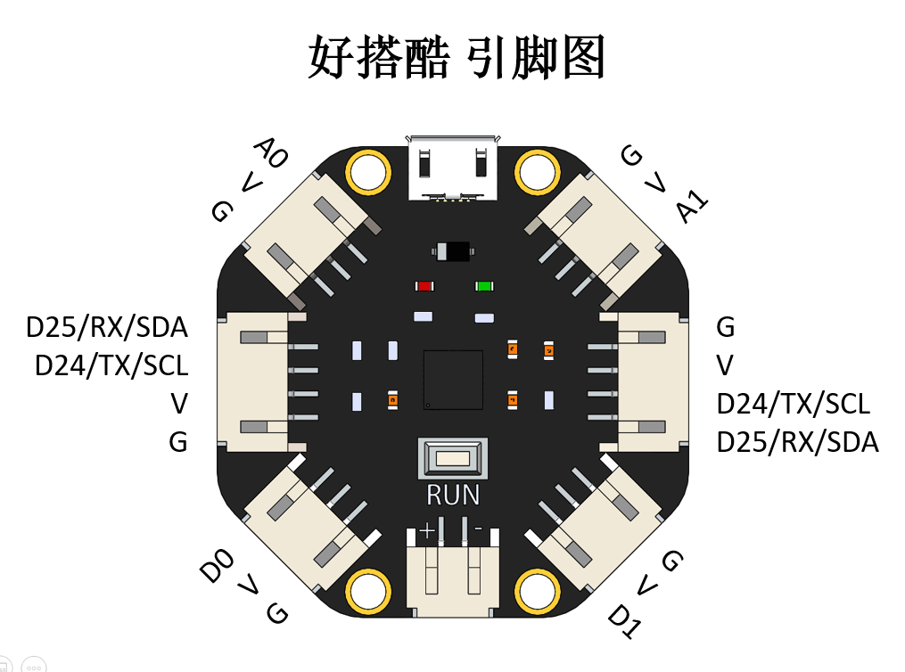

# 好搭酷

## 概述

好搭酷是一款针对造物的核心板。造型小巧，便于与各种通用模块连接，并且采用U盘下载模式，使程序下载更加简单，用户可展现无穷的想象，进行简单又有趣的造物之旅。



扫描好搭酷背面二维码可直接进入好搭酷编程界面。


## 性能参数

* 输入电压：DC 3-5V
* 处 理 器：32位ARM Cotext-M0芯片 64K Flash 8K RAM
* 接口类型：PH2.0
* 端        口：2路PWM接口，2路AD接口，2路I2C/UART接口
* 下载方式：U盘下载模式
* 尺        寸：40x40mm

## 接口说明



## 按键和指示灯介绍

运行键/RUN键：连接USB线，运行程序时，按运行键，重启进入U盘模式。

红色LED灯：电源指示灯。

绿色LED灯：板载LED灯。

## 使用方式

### 浏览器下载路径询问设置

好搭酷采用U盘下载模式下载程序，点击下方查看浏览器下载路径设置方法。



### 程序下载

1.将好搭酷主板通过USB连接线与电脑连接，电脑显示检测到U盘。


2.[单击此处](http://www.haohaodada.com)进入好好搭搭网站，登录并点击进入创作界面。


3.下拉选择好搭酷编程界面，点击进入。


4.编写程序并点击下载到设备，弹出对话框并点击确定。


示例程序：


5.选择下载路径为haohaodada U盘并下载，下载成功后U盘自动弹出。


6.程序下载成功，板载绿色LED灯闪烁。

```text
注：若要再次下载程序，需要按下主板上运行键，好搭酷重新与电脑连接。
```

## 编程界面

[点击此处](http://www.haohaodada.com/Core/)进入好搭酷编程界面。

## 常见问题

Q：下载后，U盘自动弹出，如何再次下载程序？

A：按下好搭酷运行按键，计算机再次检测到U盘，即可再次下载程序

