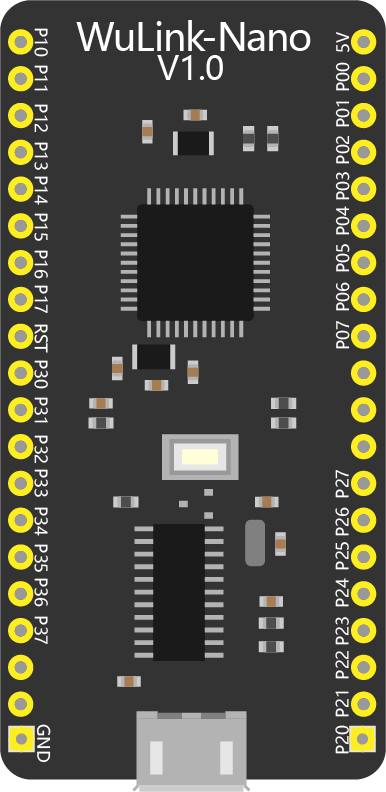
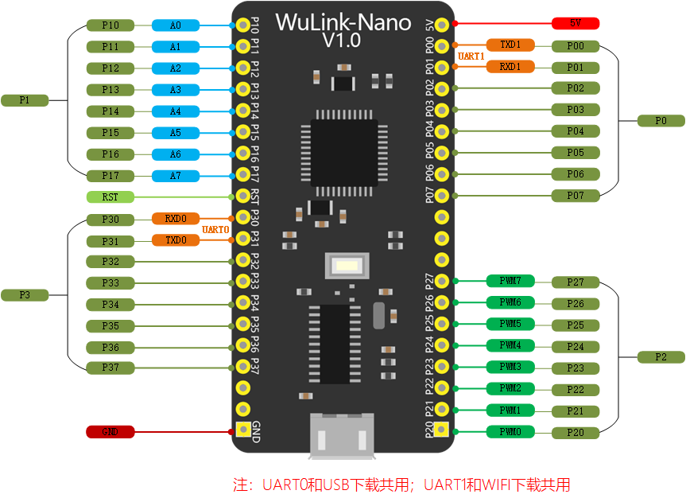

# WuLink-Nano

## 概述

Wulink-Nano是一款专门针对造物的开发板，继承了WU-Link的核心功能，集云编程、无线下载、物联网通讯功能于一体，同时精简掉了WU-Link集成的传感器，引出了所有的IO端口，方便用户自己扩展应用。

## 性能参数

*  输入电压：DC 5V;
* 工作电流：联网空载100mA;
* 处  理  器：32位HaoDa Core ARM和32位Tensilica Wifi芯片；
* 数字端口：24个通道（包含8个PWM）；
* 模拟端口：8个12bit通道；
* 下载方式：无线下载/USB下载；
*  尺       寸：54x26mm；

## 接口说明

## 按键和指示灯说明

按住按键开机：进入WEB配置。 

红色状态指示灯常亮：处于WEB配置模式。 

红色状态指示灯闪烁：未连接网络。

 蓝色状态指示灯常亮：已连接网络。

## 编程页面

[http://haohaodada.com/wulink-nano/](http://haohaodada.com/wulink-nano/)

